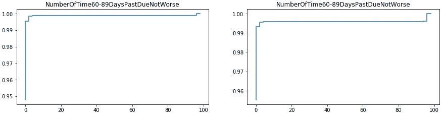

# 从零开始使用机器学习的信用违约分析(第一部分)

> 原文：<https://medium.com/analytics-vidhya/credit-default-analysis-using-machine-learning-from-scratch-part-1-8dbaad1fae14?source=collection_archive---------5----------------------->

两部分系列的第一部分。我将在这里介绍预处理，在另一部分介绍建模。


首先，感谢你来到这里。写这篇博客让我非常兴奋，因为这是我第一篇关于数据科学的博客。这将是一个由两部分组成的系列。我将在这里讨论问题陈述和预处理，并在另一部分做建模工作。

part 2[https://medium . com/@ saketgarodia/credit-default-analysis-using-machine-learning-from-scratch-part-of-the-series-2-194d 2d 78 a 1a 7？source = friends _ link&sk = 7e 202 B3 e 71034 ed1e 3506 e 38 CD 31 ca 07](/@saketgarodia/credit-default-analysis-using-machine-learning-from-scratch-part-of-the-series-2-194d2d78a1a7?source=friends_link&sk=7e202b3e71034ed1e3506e38cd31ca07)

这个项目来自 Kaggle 的一个竞赛。下面是链接:【https://www.kaggle.com/c/GiveMeSomeCredit】**。你甚至可以通过这个链接查看我的木星笔记本(*[https://github . com/garo disk/Credit-Default-Analysis-/blob/master/preprocessing . ipynb](https://github.com/garodisk/Credit-Default-Analysis-/blob/master/preprocessing.ipynb))*

**目标**:通过预测某人在未来两年内遭遇财务困境的概率，提高信用评分的技术水平。

# **导入必要的库并读取数据集**

```
import pandas as pd
import numpy as np
import matplotlib.pyplot as plt
import os
np.set_printoptions(edgeitems=10)
np.core.arrayprint._line_width = 180
df = pd.read_csv('cs-training (1).csv')
print(df.head())
print(df.columns)
print(df.shape)
print(df.dtypes)
```


基本上，我们拥有大约 150，000 名客户及其各种属性的数据。一些属性是消费者特征，一些属性是关于他们的行为。我们要预测的变量是“SeriousDlqin2yrs”。当“seriousdlqin 2 yers”= = 0 时，这意味着该客户与银行无关，当该值为 1 时，该客户极有可能违约。让我们从一些预处理开始，因为我们手头的数据相当混乱，并且肯定会有许多缺失值、异常值等，这些对于建模目的是无用的。在开始之前，这里有一个不同预测的描述:

```
df.SeriousDlqin2yrs = (df.SeriousDlqin2yrs).astype(‘category’)
df.describe()
df.info()
```


# 缺失值分析

很明显，我们可以看到‘月收入’(~ 20%)和‘依赖人数’(~ 3%)有一些缺失值。根据我们的直觉，我们知道月收入是信用评分的一个重要预测指标，因此我们不会丢弃这些数据点，并找到最佳策略来替换空值。

让我们首先探索当月收入为“非空”和月收入为“空”时，所有其他预测因素的分布是否有差异。

当月收入为“非空”时，第一列显示不同预测值的 ECDF，当月收入为“空”时，第二列显示相同的预测值。

```
df_mis_inc = df[df[‘MonthlyIncome’].isna()]
df_not_mis_inc = df[df[‘MonthlyIncome’].notna()]
varNames = [‘RevolvingUtilizationOfUnsecuredLines’, ‘age’, ‘NumberOfTime30–59DaysPastDueNotWorse’, ‘DebtRatio’, ‘NumberOfOpenCreditLinesAndLoans’, ‘NumberOfTimes90DaysLate’, ‘NumberRealEstateLoansOrLines’, ‘NumberOfTime60–89DaysPastDueNotWorse’, ‘NumberOfDependents’]
import numpy as np
from statsmodels.distributions.empirical_distribution import ECDFdef visualizeECDF( variable,data):
df = data[:]
ecdf = ECDF(df[variable])
x = np.linspace(min(df[variable]), np.percentile(df[variable],99.9))
y = ecdf(x)
plt.step(x, y)np.random.seed(100)
fig, axes = plt.subplots(nrows=10, ncols=2)
fig.tight_layout()
fig.set_figheight(45)
fig.set_figwidth(15)
plt.subplots_adjust(hspace=0.5) for i in [1,3,5,7,9,11,13,15,17]:
ax = plt.subplot(9,2,i)
ax.set_title(varNames[(i-1)//2])
visualizeECDF(varNames[(i-1)//2], data = df_not_mis_inc)
ax = plt.subplot(9,2,i+1)
ax.set_title(varNames[(i-1)//2])
visualizeECDF(varNames[(i-1)//2], data = df_mis_inc)
```


左—月收入为零；对-月收入不为空


左—月收入为零；对-月收入不为空


左—月收入为零；对-月收入不为空


左—月收入为零；对-月收入不为空


左—月收入为零；对-月收入不为空


左—月收入为零；对-月收入不为空


左—月收入为零；对-月收入不为空



左—月收入为零；对-月收入不为空

我们可以清楚地看到，除了负债率之外，所有的分布几乎相似。月收入‘非空’时的负债率分布与月收入‘空’时的分布不同。现在让我们看看负债比率的总体分布。

```
perc = range(81)val = []for i in perc:val.append(np.percentile(df[‘DebtRatio’],i ))import matplotlib.pyplot as pltplt.plot(perc, val, ‘go — ‘, linewidth=2, markersize=12)
```


在下面的代码和可视化中，我们将看到缺失收入子集的“脱层”与其他子集的前 1 个百分位数的“脱层”值具有相同的分布。

```
perc1 = [99.0,99.1,99.2,99.3,99.4,99.5,99.6,99.7,99.8,99.9]
perc2 = [0,10,20,30,40,50,60,70,80,90]
val1 = []
val2 = []for i in perc1:
val1.append(np.percentile(df_not_mis_inc[‘DebtRatio’],i))for i in perc2:
val2.append(np.percentile(df_mis_inc[‘DebtRatio’],i))plt.plot(perc1,val1)
plt.show()
plt.plot(perc2,val2)
plt.show() 
```

## 负债比率的前 1%分布


## 月收入为空时的负债比率分布


上述分析表明，我们可以使用对应于最高 1%负债比率的月收入值来估算月收入，我们得到的负债比率为 0.23 ~ 0。因此，我们将用 0 来估算月收入。这听起来也很直观，因为非常高的债务值通常对应于 vesy less 月收入，这里是 0。同样，我们看到了“无依无靠者”的分布，但我们无法获得任何有用的信息，所以我们只是用中间值 0 来估算。

我们的下一步是检查异常值

# 异常值分析

首先，我们将使用一个基本的箱线图分析来了解异常值。让我们看看有多少值超过了中位数的 1.5 IQR。

```
cols = df1.columnsfor i in cols:
Low_Bound = ((np.percentile(df[i],25)) — 1.5*np.subtract(*np.percentile(df[i],[75,25])))
Upp_Bound = ((np.percentile(df[i],75)) + 1.5*np.subtract(*np.percentile(df[i],[75,25])))
df1[i] = df[i].apply(lambda x : 1 if(x < Low_Bound or x > Upp_Bound) else 0 )
print(df1.sum(axis = 0, skipna = True))
```


箱线图中异常值的数量

因此，总的来说，我们有大约 47%的数据点包含一个或多个异常值。我们不能删除这些数据点，因为我们可能会丢失大量信息。因此，让我们来看看与严重犯罪高度相关的预测因素。像“30-59 天的工作日”、“90 天的工作日”、“年龄”、“60-89 天的工作日”这样的变量与严重的违法行为高度相关。让我们看看他们的价值使用熊猫的价值计数功能来分析离群值。


“number of time 30–59dayspastduenotbraster”的值计数


“NumberOfTimes90DaysLate”的 Value_counts


“number of time 60–89dayspastduenotbraster”的 Value_counts

我们可以看到，所有这 3 个预测值只有很少的数据点具有较高的值 96 和 98，但大多数值和中位数都在 15 左右。这可能是由于一些打字错误或一些数据错误。虽然它不太可能默认 98 次，但可能会有一些客户具有这些值，但这对预测建模没有用，因为无论如何建模都无法检测到像这样的极端异常值。因此，我们将所有这些值限制为 20。

```
#Capping
df.loc[df[‘NumberOfTime30–59DaysPastDueNotWorse’]>20,’NumberOfTime30–59DaysPastDueNotWorse’] = 20df.loc[df[‘NumberOfTimes90DaysLate’]>20,’NumberOfTimes90DaysLate’] = 20df.loc[df[‘NumberOfTime60–89DaysPastDueNotWorse’]>20,’NumberOfTime60–89DaysPastDueNotWorse’] = 20
```

以类似的方式，我们将把“NumberRealEstateLoansOrLines”限制为 30，“NumberOfOpenCreditLinesAndLoans”限制为 40。

现在，让我们看看其余 3 个连续变量“RevolvingUtilizationOfUnsecuredLines”、“DebtRatio”和“MonthlyIncome”的分布

```
varNames = [‘RevolvingUtilizationOfUnsecuredLines’, ‘DebtRatio’, ‘MonthlyIncome’]
import matplotlib.pyplot as plt
import numpy as np
from statsmodels.distributions.empirical_distribution import ECDFdef visualizeECDF( variable,data):
df = data[:]
ecdf = ECDF(df[variable])
x = np.linspace(min(df[variable]), np.percentile(df[variable],99.5))
y = ecdf(x)
plt.step(x, y)np.random.seed(100)
fig, axes = plt.subplots(nrows=3, ncols=2)
fig.tight_layout()
fig.set_figheight(10)
fig.set_figwidth(15)
plt.subplots_adjust(hspace=0.5)ax = plt.subplot(3,2,1)
ax.set_title(varNames[0])
visualizeECDF(varNames[0], data = df)perc = [97.5,98,98.5,99,99.5,100]
val = []for i in perc:
val.append(np.percentile(df[‘RevolvingUtilizationOfUnsecuredLines’],i ))
ax = plt.subplot(3,2,2)
ax.set_title(varNames[0])
plt.plot(perc, val, ‘go — ‘, linewidth=2, markersize=12)ax = plt.subplot(3,2,3)
ax.set_title(varNames[1])
visualizeECDF(varNames[1], data = df)perc = [97.5,98,98.5,99,99.5,100]
val = []for i in perc:
val.append(np.percentile(df[‘DebtRatio’],i ))
ax = plt.subplot(3,2,4)
ax.set_title(varNames[1])
plt.plot(perc, val, ‘go — ‘, linewidth=2, markersize=12) ax = plt.subplot(3,2,5)
ax.set_title(varNames[2])
visualizeECDF(varNames[2], data = df)perc = [97.5,98,98.5,99,99.5,100]
val = []
for i in perc:
val.append(np.percentile(df[‘MonthlyIncome’],i ))
ax = plt.subplot(3,2,6)
ax.set_title(varNames[2])
plt.plot(perc, val, ‘go — ‘, linewidth=2, markersize=12)
```

**ECDF 地块**


完全分配与最高 2.5 个百分点分配(无担保贷款的循环利用)


完全分布与最高 2.5 个百分点分布(债务比率)


完全分布与最高 2.5 个百分点分布(月收入)

我们可以从显示前 2.5 个百分点值分布的第二列中清楚地看到，这些值在 99.5 个百分点后突然跳跃，这意味着我们可以从所有这 3 个预测值中删除前 0.5 个百分点值，因为它们会干扰我们的建模

```
df1 = df[[‘RevolvingUtilizationOfUnsecuredLines’, ‘DebtRatio’, ‘MonthlyIncome’]]var1_cap = np.percentile(df[‘RevolvingUtilizationOfUnsecuredLines’],99.5)var2_cap = np.percentile(df[‘DebtRatio’],99.5)var3_cap = np.percentile(df[‘MonthlyIncome’],99.5)print(var1_cap)print(var2_cap)print(var3_cap)df1[‘RevolvingUtilizationOfUnsecuredLines’] = df1[‘RevolvingUtilizationOfUnsecuredLines’].apply(lambda x : x if x<=var1_cap else var1_cap)df1[‘DebtRatio’] = df1[‘DebtRatio’].apply(lambda x : x if x<=var1_cap else var1_cap)df1[‘MonthlyIncome’] = df1[‘MonthlyIncome’].apply(lambda x : x if x<=var1_cap else var1_cap)
```

现在，我们已经处理了缺失值和异常值，我们可以开始建模了。我将在本系列的第 2 部分讨论这些数据的建模。下面是 PART2 的链接——[https://medium . com/@ saketgarodia/credit-default-analysis-using-machine-learning-from-scratch-part-of-the-series-2-194d 2d 78 a 1a 7？source = friends _ link&sk = 7e 202 B3 e 71034 ed1e 3506 e 38 CD 31 ca 07](/@saketgarodia/credit-default-analysis-using-machine-learning-from-scratch-part-of-the-series-2-194d2d78a1a7?source=friends_link&sk=7e202b3e71034ed1e3506e38cd31ca07)

请在这里发表对我的代码或博客的任何反馈或改进。我将很高兴接待他们。

感谢你阅读:D