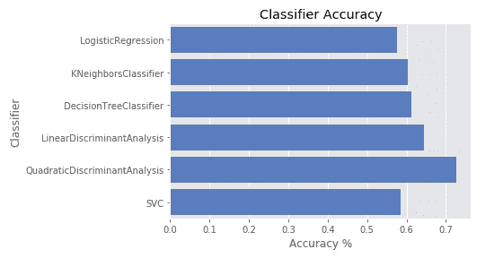

# 从零开始使用机器学习进行信用违约分析(本系列的第 2 部分)

> 原文：<https://medium.com/analytics-vidhya/credit-default-analysis-using-machine-learning-from-scratch-part-of-the-series-2-194d2d78a1a7?source=collection_archive---------4----------------------->

*利用机器学习预测 2 年内可以违约的客户。*


感谢您阅读信用违约分析系列的第 2 部分。即使你没有看过第一部分，也没关系。在第一部分中，我们重点关注预处理元素，如缺失值分析和异常值分析，并为我们将在此展示的建模准备好数据。让我们首先可视化所有预测器的数据类型，并将因变量的数据类型改为“类别”。如果你想在阅读本文之前阅读第一部分，这里有第一部分的链接。[https://medium . com/@ saketgarodia/credit-default-analysis-using-machine-learning-from scratch-part-1-8d bad 1 FAE 14？source = friends _ link&sk = c 2559676 ba 1b 34 b 01 ad 9 c 6 beab 69180 f](/@saketgarodia/credit-default-analysis-using-machine-learning-from-scratch-part-1-8dbaad1fae14?source=friends_link&sk=c2559676ba1b34b01ad9c6beab69180f)

```
df = pd.read_csv(‘cleaned_all.csv’)
print(df.dtypes)
```


SeriousDlqin2yrs 年是因变量

```
#Importing all the necessary packagesdf.SeriousDlqin2yrs = (df.SeriousDlqin2yrs).astype(‘category’)import numpy as npimport pandas as pdimport seaborn as snsimport matplotlib.pyplot as pltdef warn(*args, **kwargs): passimport warningswarnings.warn = warnfrom sklearn.model_selection import **train_test_split**from sklearn.model_selection import GridSearchCVfrom sklearn.model_selection import cross_val_scorefrom sklearn.model_selection import KFoldfrom sklearn.metrics import roc_curvefrom sklearn.metrics import precision_recall_curvefrom sklearn.metrics import roc_auc_scorefrom sklearn.linear_model import LogisticRegressionfrom sklearn.metrics import classification_reportfrom sklearn.metrics import confusion_matrixfrom sklearn.ensemble import RandomForestClassifierfrom sklearn.ensemble import GradientBoostingClassifierimport pandas as pd # for data analyticsimport numpy as np # for numerical computationfrom matplotlib import pyplot as plt, style # for plotingimport seaborn as sns # for plotingfrom sklearn.metrics import fbeta_score, make_scorer, precision_score, recall_score, confusion_matrix # for evaluationimport itertoolsstyle.use(‘ggplot’)np.random.seed(42)
```

现在，让我们看看是否有机会使用 PCA 来减少特征的数量。为此，让我们检查由其他预测因素解释的严重滞后 2 年的差异量。

```
from sklearn.preprocessing import StandardScalerscaler = StandardScaler()df_std = pd.DataFrame(scaler.fit_transform(df.drop([‘Unnamed: 0’, ‘SeriousDlqin2yrs’],axis=1)), columns = df.drop([‘Unnamed: 0’, ‘SeriousDlqin2yrs’],axis=1).columns)from sklearn.decomposition import PCApca = PCA()pca.fit(df_std)print(pca.explained_variance_ratio_.cumsum())Output[0.24612617 0.41598383 0.55069126 0.65415629 0.74505298 0.81772095  0.87925848 0.93071701 0.96391217 0.98814172 1\.        ]
```

从上面代码片段的输出中我们可以看到，很难将特征的数量压缩到 2 或 3，因为每个预测器都包含因变量的大量方差。此外，我们的数据集非常庞大，10 个特征对我们来说并不算多，所以我们将继续不使用主成分，而是使用所有的特征。

现在，让我们使用 Python 的 seaborn 库来可视化所有预测值的分布。

```
plt.figure(figsize=(9, 8))df[[‘RevolvingUtilizationOfUnsecuredLines’, ‘age’, ‘NumberOfTime30–59DaysPastDueNotWorse’, ‘DebtRatio’, ‘MonthlyIncome’, ‘NumberOfOpenCreditLinesAndLoans’, ‘NumberOfTimes90DaysLate’, ‘NumberRealEstateLoansOrLines’, ‘NumberOfTime60–89DaysPastDueNotWorse’, ‘NumberOfDependents’]].hist(figsize=(16, 20), bins=50, xlabelsize=8, ylabelsize=8);
```


从上面的分布我们可以看出，有些预测值是偏态的。因此，我们将进行转换并消除偏斜，因为我们要尝试的一些模型需要正态分布的预测值，尽管这对于基于树的模型来说是不必要的。让我们进行变换，并再次可视化预测值的分布。

```
dataset = df[[‘RevolvingUtilizationOfUnsecuredLines’, ‘age’, ‘NumberOfTime30–59DaysPastDueNotWorse’, ‘DebtRatio’, ‘MonthlyIncome’, ‘NumberOfOpenCreditLinesAndLoans’, ‘NumberOfTimes90DaysLate’, ‘NumberRealEstateLoansOrLines’, ‘NumberOfTime60–89DaysPastDueNotWorse’, ‘NumberOfDependents’]]print(dataset.shape)dataset[‘TimRevolvingUtilizationOfUnsecuredLinese’] = np.log(dataset[‘RevolvingUtilizationOfUnsecuredLines’] + 1)dataset[‘NumberOfTimes90DaysLate’] = np.log(dataset[‘NumberOfTimes90DaysLate’] + 1)dataset[‘NumberOfTime60–89DaysPastDueNotWorse’] = np.log(dataset[‘NumberOfTime60–89DaysPastDueNotWorse’] + 1)dataset[‘NumberOfTime30–59DaysPastDueNotWorse’] = np.log(dataset[‘NumberOfTime30–59DaysPastDueNotWorse’] + 1)dataset[‘NumberRealEstateLoansOrLines’] = np.log(dataset[‘NumberRealEstateLoansOrLines’] + 1)dataset[‘MonthlyIncome’] = np.log(dataset[‘MonthlyIncome’] + 1)fig, ax = plt.subplots(((dataset.shape[1]-1) // 3 + 1), 3, figsize=(18,24))j=0for i in range(dataset.shape[1]-1):var_val = dataset.iloc[:,i].valuesvar_name = dataset.columns[i]sns.distplot(var_val, ax=ax[i//3,j], color='g')ax[i//3,j].set_title('Distribution of var : ' + var_name, fontsize=14)ax[i//3,j].set_xlim([min(var_val), max(var_val)])j+=1if j == 3:j=0
```


现在，一旦我们完成了预处理和所需的转换，我们就可以开始建模了。让我们首先将数据集分为训练集和测试集，这样我们就可以调整模型参数，并使用测试集找到最佳模型。

```
from sklearn.model_selection import train_test_splitX_train, X_test, y_train, y_test = train_test_split(dataset,df[‘SeriousDlqin2yrs’],test_size = 0.3,random_state=100,shuffle = True)print(y_train.value_counts()[1]/X_train.shape[0])print(y_test.value_counts()[1]/X_test.shape[0])#Output
0.06688571428571428 
0.06673333333333334
```

我们可以看到，只有大约 7%的数据的“SeriousDlqin2yrs”为 1，这意味着数据集高度不平衡，这在进行任何类型的异常检测时都是正常的。

让我们用 T-sne 可视化一下我们的模型。T-sne 提供了数据的二维视图，帮助我们了解数据是如何混合在一起的。有时我们从 SNE 霸王龙那里得到的直觉可能是有用的。

```
from sklearn.model_selection import train_test_splitX_TSNE, _, y_TSNE, _ = train_test_split(X_train,y_train,test_size = 0.9,random_state=100,shuffle = True)print(y_TSNE.value_counts()[1]/X_TSNE.shape[0])print(y_TSNE.value_counts())print(X_TSNE.shape[0])model = TSNE(learning_rate=50)tsne_features = model.fit_transform(X_TSNE)#print(tsne_features.head())
import seaborn as snssns.scatterplot(x = tsne_features[:,0], y = tsne_features[:,1], hue = y_TSNE)plt.show()
```


我们可以看到，数据集分布非常紧密，因此我们不会对这种不平衡的数据集使用欠采样和过采样技术，因为这会带来很多偏差。你可以阅读欠采样和过采样技术，有很多关于它们的博客。

在尝试各种建模技术之前，让我们首先缩放我们的模型。

```
from sklearn.preprocessing import StandardScalerscaler = StandardScaler()X_train = scaler.fit_transform(X_train)X_test = scaler.transform(X_test)
```

现在，让我们导入我们将要使用的所有库。

```
from sklearn.metrics import accuracy_score, log_lossfrom sklearn.neighbors import KNeighborsClassifierfrom sklearn.svm import SVC, LinearSVC, NuSVCfrom sklearn.tree import DecisionTreeClassifierfrom sklearn.ensemble import RandomForestClassifier, AdaBoostClassifier, GradientBoostingClassifierfrom sklearn.naive_bayes import GaussianNBfrom sklearn.discriminant_analysis import LinearDiscriminantAnalysisfrom sklearn.discriminant_analysis import QuadraticDiscriminantAnalysisfrom sklearn.model_selection import cross_val_score
```

现在，我们将尝试一些只保留默认参数的分类算法，并使用 AUC([https://towardsdatascience . com/understanding-AUC-roc-curve-68b 2303 cc9 C5](https://towardsdatascience.com/understanding-auc-roc-curve-68b2303cc9c5))度量检查它们在交叉验证集上的性能。

```
classifiers = [LogisticRegression(),KNeighborsClassifier(3),DecisionTreeClassifier(),LinearDiscriminantAnalysis(),QuadraticDiscriminantAnalysis(),SVC(kernel=”sigmoid”, C=0.025, probability=True)]# Logging for Visual Comparisonlog_cols=[“Classifier”, “cross_val_score”]log = pd.DataFrame(columns=log_cols)for clf in classifiers:auc_scores = cross_val_score(clf,X_train,y_train,cv=5,scoring=make_scorer(roc_auc_score))name = clf.__class__.__name__print(“=”*30)print(name)print(‘****Results****’)print(“Accuracy: {:.2%}”.format(auc_scores.mean()))log_entry = pd.DataFrame([[name, auc_scores.mean()]], columns=log_cols)log = log.append(log_entry)print(“=”*30)
```


不同建模技术的最佳交叉验证 AUC



我们可以看到，在超参数的默认值下，二次行列式分析具有最佳性能。在我们建立了最佳模型之后，我们将更深入地理解度量值。

现在，让我们尝试机器学习社区使用的一些最强大的模型，它们是集成技术。合奏使用许多模型的力量来获得最佳性能。我们将使用随机森林分类器和梯度推进分类器。随机森林分类器通过首先使用引导数据构建几棵树，然后使用所有树基于多数投票进行预测。使用随机森林的另一个好处是，每个节点上的特征选择是随机发生的，这可以防止过度拟合，从而使模型对新数据更加健壮。我们将使用 RandomizedSearchCV，通过 5 重交叉验证来调整我们的模型。

```
from sklearn.model_selection import RandomizedSearchCVclf = RandomForestClassifier()# use a full grid over all parametersparam_grid = {‘n_estimators’ : [50,100,150], “max_depth”: [3, None],“max_features”: [1, 3, 10],“min_samples_split”: [2, 3, 10],}# run grid searchgrid = RandomizedSearchCV(clf, param_grid, cv=5,scoring=’roc_auc’,n_iter = 10, iid=False)grid.fit(X_train, y_train)print(“Grid-Search with roc_auc”)print(“Best parameters:”, grid.best_params_)print(“Best cross-validation score (auc_roc)): {:.3f}”.format(grid.best_score_))#print(“Test set AUC: {:.3f}”.format(#roc_auc_score(y_test, grid.decision_function(X_test))))#print(“Test set accuracy: {:.3f}”.format(grid.score(X_test, y_test)))
```


**输出**

我们得到了 0.853 的 AUC 分数，这是惊人的。现在让我们尝试梯度推进技术。梯度推进通过改善先前模型的误差来工作。它建立一个模型，然后根据前一个模型的残差依次建立另一个模型，依此类推，从而利用几个模型的能力。这是机器学习社区中最广泛使用的模型之一，用于测试集上的性能。

```
clf = GradientBoostingClassifier(random_state=0)# use a full grid over all parametersparam_grid = {‘n_estimators’ : [20,30,40], “max_depth”: [2,5,7,9],“max_features”: [2,3,5] ,’learning_rate’ : [0.05, 0.075, 0.1, 0.25, 0.5, 0.75, 1]}# run grid searchgrid = RandomizedSearchCV(clf, param_grid, cv=5,scoring=’roc_auc’,n_iter = 10, iid=False)grid.fit(X_train, y_train)print(“Grid-Search with roc_auc”)print(“Best parameters:”, grid.best_params_)print(“Best cross-validation score (auc_roc)): {:.3f}”.format(grid.best_score_))#print(“Test set AUC: {:.3f}”.format(#roc_auc_score(y_test, grid.decision_function(X_test))))#print(“Test set accuracy: {:.3f}”.format(grid.score(X_test, y_test)))
```


哇，我们使用梯度增强技术得到了 0.861 的惊人 AUC。现在我们已经找到了最佳的超参数集，让我们使用整个训练集来训练我们的模型，这样所有的数据都可以用作最后一步。

```
gbc = GradientBoostingClassifier(n_estimators= 40, max_features= 3, max_depth= 5, learning_rate= 0.25)gbc.fit(X_train, y_train)y_pr=gbc.predict(X_test)print(“Test set AUC: {:.3f}”.format(roc_auc_score(y_test, gbc.predict_proba(X_test)[:, 1])))print(classification_report(y_test, y_pr,target_names=[“0”,”1"]))confusion_matrix(y_test, y_pr)
```


最终模型分析

让我们绘制精度-召回 F 分数曲线，以形象化我们在不同阈值下如何区分“0”和“1”类。

```
tresholds = np.linspace(0, 1, 100)y_scores = gbc.predict_proba(X_test)[:, 1]scores = []for treshold in tresholds:y_hat = (y_scores > treshold).astype(int)scores.append([recall_score(y_pred=y_hat, y_true=y_test.values),precision_score(y_pred=y_hat, y_true=y_test.values),fbeta_score(y_pred=y_hat, y_true=y_test.values, beta=2)])scores = np.array(scores)print(scores[:, 2].max(), scores[:, 2].argmax())plt.plot(tresholds, scores[:, 0], label=’$Recall$’)plt.plot(tresholds, scores[:, 1], label=’$Precision$’)plt.plot(tresholds, scores[:, 2], label=’$F_2$’)plt.ylabel(‘Score’)plt.xlabel(‘Threshold’)plt.legend(loc=’best’)plt.show()
```


在算法使用的阈值为 0.5 ( predict_proba = 0.5)时，精度值为 0.56，召回值为 0.20。精度告诉我们，在全部阳性分类数据点中，被正确分类为阳性的数据点的百分比。回忆告诉我们在所有积极的数据点中，真正被归类为积极的数据点的百分比。([https://towards data science . com/beyond-accuracy-precision-and-recall-3da 06 bea 9 f6c](https://towardsdatascience.com/beyond-accuracy-precision-and-recall-3da06bea9f6c))


你可能会认为我们的模型表现不好，因为召回值只有 0.20。但是，在现实世界中，大多数建立在不平衡数据集上的模型都具有这样的精度和召回值。不同的企业和行业可以以不同的方式使用该模型。总是有一个精确召回的权衡。我给你举个例子。假设我们为银行建立了这个模型。可能会有不同风险偏好的银行。一些风险偏好较低的银行无法向违约概率低于 0.5 的人提供贷款。在这种情况下，这些低偏好银行将通过降低概率的阈值来使用该模型，从而增加召回值并降低精确度。以类似的方式，高风险偏好银行可以提高门槛，从而向违约概率为 0.6 的人提供贷款。

现在，让我们绘制 ROC 曲线。

```
from sklearn.metrics import roc_curvefpr_rf, tpr_rf, thresholds_rf = roc_curve(y_test, gbc.predict_proba(X_test)[:, 1])plt.plot(fpr_rf, tpr_rf, label=”ROC Curve RF”)plt.xlabel(“FPR”)plt.ylabel(“TPR (recall)”)F_2 = list(scores[:, 2])close_default_rf = tresholds[F_2.index(max(F_2))]close_default_rf = np.argmin(np.abs(thresholds_rf — close_default_rf))plt.plot(fpr_rf[close_default_rf], tpr_rf[close_default_rf], ‘^’, markersize=10, label=”threshold RF”, fillstyle=”none”, c=’k’, mew=2)plt.legend(loc=4)
```


ROC 曲线下的面积告诉我们，在不同的阈值下，模型能够在多大程度上区分“1”和“0”。AUC 越高，我们的模型预测得越好。

感谢阅读。我只是一个数据科学博客的初学者，因此希望听到您的反馈。

感谢你阅读:D