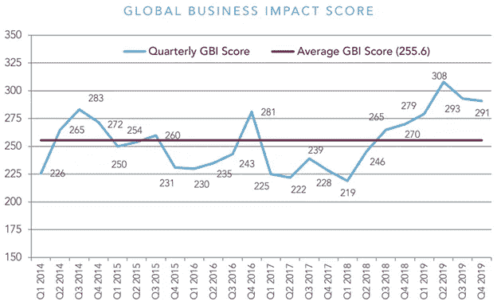
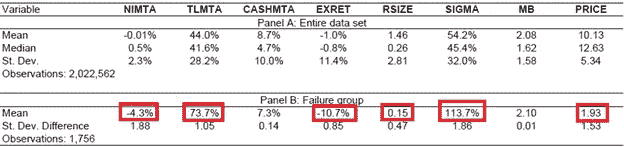

# 信用风险和机器学习概念-3

> 原文：<https://medium.com/analytics-vidhya/credit-risk-and-machine-learning-concepts-3-d2bb2f39d843?source=collection_archive---------12----------------------->

在我关于这个主题的前两篇文章中，我介绍了三种信用风险管理的方法，并讨论了在在线系统、互联网和丰富的数据和计算能力出现之前，我为英国的一个组织提出的解决方案的一些细节。

1.全球企业的出现

全球供应链是复杂的，唯一不变的是变化——无论是由于经济或地区的不稳定，还是国内政策的变化。例如，即使转向网上消费者商务，降低了配送中心到商店的运输对消费者的重要性，有利于配送中心，稳定性和长期物流和货运业务也在迅速变化。随着新市场的开放或创业机会的增加，有 4 个行业在前 18 个月内失败的次数最多。这些是:1。建筑；2.零售；3.运输；第四。制造业。(资料来源——邓白氏全球商业失败报告)。

因此，与单个实体相关的微观算法，如 Altman Z-Tests 和 Merton 模型，没有考虑到全球商业市场的波动性。如果您代表的是一家在全球开展业务的组织，或者您的客户是一家全球企业的一部分，这些信息将成为如何考虑客户支付能力未来潜在问题的辅助信息。Dun and Bradstreet 出版和计算全球商业指数季刊，帮助模拟全球趋势。

邓白氏全球商业影响评分来自[2019 年第四季度全球商业风险报告。](https://www.dnb.com/perspectives/finance-credit-risk/quarterly-global-business-risk-report.html)

2.流动性和其他微观指标

实体支付和履行债务义务的能力基于业务部门、现金流、借款利率和管理方向。在上一篇文章中，我提到了债务与有形资产净值的比率。此外，EBITDA/总资产、净销售额/总资产、权益账面价值/总负债、营运资本/总资产和留存收益/总资产是 Altman Z-Score 的传统组成部分，这些比率的权重取决于公司结构和业务部门。

**奥特曼 Z 评分公式**

最初的公式是为公开交易的制造公司创造的。

z 得分= 1.2(A)+1.4(B)+3.3(C)+0.6(D)+1.0(E)

其中:

A =营运资本(流动资产-流动资产)/总资产(衡量公司的流动性)

B=留存收益/总资产(衡量累计利润与资产之比)

C=息税前利润(EBIT) /总资产(衡量公司资产产生的利润)

D=股权的市场价值(Mkt。首都+优先股)/总负债(比较公司价值与其负债)

E=销售额/总资产(效率比率——衡量公司的资产在销售额中产生了多少)。

z 分数结果:

< 1.81 represents a company in distress.

Z-Score between 1.81 and 2.99 represents the “caution” zone.

Z-Score of over 3.0 represents a company with a safe balance sheet.

Z1-Score — Score for Private Firms

Z1 = .72(A) + .84(B) + 3.107(C) + .42(D) + 1.0(E)

Z2 — Score For Non-Manufacturers & Emerging Markets

Z2 = 6.56(A) + 3.26(B) + 6.72(C) + 1.05(D)

These have been the standard algorithms to determine and predict the financial health of a company. There are studies that show Z-scores are fairly accurate to predict 80%-90% of bankruptcies around 18 months to a year prior to the fact. However, it does create some false positives. Wesley Grey, a PhD from Research Insights Factor investing, called out the reliance on these 5 ratios of the Z-Score and consider other more sophisticated alternatives.( [的 z-Score https://alpha architect . com/2011/07/23/stop-using-Altman-z-Score/](https://alphaarchitect.com/2011/07/23/stop-using-altman-z-score/))

有一个模型考虑了 8 个因素，这些因素可以预测一个实体未来的财务问题。约翰·坎贝尔、延斯·希尔舍尔和简·齐拉吉在 2008 年的《T2 金融杂志》上解释了这个模型

总有形资产的净收入超过市场价值。(尼姆塔)

总负债超过总有形资产的市场价值。(TLMTA)

股票或现金和短期投资超过有形资产总额的市场价值(CASHMTA)

与价值加权标准普尔 500 指数回报(EXRET)相关的超额回报

对于上市公司-

公司的市场权益估值与标准普尔 500 的总估值之比(RSIZE)

股票回报率标准差计算为连续 3 个月的股票回报率平方和的平方根，按年计算。(西格玛)

公司的市场账面价值(MB)

实体的当前股价。

在下表中，面板 A 显示了所有公司一个月的观察结果；面板 B 显示了一年内倒闭企业的汇总统计数据。

3.交易业绩报告。

确定了适当的比率作为我们得分的基础，并确定了通过适当的加权和财务考虑表明了低破产风险，可以从主要信用评级或众包信息中提供的下一组信息是对实体及时支付债务和具有商定付款条款的未结发票的衡量。这被称为“期限外天数”，值为 0 表示该实体如期履行付款义务。现有客户还会有内部付款历史记录来补充这一决定，趋势可能预示着不久的将来—如果该实体开始付款越来越晚，这可能表明管理或现金流问题。

4.报告的其他因素

在企业的正常生命周期中，它可能会面临诉讼和法律判决，判决的未结余额可能是一个要考虑的因素。一个企业在起步阶段最为脆弱，因为许多企业在经营活动的第一年就失败了。实体详细信息的认证，如及时或完整的监管文件、联系方式的验证和作为商业活动中心的公司位置，也可以纳入信用条款的总体评分和确定中。可以自动搜索和确认指定的电话号码。可以使用主要交易地址的街道地图或鸟瞰图，通过视觉图像分析和评估，来识别它是否是合法的营业场所并显示商业活动。可以从商业和贸易出版物中收集 RSS 流，并对提及该实体或其高级管理层的任何相关文章进行搜索和情感分析。

5.齐心协力

最终输出将应用所选计算的加权输出，无论是遵循奥特曼 Z-Score、默顿或坎贝尔、希尔舍尔和齐拉吉还是任何其他方法。对信贷经理最有用的结果将是应用于指示信贷工具和限额是否将被扩展的总体分数和分级，以及最大信贷和其他条款的指示。一种算法，它可以根据所有适当元素的加权分数的合计来确定最大信用限额。

前两期可以在这里找到:

[https://medium . com/@ Geoff . Leigh 19/credit-risk-and-machine-learning-concepts-85ef 47 c 978 c 7？source = friends _ link&sk = 5249 ACC 679330 BD 64 c 76 bcae 1 DC 074d 1](/@geoff.leigh19/credit-risk-and-machine-learning-concepts-85ef47c978c7?source=friends_link&sk=5249acc679330bd64c76bcae1dc074d1)

[https://medium . com/@ Geoff . Leigh 19/credit-risk-and-machine-learning-concepts-2-fc 37 E1 a 05183？sk = 94ef 606 E1 c 60 e2cf 1522 b 9 c 38 a5 e 144 e](/@geoff.leigh19/credit-risk-and-machine-learning-concepts-2-fc37e1a05183?sk=94ef606e1c60e2cf1522b9c38a5e144e)

下一期文章将介绍创建矩阵以确定信用限额和信用条款所涉及的一些机制，可以在这里找到:[https://medium . com/@ Geoff . Leigh 19/credit-risk-and-machine-learning-concepts-4-3c 44 b 479 a3 d 1？source = friends _ link&sk = cf 6 Fe 8 b 0 a 96d 01 c 68971 f 72 bcc 179229](/@geoff.leigh19/credit-risk-and-machine-learning-concepts-4-3c44b479a3d1?source=friends_link&sk=cf6fe8b0a96d01c68971f72cbc179229)