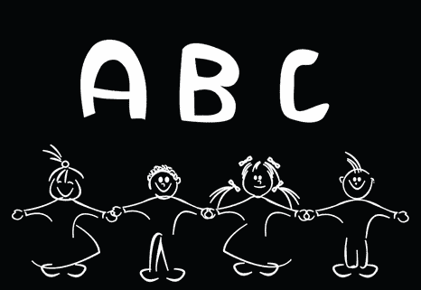
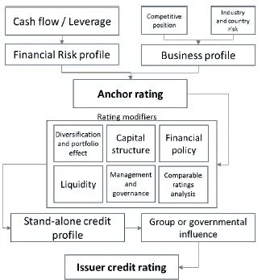
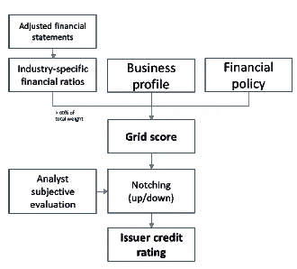
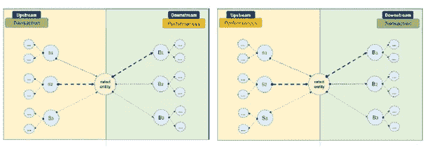
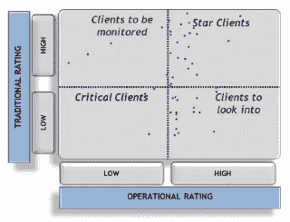

# 信用风险和机器学习概念-4

> 原文：<https://medium.com/analytics-vidhya/credit-risk-and-machine-learning-concepts-4-3c44b479a3d1?source=collection_archive---------18----------------------->

信用限额和交易条款的基于规则的矩阵确定

前几期文章介绍了一些概念，以及使用纯算术关键比率对一个实体的财务稳定性和信用评分进行评级的方法的基础，对这些信息和其他一些信息应用适当的权重来确定信用限额和评分范围。在这里，我将简要介绍一些随机方法，与定性流动性和绩效指标进行对比，并展示如何将这些方法整合到一个复杂的基于规则的指令集和解决方案中，正如我最近为一家国际供应链组织所做的那样。

评估上市企业财务稳定性的经典随机方法是默顿模型，以及类似的模型，如穆迪的 KVM。简而言之，我们正在计算实体在未来某个日期无法履行所有债务的概率。

在这个模型中，公司资产的价值被假定为服从对数正态扩散过程，具有恒定的波动性。非证券化债务的近似是商业信用风险评级的修改，不同于证券权益和债务，将债务视为纯贴现债券，其中承诺在时间 *T* 支付 *D* 。如果公司的资产价值在时间 *T* 超过了承诺的支付额 *D* ，债务很可能会被偿还。如果资产价值低于承诺的付款额，公司很可能会拖欠付款。

公司的权益定义为 *E* 。公司有形资产的价值是 *A* 。如果 *E0* 和 *A0* 代表今天的权益和有形资产的价值，并且 *ET* 和*在*是时间 *T* 的价值。

支付方式为: *ET =* max[ *AT* — D，0]。进一步的标准计算将确定权益，并且通过设定假定利率和资产波动的恒定值，可以采取额外的步骤来确定公司在时间 t 违约的风险中性概率。

考虑到影响，默顿模型的另一个实现使用了两个隐含波动率

杠杆(L)的表达式。如果 *D* * = *De* -rT 被定义为承诺的现值

债务支付，那么杠杆率是通过: *L* = *D* / A0* 得出的

评级和分析机构，如穆迪、惠誉、标准普尔等，在得出其对上市公司的评级时，会应用额外的专有因素，包括:

宏观经济条件

竞争力

盈利战略

资本结构公司治理

定量财务分析价值链

财务比率技术和 R&D

流动性其他运营方面

风险

集团影响和行业细分趋势

下面显示了一些考虑风险评估的矩阵:

标准普尔方法矩阵

穆迪 KVM 的方法矩阵

四(4)个评级轴通常用于支持银行巴塞尔新协议的要求。

财务模型，解决了 6 个表明前期风险的因素:

现在被普遍认为是信贷风险良好指标的 6 个因素是:

盈利能力；资本结构；流动性；活动；增长和规模。这些因素的权重分别为 26%。24%.14%.13%.13%, 10%.财务的“新鲜度”也非常重要。

2.内部行为模式—该客户和组织的运营评级和行为

3.外部行为模式——与其他组织的行为、参考指标和一般条件。

4.定性模式——专家对关系和非数字指标的判断。

然后将应用向上或向下的信贷风险系数。

向上和向下的信用风险因素

运营绩效与客户细分有关，并应用持续监控以确保保留以下表格中的评级位置，重点警告和监控高风险和低运营评级，并确定为什么对低风险评级的高运营评级客户(因此被认为在财务上更不稳定)进行评级。

还应理解接受运营评级低且风险波动性低的客户的理由，以确保他们不会对提供信贷条款的组织的整体现金流或现金可用性产生负面影响。

我整理的评级框架已经考虑了这些驱动因素中的许多因素，并将传统评级(如商业信用和金融稳定性)分数与运营评级相结合，因此我们可以专注于高分数但低绩效的支付历史客户和高绩效但低评级的客户。对数据的分析表明，这 4 个方框是对客户行为的适当聚类，因为客户具有应收账款和向他们提供的信用期限。

观察和聚类支持加权和“加减”或“微调”方法，以考虑 CRA 评级作为起点、客户提供的额外财务数据以及来自 CRA 报告源和交易历史的趋势信息，以提供映射到信贷限额和信贷期限设置的组织范围的计算值，并对信贷限额范围值授予适当的批准权限。

前三期可以在这里找到:

[https://medium . com/@ Geoff . Leigh 19/credit-risk-and-machine-learning-concepts-85ef 47 c 978 c 7？source = friends _ link&sk = 5249 ACC 679330 BD 64 c 76 bcae 1 DC 074d 1](/@geoff.leigh19/credit-risk-and-machine-learning-concepts-85ef47c978c7?source=friends_link&sk=5249acc679330bd64c76bcae1dc074d1)

[https://medium . com/@ Geoff . Leigh 19/credit-risk-and-machine-learning-concepts-2-fc 37 E1 a 05183？sk = 94ef 606 E1 c 60 e2cf 1522 b 9 c 38 a5 e 144 e](/@geoff.leigh19/credit-risk-and-machine-learning-concepts-2-fc37e1a05183?sk=94ef606e1c60e2cf1522b9c38a5e144e)

 [## 信用风险和机器学习概念-3

### 在我关于这个主题的前两篇文章中，我介绍了三种信用风险管理的方法，并讨论了…

medium.com](/analytics-vidhya/credit-risk-and-machine-learning-concepts-3-d2bb2f39d843) 

下一期文章将从信用风险分析师的角度出发，可以在下面找到:

[https://medium . com/@ Geoff . Leigh 19/credit-risk-and-machine-learning-concepts-5-88 F2 DC 1e 18 e 2？source = friends _ link&sk = 2a 4015 BC 86 ee 6071716865356 ffb1 a0d](/@geoff.leigh19/credit-risk-and-machine-learning-concepts-5-88f2dc1e18e2?source=friends_link&sk=2a4015bc86ee6071716865356ffb1a0d)