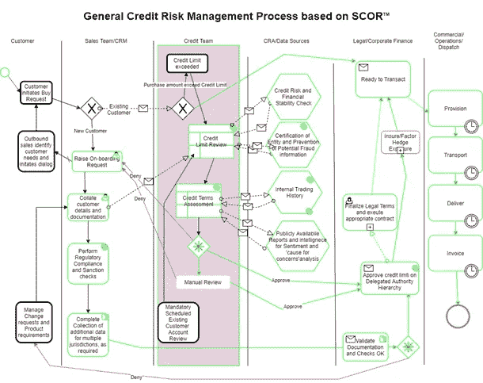

# 信用风险和机器学习概念— 5

> 原文：<https://medium.com/analytics-vidhya/credit-risk-and-machine-learning-concepts-5-88f2dc1e18e2?source=collection_archive---------11----------------------->

信贷经理如何消费和利用这些信息

信用风险分析师必须快速完成初步的信用筛选，因为通常会有一笔交易正在进行中，并且会有一个新客户加入，或者计划对当前客户进行审查，以根据客户及其财务状况的最新信息的表现和考虑进行评估。在复杂的业务中，入职和信用审查不一定只有一种方法。在上一节中，我展示了组成主要金融分析组织分数的组件的工作流，主要是针对市场证券的交易员。在这里，我将阐述企业信用风险分析师通常会采取的步骤。

在由供应变革管理协会(ASCM)和美国生产和库存控制协会(APICS)发布的供应链运营参考模型(SCOR)中，已经为供应链组织制定了一种方法，该模型采用了成员组织和个人确定的各种方法，并将其嵌入到用于交付库存、按订单生产或按订单设计的产品的 sD(交付)流程中，这是供应链运营中业务活动整体层次结构的一部分。接收、输入和验证订单以及授权产品退货和发票退款的步骤可能会有所不同。

SCOR 围绕 6 个主要业务流程组织——计划、采购、制造、交付、返回和启用(SCOR 12.0 参考模型文档)

人工信用审查的活动有哪些？

当没有足够的数据时，例如信用评级机构拒绝产生分数，或者评级和评估指示的情况没有消极到建议拒绝信用条款，但也没有积极到可以评估风险水平，则进行人工信用审查，这也可以是团队活动。这将允许一些信贷管理分析师提供输入，如果他们之前已经分析了正在讨论的实体。关键因素是确定该实体不存在欺诈性经营的可能性，或者信贷请求来自持续经营的合法企业。销售人员的输入可能很重要，财务数据的分析在更大程度上也很重要。流动性突然变差或未结应收账款支付缓慢可能有合理的原因，但不一定是客户的问题。可能发生了异常事件，并且可能有额外的条款可以适用，例如为客户的未付发票提供银行担保，或新交易的预付款，以及经常账户余额的付款条件。这也包括更大的公司财务团队中的合伙人，以及潜在的内部或聘请的法律顾问。还依赖于对如何评估资产负债表和损益表(P&L)的专业理解。
关键细节是，必须做出的最有根据的猜测应该是确定交易对手支付债务的能力、能够支持债务的公司的内在价值，以及实体在满足普遍接受的商业信贷条款惯例的态度和能力方面报告或经历的行为。

下一篇文章将讨论该方法的范围和一些见解，以包括机器学习和辅助智能，下一篇文章将研究一家失败公司的剖析，可以在这里找到:[https://medium . com/analytics-vid hya/credit-risk-and-Machine-Learning-concepts-6-15 adee 7c 0454？source = friends _ link&sk = 7f 039 a 815 c 58 ce 5371 c 12 ef 5c 72 AC 926](/analytics-vidhya/credit-risk-and-machine-learning-concepts-6-15adee7c0454?source=friends_link&sk=7f039a815c58ce5371c12ef5c72ac926)

前 4 期可以在这里找到:

[https://medium . com/@ Geoff . Leigh 19/credit-risk-and-machine-learning-concepts-85ef 47 c 978 c 7？source = friends _ link&sk = 5249 ACC 679330 BD 64 c 76 bcae 1 DC 074d 1](/@geoff.leigh19/credit-risk-and-machine-learning-concepts-85ef47c978c7?source=friends_link&sk=5249acc679330bd64c76bcae1dc074d1)

[https://medium . com/@ Geoff . Leigh 19/credit-risk-and-machine-learning-concepts-2-fc 37 E1 a 05183？sk = 94ef 606 E1 c 60 e2cf 1522 b 9 c 38 a5 e 144 e](/@geoff.leigh19/credit-risk-and-machine-learning-concepts-2-fc37e1a05183?sk=94ef606e1c60e2cf1522b9c38a5e144e)

[https://medium . com/analytics-vid hya/credit-risk-and-machine-learning-concepts-3-D2 bb 2 f 39d 843](/analytics-vidhya/credit-risk-and-machine-learning-concepts-3-d2bb2f39d843)

[https://medium . com/analytics-vid hya/credit-risk-and-machine-learning-concepts-4-3c 44 b 479 a3 d 1？source = friends _ link&sk = cf 6 Fe 8 b 0 a 96d 01 c 68971 f 72 bcc 179229](/analytics-vidhya/credit-risk-and-machine-learning-concepts-4-3c44b479a3d1?source=friends_link&sk=cf6fe8b0a96d01c68971f72cbc179229)