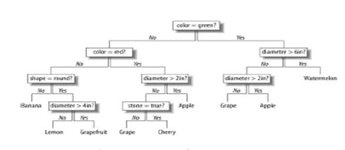
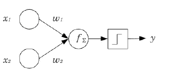
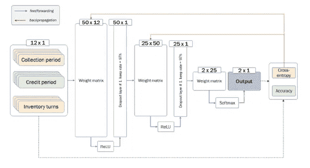

# 信用风险和机器学习概念-6

> 原文：<https://medium.com/analytics-vidhya/credit-risk-and-machine-learning-concepts-6-15adee7c0454?source=collection_archive---------22----------------------->

这个领域的机器学习组件是什么？


设计 AI/ML 解决方案的标准方法通常包括创建决策树，该决策树作为设计思维行为驱动的开发的结果，映射出功能和动作序列。这不是序列图的层次，而是流程和决策流的映射，否则人会这样做，但规则是直接编码的，以使自动化流程具有额外的洞察力，并且能够在几乎即时的时间内一次考虑比人类多得多的数据。



决策树的示例

下面介绍的模型标志着风险建模实践的巨大飞跃。之前提出的所有方法都预先假定模型的参数独立于观察数据集 *D* ，因此 *PD = p(x|⊖，D) = P(x|⊖)*

非参数模型释放这个假设，这样 *⊖* = *f* ( *D* )。模型的解释力，即 *⊖* 能够捕捉到的关于数据的信息量，也取决于 *D* 的基数，即数据越多，模型越精确。

决策/分类树由一系列基于协变量向量的条件是/否子句组成，用于对客户进行分组。因此，神经网络的作用是基于多个变量快速地将一个实体与已经失败或无法偿还债务的其他实体一起分类。

正在建模的新方法采用查看净营运营运资本(NOWC)和一些其他趋势的方法，以确定支付能力，以及可用的支付历史、行业趋势、经济趋势、法院诉讼和持续经营的验证。NOWC 是一个衡量公司用营运资产偿还所有营运负债的能力的比率。这是一个重要的指标，因为它显示了公司的杠杆和流动资产的数量。

它还显示了一家公司如何利用其资源运营，以及该公司如何有效地适应意外事件和新机遇。这在等式本身中是显而易见的。

净营运营运资本公式的计算方法是从营运资产中减去营运负债，如下所示:

现金+应收账款+存货—应付账款+预提费用或流动经营资产—流动经营负债。

这一指标更多地与现金流而不是净营运资本计算联系在一起，因为 NWC 包括所有的流动资产和流动负债。正因为如此，NOWC 经常被用来计算自由现金流量。比如说。：

假设 Bob 的运输和供应公司的资产负债表上有以下资产:

*   现金:10 万美元
*   应收账款:20 000 美元
*   库存/修复:50 万美元
*   应付账款:300 000 美元
*   应计费用:100 000 美元

鲍勃将按如下方式计算他的 NOWC:

$100,000 + $20,000 + $500,000 — $300,000 — $100,000 = $220,000

这意味着鲍勃可以只用他的一部分流动资产来偿还他所有的流动负债。因此，如果他的卖主或债权人要求同时偿还他的所有债务，他将能够还清这些债务，并且仍然有大量的流动资产来经营企业。

净营运资本(NOWC)是营运流动资产超过营运流动负债的部分。在大多数情况下，它等于现金加应收账款加存货减应付账款减应计费用。

经营性流动资产是指(a)支持业务运营所需的资产，以及(b)预计在未来 12 个月内转换为现金的资产。它们不包括当前的金融投资。

经营性流动负债是指(a)为开展业务而承担的负债，以及(b)预计在未来 12 个月内偿还的负债。它们不包括任何流动贷款或有息负债。

净营运资本不同于(净)营运资本，后者等于流动资产减去流动负债。NOWC 是计算自由现金流的中间输入。自由现金流等于经营现金流减去经营资产总投资减去净营运资本投资。

**决策分类**

决策树或分类树由一系列基于协变量向量的条件子句(通常是/否子句)组成，这些子句将实体分类成组。以二元分类树为例，如“规模”,包括报告的全职员工人数和趋势、企业年龄、总净值减去无形资产和趋势、包括争议和破产保护或重组申请在内的任何县判决、包括主要高管和任何负面犯罪活动和法庭案件在内的贸易和新闻报道情绪分析。

正如在决定水果标识的图中一样，每个节点将客户集分成不同的子集，直到到达结束节点。客户被细分为许多类别，必须给这些类别分配一个违约概率(PD)。这不是简单地给一个客户打分，而是根据观察到的数据对“可能违约”的分类进行调整和再调整。因此，这不允许对同一类别的客户进行区别对待。一个较小的缺点是，由于该模型不是基于任何统计假设，因此无法评估具有统计相关性的框架的稳定性。因此，稳健性与训练样本的良好性相关联。该模型有助于构建变量之间潜在的复杂或非线性关系:例如，协变量可能只在树的某个节点上相关，并且只与特定的客户子集相关。能够清晰地模拟协变量之间的相互作用，这是决策树的另一个优势，不幸的是，如果变量之间的相互作用是先验已知的，这将变得特别有用。

**神经网络**

神经网络得名于这样一个事实，即它们天真地似乎模拟了大脑的工作方式。神经网络更正式的定义是多层感知器。感知器(见下图)是系统的基本单元，由 *n* 个轴突和一个节点构成，分别代表 *n* 个权重和一个基本运算，它接受输入并产生加权输入运算的输出。从每个节点输出的值通过平滑函数进行“过滤”,该函数重新调整输出的比例，以使结果不会在多个层之间发散，从而使处理单元负担过重。



感知器的简单例子

事实上，它们可以通过协变量 *x* 的多个向量的一系列级联矩阵乘法来描述。模型的输出可以被称为 PD，通过层中的一系列中间节点(连接的一系列感知器)与输入相关，这些节点接收向量 *x* 或其他节点的输出作为输入，并依次向一个或多个下游节点或最终输出输出值。没有对网络内关系的结构进行初步假设。事实上，从初始状态开始，网络可以用违约/未违约公司的不同样本进行“训练”。基本上，训练是一个称为反向传播的迭代过程，通过该过程，一种算法评估节点连接的最佳权重，比较网络当前状态的结果。

建议对净营运资本(NOWC)法进行修改。这减少了各种信用评级机构使用的多达 24 个特征。对一组最初移动的 4 年财务数据进行趋势评估。员工数量、收入、规模和经营年限将是评级评估的初始限定条件，否则，如果未达到阈值，信用咨询状态将在完成评级后返回，或者如果公司不再活跃(处于清算、解散、破产状态)，则信用受到质疑。财务数据的及时性因素“新鲜度”随着其变得越来越陈旧，会对信用风险因素产生负面影响。

部门评估和一般商业状况将是下一次评估。这被建模为神经网络模型的多层感知器结构，类似于下面的框架:



蓝线表示沿着网络传播输入的前馈流，而橙色箭头表示路径反向传播过程。

最后给出了目前正在开发中的这种神经网络的一些 R 代码。2017 年米兰理工大学的加布里埃尔·博诺米·博塞吉亚撰写的基于供应链的信誉论文作为理学硕士的重要内容。一些其他内容也来源于该参考文献。

这是我关于信用风险和机器学习的博客的第六部分。下一部分将考虑失败和失败公司的剖析，以及 NOWC 神经网络感知器方法可能已经表明了什么，可通过以下链接获得:

[信用风险和机器学习概念-7](/@geoff.leigh19/credit-risk-and-machine-learning-concepts-7-fdc9eb8dcd14?source=friends_link&sk=f3142319d5eb06540512264f587623e4)

前 5 期可以在这里找到:

[https://medium . com/@ Geoff . Leigh 19/credit-risk-and-machine-learning-concepts-85ef 47 c 978 c 7？source = friends _ link&sk = 5249 ACC 679330 BD 64 c 76 bcae 1 DC 074d 1](/@geoff.leigh19/credit-risk-and-machine-learning-concepts-85ef47c978c7?source=friends_link&sk=5249acc679330bd64c76bcae1dc074d1)

[https://medium . com/@ Geoff . Leigh 19/credit-risk-and-machine-learning-concepts-2-fc 37 E1 a 05183？sk = 94ef 606 E1 c 60 e2cf 1522 b 9 c 38 a5 e 144 e](/@geoff.leigh19/credit-risk-and-machine-learning-concepts-2-fc37e1a05183?sk=94ef606e1c60e2cf1522b9c38a5e144e)

[https://medium . com/analytics-vid hya/credit-risk-and-machine-learning-concepts-3-D2 bb 2 f 39d 843](/analytics-vidhya/credit-risk-and-machine-learning-concepts-3-d2bb2f39d843)

[https://medium . com/analytics-vid hya/credit-risk-and-machine-learning-concepts-4-3c 44 b 479 a3 d 1？source = friends _ link&sk = cf 6 Fe 8 b 0 a 96d 01 c 68971 f 72 bcc 179229](/analytics-vidhya/credit-risk-and-machine-learning-concepts-4-3c44b479a3d1?source=friends_link&sk=cf6fe8b0a96d01c68971f72cbc179229)

[https://medium . com/analytics-vid hya/credit-risk-and-machine-learning-concepts-5-88 F2 DC 1e 18 e 2？source = friends _ link&sk = 2a 4015 BC 86 ee 6071716865356 ffb1 a0d](/analytics-vidhya/credit-risk-and-machine-learning-concepts-5-88f2dc1e18e2?source=friends_link&sk=2a4015bc86ee6071716865356ffb1a0d)

示例 R 代码片段:

```
>> ####> #> # load library> #> ####>> library ( tensorflow )>> ####> #> # Import data> #> ####>> companies <- read.csv (“ companies _ large _ norm.csv “,header =T)> companies <- companies [,c (1 ,2 ,8:19) ]> active <- companies [ which ( companies $ Active == 1) ,]> default <- companies [ which ( companies $ Default == 1) ,]>> ### SAMPLE 5000 active and 5000 default for testing purposes>> smp _act <- sample ( nrow ( active ), size = 5000)> smp _def <- sample ( nrow ( default ), size = 5000)> test <- rbind ( active [smp _act ,], default [smp_def ,])> test <- test [ sample ( nrow ( test )) ,]> train <- rbind ( active [-smp _act , ], default [-smp_def , ])> train <- train [ sample ( nrow ( train )) ,]> train _ active <- active [-smp _act ,]> train _ default <- default [-smp_def ,]> test _ values <- as.matrix ( test [ ,3: ncol ( test )])> test _ labels <- as.matrix ( test [ ,1:2])>> # ####> #> # build the mlayer perceptronxxixxxx APPENDIX I. SCRIPTS> #> # ####>> n_ classes <- 2L> n_ nodes _l1 <- 50L> n_ nodes _l2 <- 25L> keep _ prob = 0.97> x_ length <- as.integer ( ncol ( companies ) -2)> ### Initialize weigths and biases with values> from truncated std. normal>> weight _ variable <- function ( shape ) {+ initial <- tf$ truncated _ normal (shape , stddev = 0.1)+ tf$ Variable ( initial )+ }> bias _ variable <- function ( shape ) {+ initial <- tf$ constant (0.1 , shape = shape )+ tf$ Variable ( initial )+ }> ### define connections within the network>> x <- tf$ placeholder (tf$ float32 , shape (NULL , x_ length ))> hl1 _W <- tf$ Variable (tf$ truncated _ normal ( shape (x_length , n_ nodes _l1),+ stddev + name > hl1 _b <- tf$ Variable (tf$ zeros ( shape (n_ nodes _l1)), name = “B_hl_1”)> hl2 _W <- tf$ Variable (tf$ truncated _ normal ( shape (n_ nodes _l1 , n_ nodes _l2),+ stddev + name > hl2 _b <- tf$ Variable (tf$ zeros ( shape (n_ nodes _l2)), name = “B_hl_2”)> out _W <- tf$ Variable (tf$ truncated _ normal ( shape (n_ nodes _l1 , n_ classes ),+ stddev + name > out _b <- tf$ Variable (tf$ zeros ( shape (n_ classes )), name = “B_ outupt _ layer “)>> ### define activation and droupout function>> l1 <- tf$ add(tf$ matmul (x,hl1 _W),hl1 _b)> l1 <- tf$nn$ relu (l1)> drop1 <- tf$nn$ dropout (l1 , keep _ prob )> l2 <- tf$ add(tf$ matmul (drop1 ,hl2 _W),hl2 _b)> l2 <- tf$nn$ relu (l2)> drop2 <- tf$nn$ dropout (drop1 , keep _ prob )> out <- tf$ add (tf$ matmul (l1 ,out _W),out _b)> y <- tf$nn$ softmax (out )> ### placeholder for output variable>> y_ <- tf$ placeholder (tf$ float32 , shape (NULL , n_ classes ))>> ### error function>> cross _ entropy <- tf$ reduce _ mean (-tf$ reduce _sum (y_ * tf$ log(y),xxxi+ >> ### declaration of the backpropagation> ### optimization algorithm ( ADaptive Moment estimation )>> optimizer <- tf$ train $ AdamOptimizer ()> train _ step <- optimizer $ minimize ( cross _ entropy )>> ### store and reload partially trained model if needed>> # do not run first time>> # loader = tf$ train $ import _ meta _ graph (“ folder “)> # loader $ restore (sess , tf$ train $ latest _ checkpoint (“ folder “))>> # saver $ restore (sess , “ folder “)>> ### do not run when loading>> init <- tf$ global _ variables _ initializer ()> sess <- tf$ Session ()> sess $ run( init )>> ### Define accuracy metrics>> correct _ prediction <- tf$ equal (tf$ argmax (y, 1L), tf$ argmax (y_, 1L))> accuracy <- tf$ reduce _ mean (tf$ cast ( correct _ prediction , tf$ float32 ))>> ### Define summary statistics to be monitor training> ### ( accuracy and and weigths )>> summary <- tf$ summary $ scalar (“ accuracy “, accuracy )> summary _ CrossEntropy <- tf$ summary $ scalar (“ cross entropy “,+ > summary _hl1 _W <- tf$ summary $ histogram (“ weights1 “,hl1_W)> summary _hl2 _W <- tf$ summary $ histogram (“ weights2 “,hl2_W)> summary _ output _ layer _W <- tf$ summary $ histogram (“ weightsOut “,out_W)> summary _w <- c( summary _hl1_W,+ summary _hl2_W,+ summary _ output _ layer _W+ )> summary _ weights <- tf$ summary $ merge ( summary _w)> log _ writer <- tf$ summary $ FileWriter ( paste0 (“ folder “,j))> saver <- tf$ train $ Saver ()>> ####> #> # Train the model> #> ####>> for (i in 1:5000) {xxxii APPENDIX I. SCRIPTS++ ### random selection of the training batch++ train <- rbind ( train _ default ,+ train _ active [ sample ( nrow ( train _ default )) ,])++ ### shuffle++ train <- train [ sample ( nrow ( train )) ,]++ ### separate input (col 1 and 2) from labels ( remaining columns )++ train _ values <- as.matrix ( train [ ,3: ncol ( train )])+ train _ labels <- as.matrix ( train [ ,1:2])++ batch _xs <- train _ values+ batch _ys <- train _ labels++ sess $ run( train _step ,+ feed _ dict = dict (x = batch _xs , y_ = batch _ys))++ ### save accuracy on testing sample each 10 iteration++ if(i %% 10 == 0){+ accuracy = sess $ run( summary ,+ feed _ dict = dict (x = test _ values , y_ = test _ labels ))++ log_ writer $ add _ summary ( accuracy , i)++ error = sess $ run ( summary _ CrossEntropy ,+ feed _ dict = dict (x = test _ values , y_ = test _ labels ))+ log_ writer $ add _ summary (error , i)++ weigths = sess $ run ( summary _ weights )+ log_ writer $ add _ summary (c, global _ step = i)+ }++ ### save entire model each 100 iterations++ if(i %% 100 == 0){+ saver $ save (sess , “ folder “, global _ step =i)++ }+ }>> ####> #> # Show stats> #> ####>> ### print confusion matrix , balanced accuracy and accuracyxxxiii>> prediction = tf$ equal (tf$ argmax (y, 1L), 2L)> pred = sess $ run(tf$ argmin (y, 1L), feed _ dict = dict (x = test _values ,+ > conf.mat <- table ( Predictions =pred , Actual = test _ labels [ ,1])> conf.mat>> bal.accuracy <- ( conf.mat [1 ,1]/sum( conf.mat [ ,1]) ++ conf.mat [2 ,2]/ sum( conf.mat [ ,2]))/2> bal.accuracy>> sess $ run( accuracy , feed _ dict = dict (x = test _values , y_ = test _ labels ))>
```