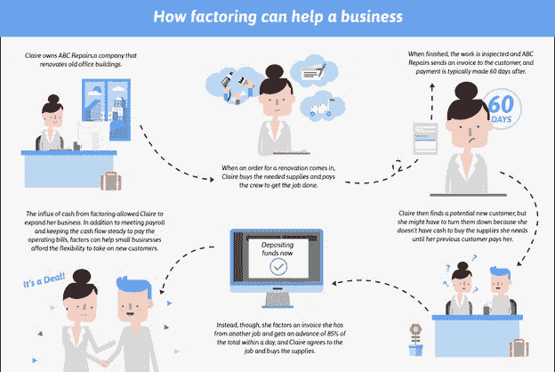

# 信用风险和机器学习概念-8

> 原文：<https://medium.com/analytics-vidhya/credit-risk-and-machine-learning-concepts-8-e9884a420a92?source=collection_archive---------19----------------------->

组织如何利用应收账款头寸——应收账款支持的保理和信用贷款

ID 132340480 designer 491 | Dreamstime.com 根据许可使用。

作为一个企业，其目标是向顾客销售某种产品并从中获利，反复向同一目标群体销售，但根据产品或服务的不同，只向一个大的目标群体销售。收入可以完全以现金为基础，因此降低了风险，或者按照“报价-订单-履行(根据需要制作并交付)-发票-现金”标准供应链的企业对企业的更正常的交易条款，在履行/交付之间创建未结发票和未结应收款，此时项目或服务可能对供应商有成本因素，直到客户支付发票并为您提供现金。然后，您可以履行您的义务，如向员工支付工资，向供应商支付在制品或库存项目的费用，以及在支付任何税款和贷款利息后，股东和投资者预期的任何利润或股息。

因此，在将订单转换为现金时，您总是会延迟付款，这种延迟可能会影响您可用于履行义务或继续投资和扩大业务的自由现金数量。有许多方法可以解决这个问题，除了坚持预付款或在交货时直接从客户那里提取付款的能力。这些机制在零售企业对消费者的环境中很好，但在企业对企业的环境中就不正常了。

那么，企业如何保护自己免受坏账的影响呢？在本系列的前几篇博客中，我介绍了信用风险主题和常用于评估商业风险的定量方法，并介绍了该领域的一些新主题，包括事件发生概率的更随机考虑，以及包含定性和定量信息的神经网络和决策树方法，以确定风险水平。以及作为客户的公司能够迅速支付发票的速度和可能性的风险水平，这些确定的子集包括当未结应收账款情况不能结清时，实体停止经营并成为坏账负债的可能性的预测。因此，对应收账款风险的一些标准方法是第一步。

ID 34369674 Kheng Ho Toh | Dreamstime.com 根据许可使用。

您的应收账款风险有多大？

要评估的主要指标是应收账款集中系数。如果坏账情况在历史上每年不到总账面的 1%，那么对于现有客户和可能已经到位的催收流程，或者缓解程序(如保理和信用贷款的 A/R 支持，将在后面详细讨论)来说，不存在需要注意的大问题。

集中度的计算方法是每个公司占应收账款余额百分比的平方和。这个数字用小数表示，应该是一个介于 0 和 1 之间的值，值越接近 0，表示 AR 组合的集中度越低，这是一个很好的指标，表明风险得到了分散，因此一个客户不是主要的收入来源。多样性指数也可以通过将浓度比除以 1 得到。返回的值将表明拥有大部分未结应收账款的关键客户的数量。

以 Proximo LLC 的 Mike Periu 在美国运通网站上发表的一篇文章为例，说明这意味着什么:

*第一步:计算每家公司占总体 AR 余额的百分比*

*   公司 1:5 万美元/475 万美元= 1.05%
*   公司 2:5 万美元/475 万美元= 1.05%
*   公司 3:7.5 万美元/475 万美元= 1.58%
*   公司 4:10 万美元/475 万美元= 2.11%
*   公司 5:22.5 万美元/475 万美元= 4.74%
*   公司 6:23 万美元/475 万美元= 4.84%
*   公司 7:26 万美元/475 万美元= 5.47%
*   公司 8:26 万美元/475 万美元= 5.47%
*   公司 9:100 万美元/475 万美元= 21.05%
*   公司 10:250 万美元/475 万美元= 52.63%

*第二步:将第一步计算出的每家公司的百分比平方并转换成小数*

*   公司 1: 1.05% * 1.05% = .011% = 0.00011
*   公司 2: 1.05% * 1.05% = .011% = 0.00011
*   公司 3: 1.58% * 1.58% = .025% = 0.00025
*   公司 4: 2.11% * 2.11% = .044% = 0.00044
*   公司 5: 4.74% * 4.74% = .224% = 0.00224
*   公司 6: 4.84% * 4.84% = .234% = 0.00234
*   公司 7: 5.47% * 5.47% = .3% = 0.003
*   公司 8: 5.47% * 5.47% = .3% = 0.003
*   公司 9: 21.05% * 21.05% = 4.432% = 0.04432
*   公司 10:52.63% * 52.63% = 27.701% = 0.27701

*第三步:将第二步得到的方块相加*

*   0.00011 + 0.00011 + 0.00025 + 0.00044 + 0.00224 + 0.00234 + 0.003 + 0.003 + 0.04432 + 0.27701 = 0.33282

本例中的应收账款集中度为 0.33282。多样性指数为 3.0046。

因此，如果 AR 投资组合的价值受到关注，首先要考虑的策略是向更多客户销售，或者通过为提前付款提供折扣来激励现有客户加快付款。这是假设公司已经考虑了将销售转化为有用现金的风险和时间，包括足够的利润来覆盖您可能必须承担的任何借款或债务，以实现盈利目标。

从本质上说，通过向客户提供正常的贸易信用条件，公司实际上是借钱给他们，这样他们就可以从公司而不是从竞争对手那里购买商品或服务。我在本系列的第一篇博客中介绍了 3 种方法和许多子集，概括地说，通常有 3 种方法，风险评估问题可以分解为 14 个主题和子主题。

方法 1:将全部或部分销售发票委托给商业信用保险公司承保，或对未付发票进行财务重组

方法 2:使用商业信用报告机构来管理信用评级，并通过使用金融服务或银行循环信贷或由 AR 组合担保的商业贷款来减轻每笔销售交易的所有风险。

方法 3:使用商业信用机构报告、作为现有客户的过去交易历史、非结构化外部数据以及基于规则的计算的组合，通过在循环信贷或商业贷款担保中使用 AR 组合来减轻风险

**商业信用保险**为一个组织的每个未结账户收取费用，如果客户在一定时间后仍未付款，将给予最大敞口信用额度，并保证通常可收回未结金额的 80%。Euler Hermes 和 AIG 是这种贷款的最主要供应商，该流程包括在保险条款规定的商定限额范围内提供保险之前，提交客户申请批准和信用限额评级。如果客户不能或拒绝付款，这种解决方案最终会进行支付。

**应收账款保理**。这是一种以折扣获得未结发票的方式，在支付发票时偿还金额，或者让保理公司拥有债务并负责任何收款。实质上，这意味着对每张发票的总额进行贴现，以支付给保理实体，并且只收取发票上 80–90%的现金。许多主要银行可能会向企业提供这项服务，甚至还有更多非银行金融服务公司，其中一些公司的资质可疑，但第一商业信贷、Blue Vine、CIT Commercial Services 是一些领先的美国商业因素实体。可能收取的价格将取决于公司的业务，以及您希望让其发票成为保理商的客户的业务和信誉。有两种级别的保理业务，有追索权保理业务和无追索权保理业务，有追索权保理业务通常收费较低。当票据贴现商承担潜在坏账的所有风险时(这是无追索权票据贴现)，收取较高的费用或费率来补偿风险。对于追索权保理，如果部分应收款无法收回，出售其应收款的公司仍对保理公司负有一定的责任，这可能是因为产品有问题、账单不正确或发票上的其他争议未解决。这种情况在初创企业或小企业中很常见，因为它们现在需要资金，而没有自由现金的后果对公司更为不利。

(来自蓝藤公司的网站【https://www.bluevine.com/ )。

商业信贷额度:花旗银行、美国银行、汇丰银行或富国银行等主要银行都有商业贷款产品，可以提供给商业客户。一类是循环信贷，这样，商业支票账户不一定必须有可用的清算余额才能批准从账户中提款，否则将被视为透支情况，银行根据收到的未结应收账款信息设置最大额度。银行这样做是期望他们允许存在的债务头寸将是暂时的，并且当客户全额汇出未结 AR 头寸时，预期收入足以弥补。公司将不得不在账户透支的日子里支付银行费用和债务利息，但这将是一个比未经批准的透支情况下公司可能付出的成本更有利的条款，如果他们试图在当前账户资金不足时付款的话。应收账款，基本上是将在 30 至 60 天内支付的发票，被贷方视为可用于获得融资的资产。贷方认为应收账款是一种很强的抵押品形式，因为它流动性很强，可以很快变成现金。要用你的应收账款做抵押，它们必须是高质量的。在提供这种或其他类型的由应收账款支持的商业贷款之前，银行或金融服务实体必须披露和批准公司与客户开立信用账户的程序，包括信用和其他贸易证明、收款流程以及完整的报价到现金系统。

**基于资产的贷款:**在从新企业到成熟成功企业的阶段，可能会使用上述一种或两种机制，而不仅仅是信用保险或承担所有信用风险。介于应收账款组合支持的保理和商业信用额度之间的是基于资产的贷款。这可能会考虑到应收账款，以及库存和机械等其他资产。如果应收账款和存货被用作抵押品，基于资产的贷款可以表现得像信用额度。基本上，你建立了一个贷款账户，当发票和存货变得可用时，企业可以从中提款。与票据贴现额度一样，通常最多只能提取应收账款价值的 80%,并且当现金可用时，预计将支付额度和适用的利息费用。基于资产的贷款通常适用于年销售额超过 100 万美元的公司。

这是我关于信用风险和机器学习的博客的第 8 部分。下一部分将考虑一个实体如何应对不断变化的市场和利用人工智能。

前 7 期可以在这里找到:

[https://medium . com/@ Geoff . Leigh 19/credit-risk-and-machine-learning-concepts-85ef 47 c 978 c 7？source = friends _ link&sk = 5249 ACC 679330 BD 64 c 76 bcae 1 DC 074d 1](/@geoff.leigh19/credit-risk-and-machine-learning-concepts-85ef47c978c7?source=friends_link&sk=5249acc679330bd64c76bcae1dc074d1)

[https://medium . com/@ Geoff . Leigh 19/credit-risk-and-machine-learning-concepts-2-fc 37 E1 a 05183？sk = 94ef 606 E1 c 60 e2cf 1522 b 9 c 38 a5 e 144 e](/@geoff.leigh19/credit-risk-and-machine-learning-concepts-2-fc37e1a05183?sk=94ef606e1c60e2cf1522b9c38a5e144e)

[https://medium . com/analytics-vid hya/credit-risk-and-machine-learning-concepts-3-D2 bb 2 f 39d 843](/analytics-vidhya/credit-risk-and-machine-learning-concepts-3-d2bb2f39d843)

[https://medium . com/analytics-vid hya/credit-risk-and-machine-learning-concepts-4-3c 44 b 479 a3 d 1？source = friends _ link&sk = cf 6 Fe 8 b 0 a 96d 01 c 68971 f 72 bcc 179229](/analytics-vidhya/credit-risk-and-machine-learning-concepts-4-3c44b479a3d1?source=friends_link&sk=cf6fe8b0a96d01c68971f72cbc179229)

[https://medium . com/analytics-vid hya/credit-risk-and-machine-learning-concepts-5-88 F2 DC 1e 18 e 2？source = friends _ link&sk = 2a 4015 BC 86 ee 6071716865356 ffb1 a0d](/analytics-vidhya/credit-risk-and-machine-learning-concepts-5-88f2dc1e18e2?source=friends_link&sk=2a4015bc86ee6071716865356ffb1a0d)

[https://medium . com/@ Geoff . Leigh 19/credit-risk-and-machine-learning-concepts-6-15 adee 7c 0454？source = friends _ link&sk = 7f 039 a 815 c 58 ce 5371 c 12 ef 5c 72 AC 926](/@geoff.leigh19/credit-risk-and-machine-learning-concepts-6-15adee7c0454?source=friends_link&sk=7f039a815c58ce5371c12ef5c72ac926)

[https://medium . com/analytics-vid hya/credit-risk-and-machine-learning-concepts-7-FDC 9 EB 8 DCD 14？source = friends _ link&sk = f 3142319 D5 EB 06540512264 f 587623 E4](/analytics-vidhya/credit-risk-and-machine-learning-concepts-7-fdc9eb8dcd14?source=friends_link&sk=f3142319d5eb06540512264f587623e4)