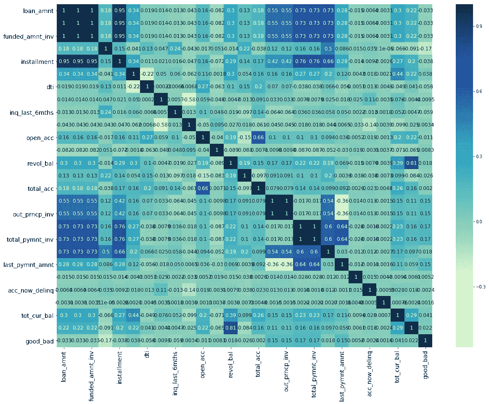
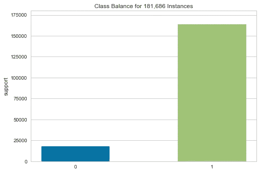

# Python 中的信用风险建模

> 原文：<https://medium.com/analytics-vidhya/credit-risk-modelling-in-python-3ab4b00f6505?source=collection_archive---------0----------------------->


图像的来源是[这里是](https://www.google.com/url?sa=i&url=https%3A%2F%2Fwww.microbilt.com%2Fnews%2Farticle%2Frisk-management-protects-business-valuation&psig=AOvVaw2LYiArjHhmmVJ1MwcCJHVH&ust=1604771231440000&source=images&cd=vfe&ved=0CAIQjRxqFwoTCPjj0Me87uwCFQAAAAAdAAAAABAJ)

信用风险是指借款人不偿还贷款、信用卡或任何其他类型的信贷工具的风险。信用风险是金融领域的一个重要话题，因为银行和其他金融机构在降低其信用风险方面进行了大量投资。2008 年全球金融危机背后的主要原因是抵押贷款给了信用评分差的客户。信用评分低表明客户拖欠贷款的可能性较高。这就是 2008 年经济衰退期间发生的事情；

> 房屋贷款借款人违约的概率很高，他们中的许多人开始拖欠贷款，银行开始没收他们的财产。这导致房地产泡沫破裂和房价大幅下跌。全球许多金融机构投资这些基金导致了经济衰退。银行、投资者和再保险人面临巨大的财务损失，许多金融和非金融公司破产。甚至非金融企业也受到了严重影响，要么是因为它们对这些基金的投资，要么是因为经济中的需求和购买活动非常低。简而言之，人们只有很少或没有钱可以花，这导致许多组织停止生产。这进一步导致大量失业。美国政府在经济衰退期间救助了许多大公司。你现在可能已经理解了为什么信用风险如此重要。如果当前和未来的信贷损失没有被正确识别或估计，整个经济都可能处于危险之中。(Deepanshu，2019 年，第 4 页)

python 中的信用风险建模可以帮助银行和其他金融机构降低风险，防止社会经历像 2008 年那样的金融危机。本文的目的是建立一个模型来预测个人拖欠贷款的概率。在构建模型时，将遵循以下步骤。

1.数据准备和预处理

2.特征工程和选择

3.模型开发和模型评估

# 数据准备和预处理

信用风险建模中使用的数据取自[这里是](https://drive.google.com/file/d/1xaF743cmUgI5kc76I86AeZDE84SMkMnt/view)。对数据的初步检查显示了总共 74 个特征，包括分类和数字特征。在建立任何机器学习模型之前，以适当的格式清理数据是非常关键的。

```
<class 'pandas.core.frame.DataFrame'>
RangeIndex: 466285 entries, 0 to 466284
Data columns (total 74 columns):
id                             466285 non-null int64
member_id                      466285 non-null int64
loan_amnt                      466285 non-null int64
funded_amnt                    466285 non-null int64
funded_amnt_inv                466285 non-null float64
term                           466285 non-null object
int_rate                       466285 non-null float64
installment                    466285 non-null float64
grade                          466285 non-null object
sub_grade                      466285 non-null object
emp_title                      438697 non-null object
emp_length                     445277 non-null object
home_ownership                 466285 non-null object
annual_inc                     466281 non-null float64
verification_status            466285 non-null object
issue_d                        466285 non-null object
loan_status                    466285 non-null object
pymnt_plan                     466285 non-null object
url                            466285 non-null object
desc                           125983 non-null object
purpose                        466285 non-null object
title                          466265 non-null object
zip_code                       466285 non-null object
addr_state                     466285 non-null object
dti                            466285 non-null float64
delinq_2yrs                    466256 non-null float64
earliest_cr_line               466256 non-null object
inq_last_6mths                 466256 non-null float64
mths_since_last_delinq         215934 non-null float64
mths_since_last_record         62638 non-null float64
open_acc                       466256 non-null float64
pub_rec                        466256 non-null float64
revol_bal                      466285 non-null int64
revol_util                     465945 non-null float64
total_acc                      466256 non-null float64
initial_list_status            466285 non-null object
out_prncp                      466285 non-null float64
out_prncp_inv                  466285 non-null float64
total_pymnt                    466285 non-null float64
total_pymnt_inv                466285 non-null float64
total_rec_prncp                466285 non-null float64
total_rec_int                  466285 non-null float64
total_rec_late_fee             466285 non-null float
recoveries                     466285 non-null float64
collection_recovery_fee        466285 non-null float64
last_pymnt_d                   465909 non-null object
last_pymnt_amnt                466285 non-null float64
next_pymnt_d                   239071 non-null object
last_credit_pull_d             466243 non-null object
collections_12_mths_ex_med     466140 non-null float64
mths_since_last_major_derog    98974 non-null float64
policy_code                    466285 non-null int64
application_type               466285 non-null object
annual_inc_joint               0 non-null float64
dti_joint                      0 non-null float64
verification_status_joint      0 non-null float64
acc_now_delinq                 466256 non-null float64
tot_coll_amt                   396009 non-null float64
tot_cur_bal                    396009 non-null float64
open_acc_6m                    0 non-null float64
open_il_6m                     0 non-null float64
open_il_12m                    0 non-null float64
open_il_24m                    0 non-null float64
mths_since_rcnt_il             0 non-null float64
total_bal_il                   0 non-null float64
il_util                        0 non-null float64
open_rv_12m                    0 non-null float64
open_rv_24m                    0 non-null float64
max_bal_bc                     0 non-null float64
all_util                       0 non-null float64
total_rev_hi_lim               396009 non-null float64
inq_fi                         0 non-null float64
total_cu_tl                    0 non-null float64
inq_last_12m                   0 non-null float64
dtypes: float64(46), int64(6), object(22)
memory usage: 263.3+ MB
```

**删除无关列处理缺失值**

有些列是标识符，在构建我们的机器学习模型时不包含任何重要信息。例子包括下面的 *id，member_id* 等。请记住，我们正试图建立一个模型来预测借款人拖欠贷款的概率，这意味着我们将不需要与一个人违约后的事件相关的特征。这是因为在发放贷款时，这些信息是不可用的。这些特性包括*恢复、collection_recovery_fee* 等。下面的代码表示删除的列。从数据集中删除了某些要素的缺失值。由于在这些列中观察到大量的缺失值，所以首选此选项。下面是用来删除不相关的列和缺失值的代码

**移除多重共线的特征**

高度相关的独立变量不能放在同一个模型中，因为它们提供相同的信息。相关矩阵用于检测这些变量。下面是相关矩阵。以下变量是多共线的 *'loan_amnt '，' funded_amnt '，' funded_amnt_inv '，' installment '，' total_pymnt_inv '和' out_prncp_inv'*



相关矩阵

**将变量转换成适当的数据类型**

一些变量不在它们适当的数据类型中，必须预处理成它们正确的格式。我们定义了一些函数来帮助自动化这个过程。用于将变量转换为相应数据的函数如下所示。

**目标列预处理**

我们数据集中的目标列是 loan status，它有不同的唯一值。这些值必须转换成二进制。对于不良借款人来说是 0，对于良好借款人来说是 1。在我们的案例中，不良借款人的定义是在我们的目标栏中属于以下情况的人。*冲销、违约、逾期(31-120 天)，不符合信贷政策。状态:冲销*其余的被归类为良好借款人。

# 特征工程和选择

**证据权重和信息价值**

信用风险模型通常需要是可解释的和易于理解的。要做到这一点，所有的自变量在本质上都必须是绝对的。由于一些变量是连续的，我们将采用证据权重的概念。

证据权重将帮助我们将连续变量转换为分类特征。连续变量被分成多个仓，并基于它们的权重，创建新的变量。此外，信息值有助于我们确定哪个特征在预测中有用。独立变量的信息值如下所示。IV 小于 0.02 的变量将不包括在模型中，因为它们没有预测能力 Siddiqi(2006)。

```
Information value of term is 0.035478
Information value of int_rate is 0.347724
Information value of grade is 0.281145
Information value of emp_length is 0.007174
Information value of home_ownership is 0.017952
Information value of annual_inc is 0.037998
Information value of verification_status is 0.033377
Information value of pymnt_plan is 0.000309
Information value of purpose is 0.028333
Information value of addr_state is 0.010291
Information value of dti is 0.041026
Information value of delinq_2yrs is 0.001039
Information value of inq_last_6mths is 0.040454
Information value of mths_since_last_delinq is 0.002487
Information value of open_acc is 0.004499
Information value of pub_rec is 0.000504
Information value of revol_util is 0.008858
Information value of initial_list_status is 0.011513
Information value of out_prncp is 0.703375
Information value of total_pymnt is 0.515794
Information value of total_rec_int is 0.011108
Information value of last_pymnt_amnt is 1.491828
Information value of collections_12_mths_ex_med is 0.000733
Information value of application_type is 0.0
Information value of acc_now_delinq is 0.0002
Information value of tot_coll_amt is 0.000738
Information value of tot_cur_bal is 0.026379
Information value of total_rev_hi_lim is 0.018835
Information value of mths_since_issue_d is 0.09055
Information value of mths_since_last_pymnt_d is 2.331187
Information value of mths_since_last_credit_pull_d is 0.313059
Information value of mths_since_earliest_cr_line is 0.02135
```

**阶层失衡**

在我们的训练集中，目标列的类标签是不平衡的，如下面的条形图所示。使用这种不平衡数据来训练我们的模型将使它偏向于预测具有多数标签的类。为了防止这种情况，我使用了随机过采样来增加目标列中少数类的观察次数。我们应该注意，这个过程只在训练数据上执行。



# 模型开发和模型评估

我们将使用逻辑回归模型来拟合我们的训练数据。该模型广泛用于信用风险建模，并可用于大规模。这很容易理解和解释。我们将用于评估模型的度量标准是基尼系数。该度量标准被信用评分机构广泛接受。

> 基尼系数可以用来衡量分类器的性能。分类器是一种模型，用于识别请求属于哪个类或类别。在信用风险中，分类器可以识别申请人属于违约还是非违约类别。基尼系数最常用于不平衡的数据集，在这种情况下，单凭概率就很难预测结果。基尼系数是风险评估的标准指标，因为违约的可能性相对较低。在消费金融行业，基尼可以评估贷款申请人是否会还款或违约的预测的 T2 准确度。更高的基尼系数有利于底线，因为可以更准确地评估请求，这意味着可以提高接受度，降低风险。

用于评估模型的基尼系数的输出如下所示。

```
0.7070253267718734
```

# 结论

该模型可进一步用于构建应用记分卡和行为记分卡。jupyter 笔记本的链接可以在[这里](https://github.com/yineme/Credit_Risk_modelling)找到

**来源**

[https://www . listen data . com/2019/08/credit-risk-modeling . htm](https://www.listendata.com/2019/08/credit-risk-modelling.html)l

[](https://www.listendata.com/2015/03/weight-of-evidence-woe-and-information.html) [## 证据权重和信息价值解释

### 在这篇文章中，我们将涵盖的概念，重量的证据和信息价值，以及如何使用它们在…

www.listendata.com](https://www.listendata.com/2015/03/weight-of-evidence-woe-and-information.html) 

[https://www . listen data . com/2015/01/model-performance-in-logistic-regression . html](https://www.listendata.com/2015/01/model-performance-in-logistic-regression.html)

[](https://towardsdatascience.com/how-to-develop-a-credit-risk-model-and-scorecard-91335fc01f03) [## 如何开发信用风险模型和记分卡

### 统计信用风险建模、违约概率预测和信用记分卡开发的演练…

towardsdatascience.com](https://towardsdatascience.com/how-to-develop-a-credit-risk-model-and-scorecard-91335fc01f03)