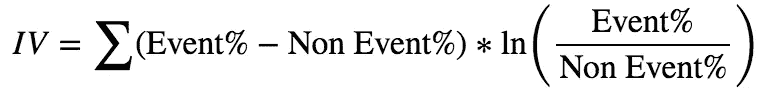
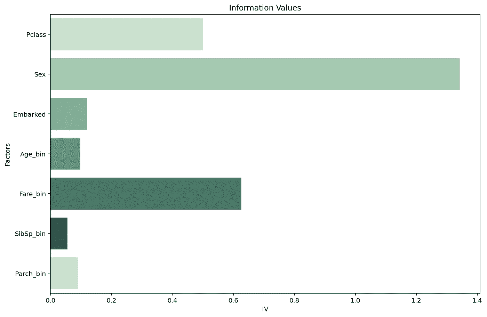
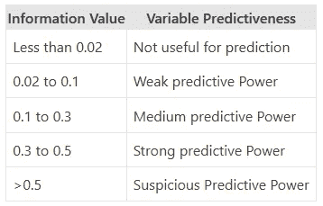
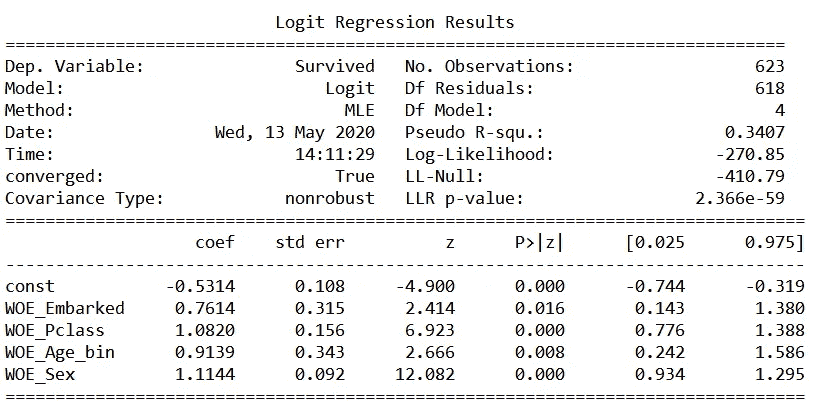
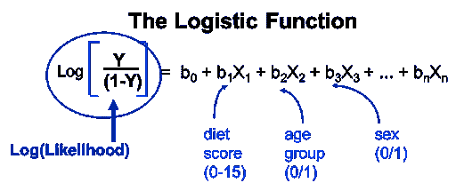
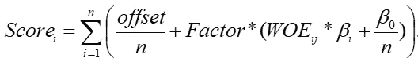
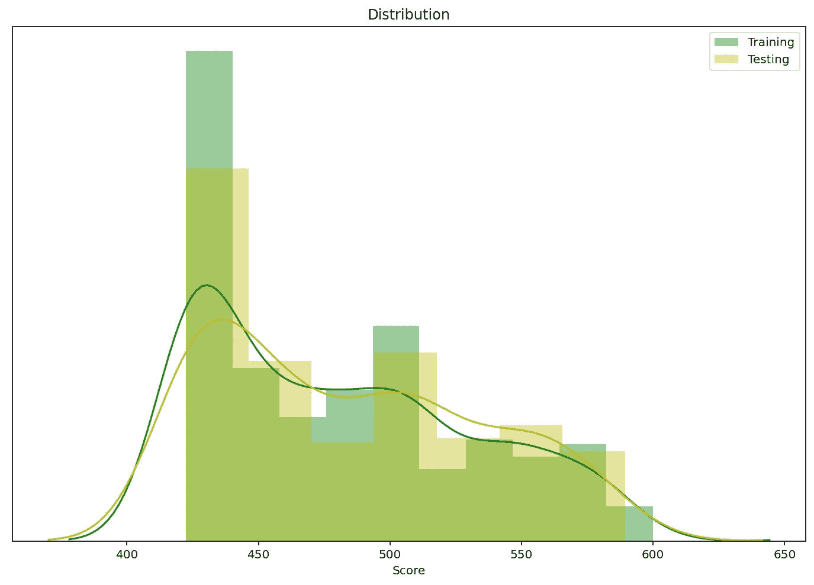

# 信用评分和泰坦尼克号数据集的小故事

> 原文：<https://medium.com/analytics-vidhya/credit-scoring-model-9730d530f4ef?source=collection_archive---------4----------------------->

大家好，今天我们开始了解**【信用评分】**概念，最好利用一些数据集来更具代表性。我将使用**号泰坦尼克号**数据集来展示如何给幸存乘客打分。


## 我们的目标

今天的主题包括:

1.  什么是信用评分？
2.  如何建立评分模型？
3.  分数怎么分配？

## 什么是信用评分？

信用评分是金融和银行业中最广泛有用的工具。该分数可以用于贷方的决策，即他们的客户是否可能偿还贷款。这也有助于贷方在提供贷款时衡量信用风险，无论风险是否在可接受的范围内。有几种信用评分模型，如:

*   申请分数
*   行为得分
*   收藏分数
*   存款分数

今天，我们重点关注最适合我们的示例数据集的**应用程序得分(A-Score)** 。

## 分数怎么算？

现在，我们将构建 A 分数模型，但在此之前，您可能会有这样的问题…

> 为什么一定要 A 分？

答案很简单。这取决于你有哪些数据类型。a 分是基于申请数据的。就“应用”而言，意味着代表特性的数据。例如，性别、年龄、地点、教育或其他一些东西通常定义你是谁/什么，很少改变。另一方面，如果你想建立其他模型，比如 B-Score，你可以使用交易数据，每天的点击数或者通常由行为改变的东西。霍普，这已经够清楚了。

**1。数据集**

正如我前面提到的，今天的数据将利用 Titanic 数据集，该数据集通常用于分类模型教程。我们正在做几乎相同的，但更多的细节与信用评分的概念，以分配生存的分数。数据集可以在[这里](https://raw.githubusercontent.com/mrpeerat/Machine_Learning_0-100/master/04%20Logistic%20Regression/titanic_data.csv)找到。下面是数据字典，给你一个数据结构的简要总结。

*   幸存:0 =否，1 =是 **(1 是我们的目标)**
*   Pclass:机票等级— 1 =第一，2 =第二，3 =第三
*   SibSp:泰坦尼克号上兄弟姐妹/配偶的数量
*   帕奇:泰坦尼克号上父母/孩子的数量
*   票价:乘客票价
*   上船:起运港 C =瑟堡，Q =皇后镇，S =南安普顿

快速检查数据集，发现在`‘Age’`列中有大量缺失值，在`‘Embarked’`中也有一些缺失值。

```
Checking missing data
PassengerId      0
Survived         0
Pclass           0
Sex              0
Age            177
SibSp            0
Parch            0
Fare             0
Embarked         2
dtype: int64
```

由于数据集的总数非常有限，我们希望尽可能地保留数据。因此，我们将通过替换为“mode”来修复缺失，然后准备好构建模型。

**2。模型建造**

在建立评分模型之前，有两件事你应该先知道。 **1。证据权重(WOE)** 和 **2。信息值(四)**。我们不使用原始值建模，但我们会将它们转换成 WOE。然后，我们使用 IV 进行特征选择。

> 证据的权重表明了自变量相对于因变量的预测能力。(ListenData 创始人 Deepanshu)


> 信息值是选择预测模型中重要变量的最有用的技术之一。这有助于根据变量的重要性对其进行排序。(ListenData 创始人 Deepanshu)



为了计算这些值，我们可以宁滨或分组我们的连续数字因素，如年龄，乘客费用或兄弟姐妹的数量*(如果你想)*。除此之外，它还可以用自己的值来表示组，例如机票等级和登机。在熊猫图书馆，你可以用`qcut()`函数作为`pandas.qcut(df[‘factor’], 10, duplicates = ‘drop’)`来计算十分位数宁滨。

初步结果可能不够好**(例如，得到 infinity IV)** ，因为当分组为十分之一时，它可能包含一些缺失的箱。你可以考虑重新宁滨，称为**粗分类**。该过程可以基于四分位数(从十分位数变化而来)、权重趋势、比率趋势(在我们的例子中是存活率)或任何其他专家感觉。所有这些都可以用来执行分析。粗略分类后，结果应该如下所示:



```
Factors
Age_bin      0.097745
Embarked     0.119923
Fare_bin     0.625860
Parch_bin    0.089718
Pclass       0.500950
Sex          1.341681
SibSp_bin    0.055999
Name: IV, dtype: float64
```

正如我前面提到的，我们通常不使用所有因素来开发模型，因为当有太多因素时，它可能会面临维护的困难。我们使用 IV 临界值进行单变量分析。因此，基于预先设定的阈值，一些因素将被消除。 ***(在我们的例子中，没有 IV 小于 0.02 的因子，全部保留！)***



用于单变量分析的一般 IV 阈值

下一步是执行**逻辑回归**。您可以拆分数据集用于训练和测试。这是为了确保超出样本数据的模型性能(不会出现过拟合)。今天我们用`statsmodels.api`通过调用`sm.Logit()`函数来建立模型。我们的目标(Y)是`‘Survived’`乘客，已经表示为 1。对于我们的特征因子(X ),我们首先利用通过单变量分析步骤的所有因子。应该注意的是，特征因子是**而不是**原始值，相反，我们将使用 WOE 来执行逻辑模型。

*** *重要**** 我们要考虑每个因子上的模型系数输出*(截距除外)*。**它必须具有相同的方向(例如，全部为正，全部为负)。**进行评分时会有影响。此外，如果 p 值大于 0.05，则应将其消除。因此，最终模型可能不包含所有功能。

下面是我的最终模型，可以看到所有的特征系数都有正方向，它们的 p 值都小于 0.05。



这是最终模型的样子

## 分数怎么分配？

今天的最终目标来了。我们现在准备计算记分卡。我们需要的是逻辑回归方程(模型系数)和权重值作为输入。这些是给你的**“Logit”**标度或**“Log odds”**值。



接下来，我们需要将 Logit 转换为记分卡的积分系统。我们将该方法称为**“缩放”**方法。该方法的主要假设是对数比值和分数可以表示为线性形式*(从上面的公式可以看出)*。有 3 个主要的记分卡设置变量:

*   **目标分数**是基准分数，可以换算成点。(您可以设置任何您想要的，它根本不会影响模型性能)
*   **目标赔率**是在某一点上指定的赔率比
*   **指向双倍赔率**意味着“某个点”的分数将增加两倍

让我们设置这些变量:

```
target_score = 600
target_odds = 30
pts_double_odds = 20
```

现在，我们可以通过应用以下公式来计算每位乘客的得分:

*   Factor = pts_double_odds / ln(2)
*   Offset = Score-{Factor * ln(Odds)}



完成这些后，我们现在得到了记分卡计算的最终公式。

## 结果

我申请了训练和测试数据集。下面是分数分布的样子。可以看出，最终模型给出了非常相似的结果。



我们可以做一些事情，比如找出存活率的最高分，并考虑其特征:

结果乘客 ID: 330，得分为 599.96。她是一名女性，当时年龄为 16 岁。她买了头等舱的票，从瑟堡的码头出来。

## 结束前

你可以看到开发评分模型并不困难。对于不同类型的数据，您可以利用相同的逻辑，并添加更先进的统计技术来构建更奇特的模型*(我的意思是更精确的模型)*。

例如，在构建 B 分数模型*(甚至 A 分数)*时，您可能会面临这样的问题，比如有太多的特征，您无法通过 IV 仅执行单变量分析。您需要的是双变量分析或多变量分析(例如相关性或聚类)来执行特征选择。

我会在这里完成它，如果你有任何问题，请让我知道。你可以通过下面的 LinkedIn 联系我。那里见！

 [## sasiwut chaiyade cha-EY 高级顾问| LinkedIn

### 查看全球最大的职业社区 LinkedIn 上 Sasiwut Chaiyadecha 的个人资料。Sasiwut 有 1 个工作列在…

www.linkedin.com](https://www.linkedin.com/in/sasiwut-chaiyadecha/) 

> 更新

[](https://github.com/naenumtou/creditrisk/blob/main/TitanicAppModel.ipynb) [## credit risk/titanicappmodel . ipynb at main naenum tou/credit risk

### 在 GitHub 上创建一个帐户，为 naenumtou/creditrisk 的发展做出贡献。

github.com](https://github.com/naenumtou/creditrisk/blob/main/TitanicAppModel.ipynb) 

与这篇文章相关的完整代码可以在上面的笔记本中找到。