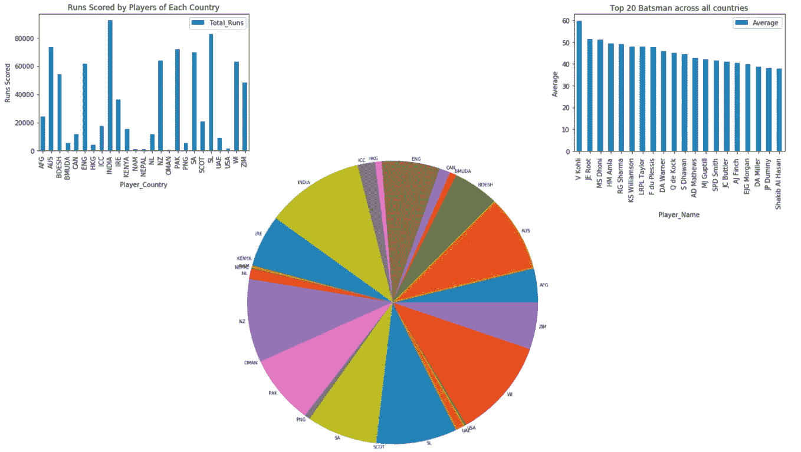
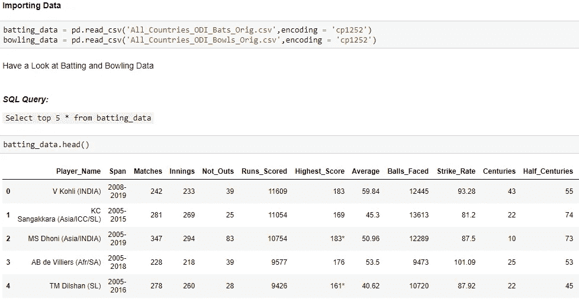
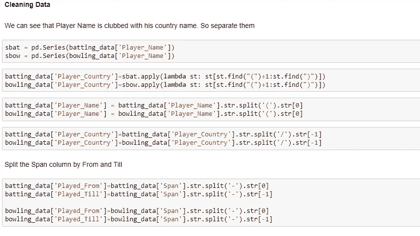
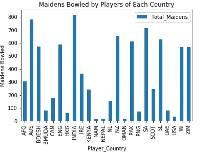
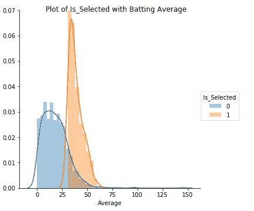
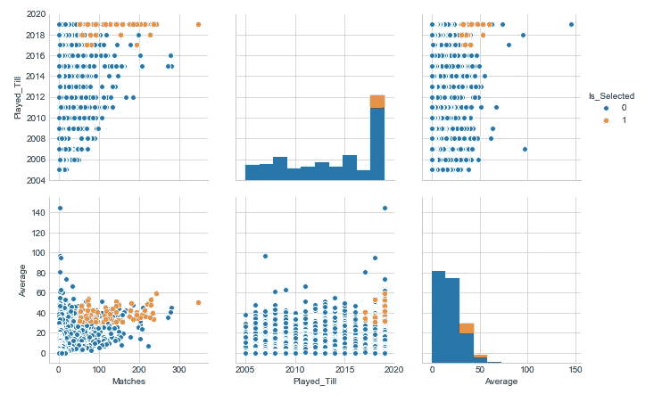
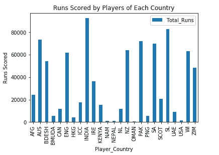
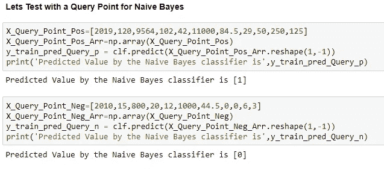
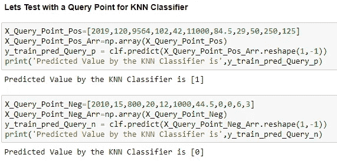

# 板球分析和预测

> 原文：<https://medium.com/analytics-vidhya/cricket-analysis-and-prediction-a7e9a7f3ebef?source=collection_archive---------18----------------------->

板球……

一项在印度不需要任何介绍的运动
一项人们崇拜的能让他们喜欢的球队赢得比赛的运动
一项不分年龄人人都喜欢的运动
一项运动员在赛场上大开杀戒的运动
一项团结所有人的运动
一项增强人民体质的运动
一项团结各国运动员的运动

除了这项运动，它还教会我们许多课程，包括生活课程

它教我们统计学

它教我们数学

它教会我们视觉化

它教会我们预测

作为一名板球爱好者，我制作了这个笔记本，用事实和数字告诉我们数据科学项目的生命周期。

**第一步:下载数据(数据收集)**

*   你可以使用一个叫做美丽的汤的工具通过网络抓取来下载数据。小心点。一些网站不允许人们废弃他们的网页。
*   使用 pandas read_csv 函数导入数据

**第二步:数据清洗(数据预处理)**

这是重要的一步。如果您错过了这一步，无论您构建的模型有多好，您都无法获得好的输出

*   您下载的数据中有许多垃圾字符，
*   可能有特殊字符。
*   整数类型数据可以作为对象加载。
*   特征中的数据可能没有被很好地表达
*   日期可以作为对象加载。
*   这些只是您应该执行数据清理的几个示例。

**第三步:探索性数据分析**

浏览所有功能，并尝试理解每个功能背后的故事。看看这些功能是如何相互关联的。如果看不懂数据，就借助剧情。它们让你对数据有很好的理解。

当你形象地想象它时，你就明白了。图片说明了很多数据

**第四步:特征工程**

这是任何数据科学项目中最重要的一步。有时候，这些特性是现成的。使用可视化，了解哪些特征有助于我们更好地预测类别标签。如果你不能使用给定的特性，使用领域知识设计/构建新的特性。这涉及到大量的数学、统计和几何直觉

**第五步:模型创建**

我们做了数据导入、数据清理、探索性数据分析、特征工程。现在是时候建立预测类别标签的模型了。不确定使用哪种型号？只需尝试 sklearn 中可用的各种模型，看看哪个模型适合您的问题陈述。

分类模型有很多。

*   k 最近邻分类器
*   朴素贝叶斯
*   决策树
*   支持向量机
*   逻辑回归
*   随机森林
*   更多的是助推和装袋

建立模型后，通过调整各种超参数值，尝试最大化精度并最小化模型的误差。

这不是结局。通过给出一个查询点来测试您的模型输出。这样，你就理解了你的模型，并分析了它是如何工作的。

**步骤 6:将您的模型部署到生产环境中**

您可以通过创建 API 和使用 Flask 将您的模型部署到生产中。根据业务需求，不断使用新数据点训练您的模型。

这是一个简单的项目，解释了数据科学项目的生命周期。喜欢就打吧。

你可以通过 LinkedIn 关注我。代码在 GitHub 存储库中

 [## Kalyan Kumar Kancharla -系统工程师-塔塔咨询服务| LinkedIn

### 经验丰富的软件工程师，有在信息技术和服务领域工作的经历…

www.linkedin.com](https://www.linkedin.com/in/kalyan-kumar-kancharla-44386a131/)  [## kalyan 457/板球分析和预测

### 此时您不能执行该操作。您已使用另一个标签页或窗口登录。您已在另一个选项卡中注销，或者…

github.com](https://github.com/Kalyan457/Cricket-Analysis-and-Prediction)