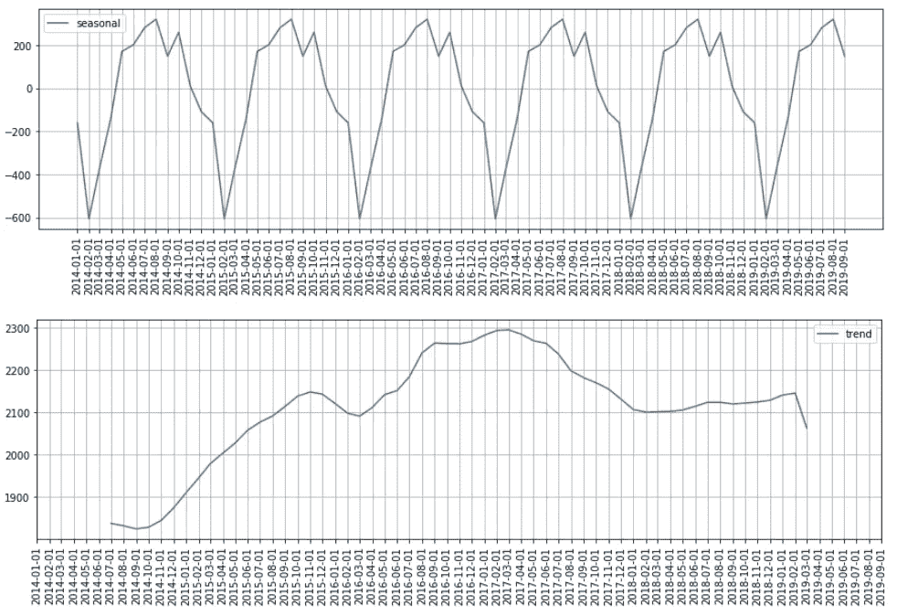
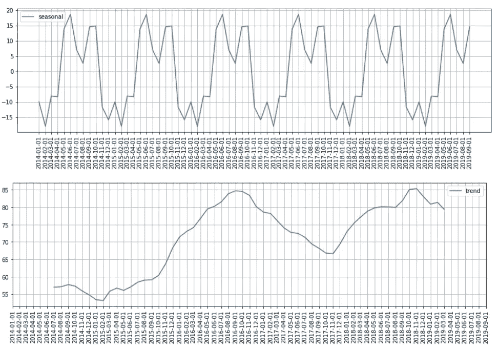
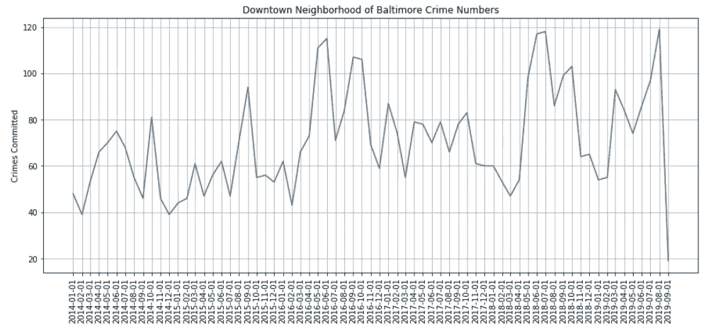
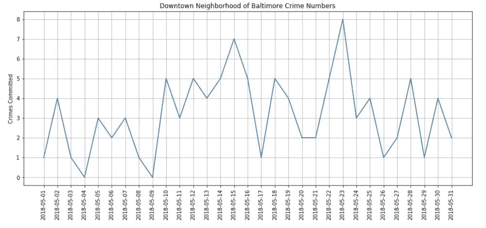
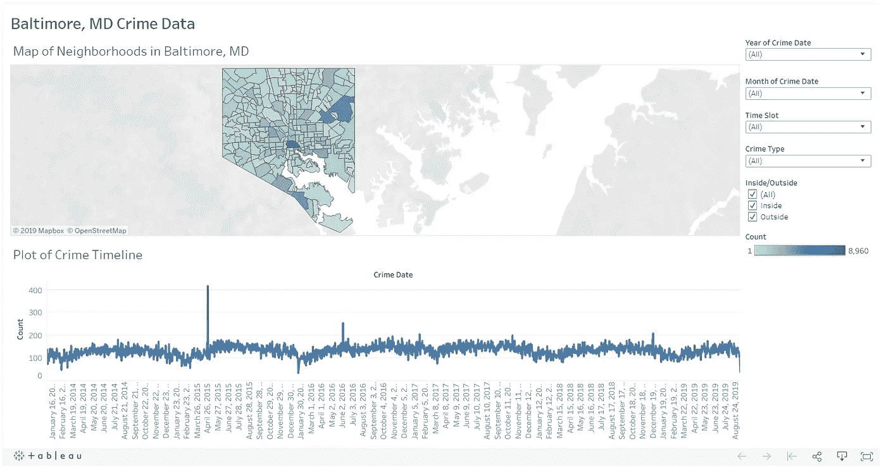

# 马里兰州巴尔的摩市的犯罪数据分析

> 原文：<https://medium.com/analytics-vidhya/crime-analysis-for-baltimore-md-7f8188a24c7c?source=collection_archive---------18----------------------->

马特·波波维奇在 [Unsplash](https://unsplash.com/s/photos/crime?utm_source=unsplash&utm_medium=referral&utm_content=creditCopyText) 上的照片

我读到过一个关于这个问题的研究，街上有更多的警察会减少犯罪吗？

如果你有兴趣阅读它，那么你可以点击[这里](https://mason.gmu.edu/~atabarro/TerrorAlertProofs.pdf)。

真正酷的是，他们发现了一个增加警力的地区，而这与犯罪率的上升毫无关系。这是通过在恐怖警报上升期间检查 DC 地区的犯罪来完成的，因此在该地区有更多的执法。他们发现通常发生在户外的犯罪总体下降了 15%。

我决定尝试把这个结论带到我认为合乎逻辑的下一步。如何在不雇佣更多警察的情况下减少犯罪？我想试着预测一年中或一天中特定时间犯罪率高的地区。这将告诉执法人员何时部署警察，到哪些地区，以便在警方现有资源的情况下最大限度地减少犯罪。

我选择关注马里兰州巴尔的摩的犯罪数据。我从他们的开放数据网站上获得这些数据，点击[这里](https://data.baltimorecity.gov/Public-Safety/BPD-Part-1-Victim-Based-Crime-Data/wsfq-mvij)可以看到。

**清理数据**

我的第一步是清理数据，我必须考虑丢失的值，填写基于经度和纬度的位置等等。
我做这件事很开心，如果你想看看我到底做了什么，或者自己用它来清理这些数据，那么你可以点击[这里](https://github.com/lraichik/Crime_data_prediction_and_analysis/blob/master/Obtaining%20and%20cleaning%20data.ipynb)查看我的 Jupyter 笔记本清理这些数据。

**EDA(探索性数据分析)**

一旦我清理了数据，我的下一步是进一步检查和分析它，以便更好地理解它。

就全市犯罪趋势而言，我发现的很少。季节性在 2 月份有所下降，可能会有一个多年的趋势。然而，由于我只有 2014 年及以后的连续数据，我无法确定这将是什么类型的趋势。你可以在这张图片中看到:

**对准一个区域**

我决定把注意力集中在市中心的邻近地区，因为那里的犯罪率最高，而且通常在一天中的 3 个小时内。

在这里，你可以看到从 11 月到 2 月的犯罪率下降，以及可能的多年趋势:

然后，我通过查看犯罪率上升的具体月份，试图找出犯罪率逐月上升的原因。这是该地区每月的犯罪情况:

有趣的是，在 2015 年 4 月至 5 月巴尔的摩骚乱期间，该地区的犯罪率并未飙升。

我找不到几个月内出现峰值的具体事件，这些事件似乎与犯罪率上升有关。例如，下面是 2018 年 5 月的地块:

正如你所看到的，这在我观察的其他几个月中是正常的，犯罪并没有真的一天超过 8 起。再加上无法找到那些天发生的可能导致这一高峰的具体事件，这意味着我无法得出结论，需要注意什么，然后才能知道何时何地应该部署更多的执法人员。

我对这些数据看得越多，就越觉得我没有足够的信息来预测犯罪发生的时间和地点。

**建模**

根据我所掌握的信息，我试图预测哪种犯罪正在发生，这是总体犯罪率最高的 5 个街区的情况。我还试图预测这 5 个街区中的哪一个发生了犯罪，然后能够知道在哪里部署警察。
我对他们两个都使用了随机森林，整体准确率在 50%左右，对某些犯罪和地区的准确率更低。

**画面仪表盘**

我在 Tableau 中做了一个有趣的仪表板，你可以根据日期，时间，邻居，犯罪进行过滤，如果犯罪发生在室内或室外，你可以找到自己对这些数据的见解。您也可以单击时间线来查看特定日期的地图。以下是仪表板的外观:

点击[这里](https://public.tableau.com/profile/levi.raichik#!/vizhome/BaltimoreMDCrimeData/Dashboard1)随意查看。

**结论**

根据我所拥有的或能够查找到的数据，我无法预测犯罪发生的地区或时间。我确实相信，随着更多犯罪数据的深入研究，可能会得到足够好的预测，以帮助部署执法机构，从而能够减少发生在外部的犯罪。不幸的是，这不是我目前能够用现有的数据做的事情。

我从这个项目中得到了一个教训，这似乎是所有数据科学家都要学习的一个重要教训，那就是我们不能总是以我们认为我们能够的方式使用我们拥有的数据。有时候我们只需要说，我们需要更多的信息来做我们想做的事情。

我不认为这是一次失败，而是一次重要的学习经历，因为我将继续成长为一名数据科学家。

请在下面随意评论，你可以点击[这里](https://github.com/lraichik/Crime_data_prediction_and_analysis)在 GitHub 中查看我这个项目的代码。