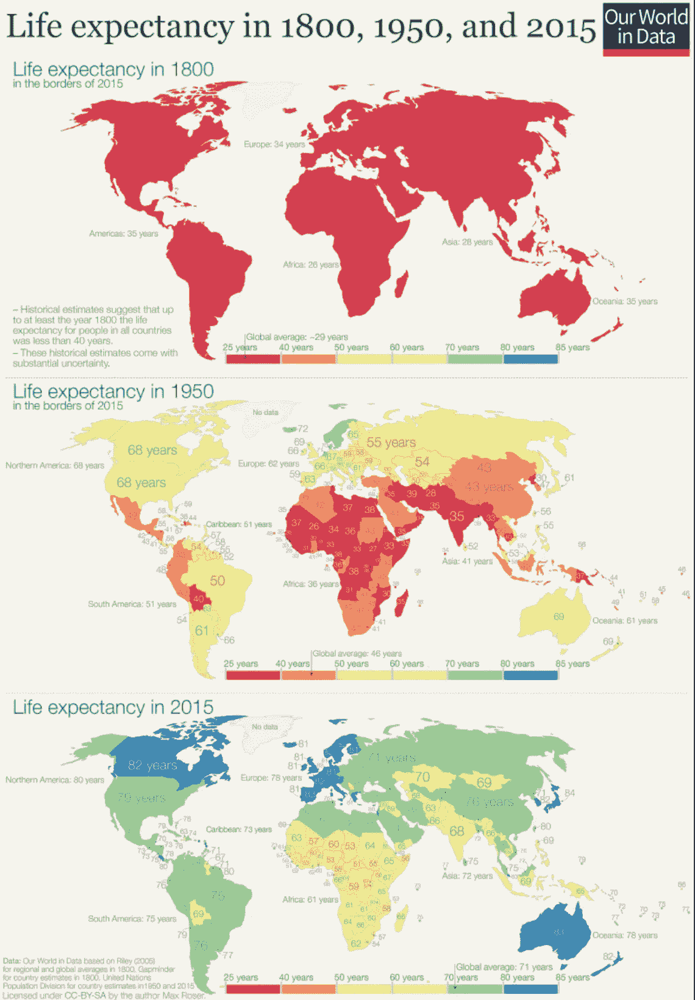
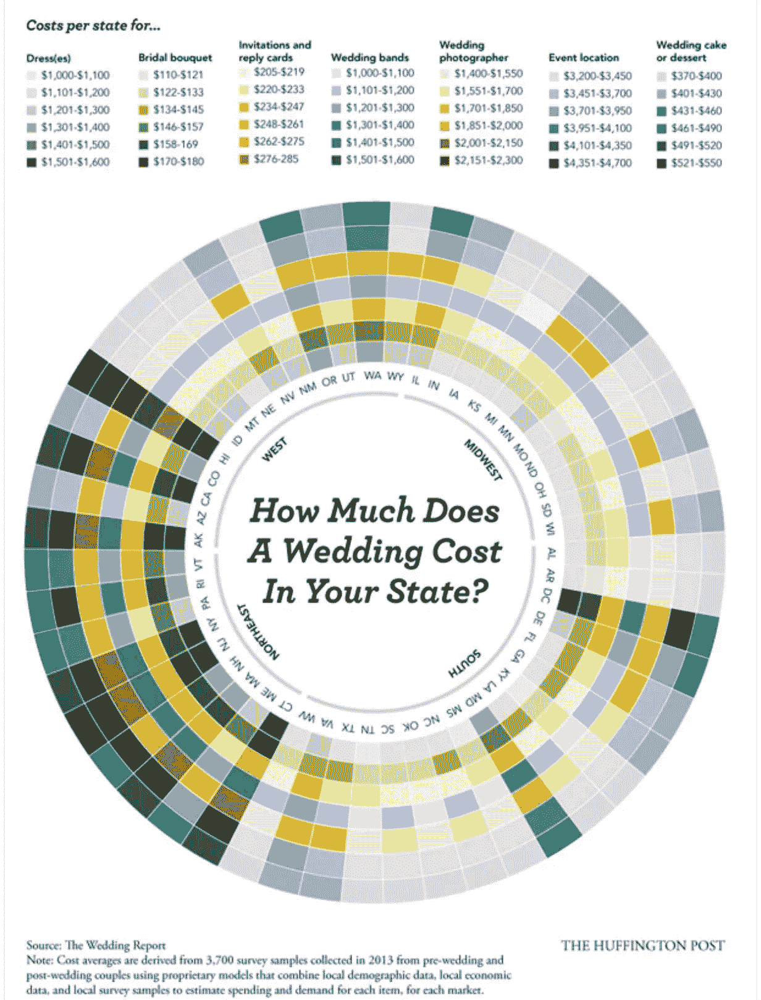

# 可视化评论

> 原文：<https://medium.com/analytics-vidhya/critiquing-datavisualization-b8bcb5a7d04a?source=collection_archive---------31----------------------->

## 评论好的和坏的可视化...

可视化是(抽象、复杂)数据的交互式表示，可以帮助人类更有效地执行任务。它帮助我们在更广泛的背景下看到特定的统计问题没有揭示的模式。此外，它还能帮助我们获得甚至是预定义的分析查询也无法获得的见解和问题。

在这篇博文中，我将评论一个好的和一个坏的可视化。

# **良好的可视化:**

在下面的可视化中，三张地图准确地显示了 1800 年、1950 年和 2015 年的预期寿命。我们可以很容易地解释预期寿命在过去三个世纪中的变化。在 1800 年，不管出生在哪里，人们的预期寿命只有 25-40 岁。随着新世纪(1950 年)的开始，新生儿有机会活得更长(超过 60 岁)，但这高度依赖于他们出生的地点。与出生在亚洲的人相比，生活在北美等大陆的人预期寿命更长。近几十年来，每个国家都在健康和许多其他方面取得了长足的进步。

1800 年、1950 年和 2015 年的预期寿命[ [来源](https://ourworldindata.org/life-expectancy-globally)

全球预期寿命从不到 30 岁增加到 72 岁以上；经过两个世纪的进步，我们甚至有望比我们的祖先多活一倍。

***评论:***

这三张地图设计简单，易于理解。由于地理空间地图在表达基于位置的数据集方面表现出色，因此它是这种表示法的绝佳选择。图例很好地代表了预期寿命范围，并用不同的颜色显示。

这些图例还突出了每个世纪的全球平均年龄，这使得比较给定世纪的进展更容易。由于第一张地图完全是红色的，很明显这些人的寿命不会超过 40 岁。所有三张地理空间地图中使用的颜色编码都是相同的，保持了一致性。

代表中使用的颜色不太明亮，选自现实世界，绿色表示良好的预期寿命(交通灯中的“开始”)，红色表示低预期寿命，黄色表示中等预期寿命。这些隐藏的特征使得这张地图很容易解读，一眼就能找到推论。显示写在地图上的真实数据增强了视觉效果，因为仅仅通过颜色梯度很难说出准确的数字。在第一张图中，左下角以项目符号格式提到的注释很容易阅读。

# **可视化效果不佳:**

堆叠圆环图显示了全美(51 个州)的婚礼预算。预算分为多个类别，如礼服，新娘花束，请柬，婚礼乐队，摄影师，活动地点和婚礼蛋糕。该图表显示了每个州的预算分配情况，并分为东北部、南部、中西部和西部地区。使用这种可视化的文章可以在[这里](https://www.thepinkbride.com/going-southern-wedding-season-really-saves-cash/)看到。

***批判*** :

这种可视化无法传达其目的，图表很容易误导。中心列出了 51 个州的代码，每个州又根据不同类型的婚礼费用进一步分类。色调代表类别。仅通过色彩饱和度很难比较价格范围。也很难解释数据的微妙之处，因为环形图对于描述这样的数据集是不准确的。

很难比较各州之间的价格。色彩饱和度被用来显示价格范围，但还不能很快回答哪个州的婚礼预算最贵。无论是条形图还是热图都是快速了解所有类别预算费用的有效方法。

希望你喜欢阅读这篇博文！！