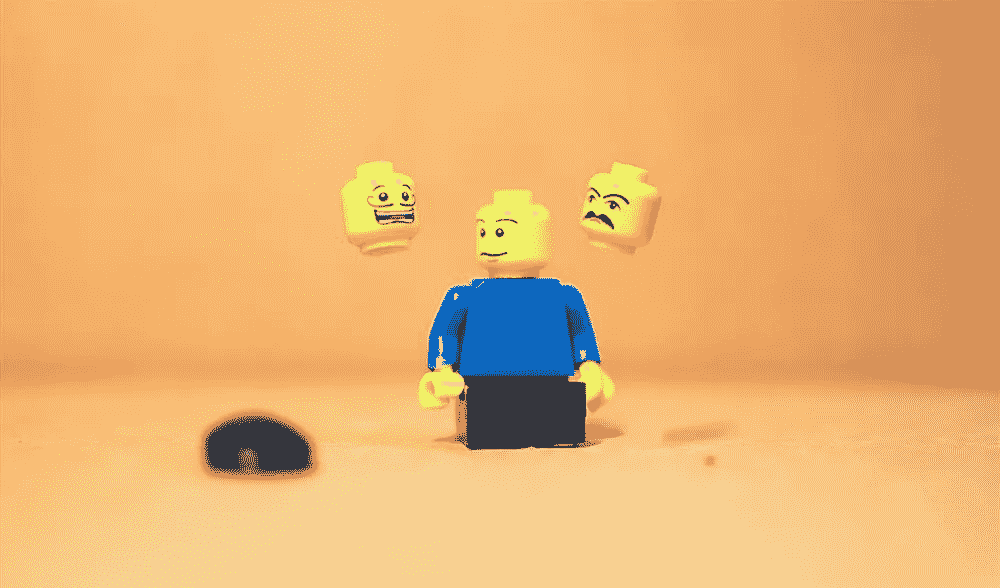
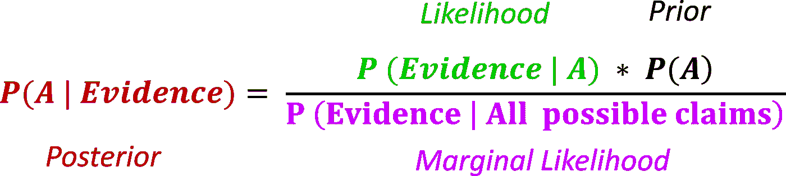
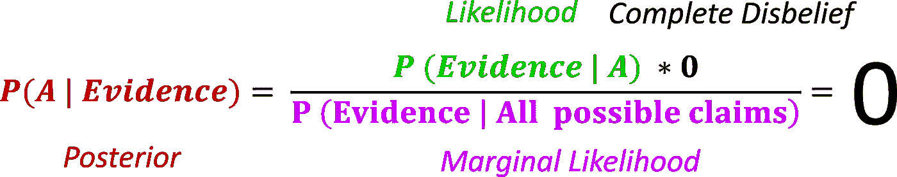

# 克伦威尔法则:为什么贝叶斯应该是不确定的

> 原文：<https://medium.com/analytics-vidhya/cromwells-rule-why-a-bayesian-should-be-unsure-6bef3d794f25?source=collection_archive---------12----------------------->

一封 17 世纪政治领袖写给苏格兰教会的信与概率论的一个信条之间有什么共同点？永远不要确定。

是的，那是我的乐高。

在本文中，我将主要使用概率的主观解释(特别是贝叶斯解释)。这是自然的，因为这一规则适用于主观概率领域的确定性。然而，在接近尾声时，我触及了一个具有绝对概率的问题，无论是从主观还是客观的角度来解释。

查看[早先的帖子](http://rsci.app.link/CDkIxnL7t1?_p=c71229c399067af2e11a90ffe8b1)中关于主观与客观概率的讨论。艾伦-y！

## **承认你可能错了**

克伦威尔法则是以奥利弗·克伦威尔的名字命名的，他在 1650 年给苏格兰教会大会写了一封著名的信:

> 我以基督的名义恳求你，想想你可能弄错了。

换句话说:承认你对一个命题的先入为主的想法可能是不正确的。直觉上，这似乎是一种理性的方法。在大多数情况下，拥有先入为主的信念是完全可以接受的(通常也是必要的)。这些先验信念本质上是你在看到任何数据之前对某件事的想法。换句话说，这些是你拥有的一套**信念**，基于你之前的**生活经历和/或知识。考虑以下索赔:**

> 如果你径直走到伦敦国王十字火车站分隔 9 号和 10 号站台的那堵墙，你穿过那堵墙，进入 9 又 3/4 号站台。

图片来源:[www.harrypotterplatform934.com](https://www.harrypotterplatform934.com/)

现在，如果你像生活在 21 世纪的大多数人一样，你对这一说法的第一反应是，这不太可能是真的。这是你对命题的先验信念，在这种情况下，它反映了你的科学知识和固体墙是如何工作的。

假设你的一个朋友告诉你她已经成功穿墙了。如果你最初对这种说法持怀疑态度(**，但没有一开始就断然否认它是不可能的**，你的怀疑可能会降低一个等级。然而，她可能仍在撒谎。随着越来越多的朋友报告说他们也成功了，你的怀疑会逐渐变成犹豫不决，然后变成不同程度的相信。最后，你可能会对这种说法给予足够的信任，这样你就可以亲自尝试一下，了解一些关于(麻瓜)世界的新的和意想不到的东西。理想情况下，理性学习就是这样进行的。

另一种情况是，你对自己的知识如此确信，以至于你得出结论(仅仅基于你先前的信念)认为这种说法是不可能的。换句话说，你的立场是你**确定**、**没有看到任何数据**，那**的说法是假的**。在这种情况下，当同样的朋友来告诉你他们在穿墙时的积极体验时，你仍然坚持你最初的结论(这种说法是不可能的)。因为你一开始就绝对相信这个说法是错误的，没有任何相反的证据(*我看见赫敏穿过了墙！*)可以改变你最初的信念。一种完全没有数据依据的信念。请注意，我们也可以构建相反的场景。一种说法实际上是错误的，但因为你一开始就绝对肯定它是正确的，所以你忽略了所有人撞到墙上的证据(以一些物理代价)。

> 换句话说，如果我们从绝对相信或不相信开始，我们就完全失去了从经验中学习的能力。

这基本上是克伦威尔的规则试图避免的。为了严格地应用它，我们需要一个数学框架来讨论信念、证据和合理性。贝叶斯推理机器(简称“贝叶斯主义”)正好提供了这样一个框架。

## **贝叶斯推理机**

在贝叶斯上下文中，“信任度”由概率表示。概率 0 分配给不可能的命题，1 分配给确定的命题。因此，在这个框架中，给定一个**命题 A** ，你给它分配一个数字 **P(A)** ，在 0 和 1 之间，表明你对这个主张有多确定。因此，贝叶斯概率是主观的，反映了分配它的人的信念(而不是对现实的客观陈述)。

除了是主观的，贝叶斯概率是有条件的。这意味着您分配给索赔的概率总是受到一些背景知识的影响。符号是 **P(A|B)** 其中 A 是你要分配概率的索赔，B 是影响该索赔的背景信息。相当于“已知 B 为真，A 为真的概率是多少”。

最后，随着新证据的出现，贝叶斯法则给了我们一种更新我们对一个命题的信念的方法。我们使用著名的贝叶斯定理:

**右边的第二项****P(A)**称为前面的**。在你看到任何证据之前，这符合我们对这个命题的最初信念。在关于你能够穿墙的说法中，这种先验信念可以来自你从未见过任何人穿过任何墙的非常可靠的经验。请注意，虽然先验被写成一个简单的无条件概率，但它实际上隐含地以你先前的经验/知识为条件。**

****左边的术语** **P(A |证据)**就是后面的**。一旦有了新的证据，这就是关于索赔的更新的信念(因此对证据有所限制)。****

******右边 P(证据| A** )的第一项称为**可能性**。如果越来越多的证据可以证实这种说法，相信这种说法就变得越来越合理，因此，给出这种说法的概率(通过后验概率表示)就增加了。这种行为是由可能性决定的。可能性衡量了有利于索赔的证据。具体来说，它告诉我们，如果主张为真，我们有多大可能看到证据。这是一个有点棘手的概念，所以让我们用平台 9 和 10 之间的墙来说明它。****

****请记住，这种说法是墙是可渗透的。因为你的相当多的朋友告诉你他们穿过了墙，你正在认真考虑这个说法可能是真的。你的邻居杰克让你知道他打算穿过墙壁进入 9 3/4 站台。既然你想要更多的第一手资料，你决定陪着他。正如你所看到的，杰克向墙跑去，但是他没有穿过墙，而是一头撞上了墙！虽然你之前认为这种说法可能是真的(你的许多朋友显然都经历过)，但看到杰克的不幸应该成为降低你对这种说法的信念的理由。理由很简单。如果这种说法是真的，而且这堵墙是可渗透的，那么看到杰克坠落的几率会很低。从数学上来说，假设这个说法是真的，看到杰克撞车的可能性很低。由于这个小数字乘以上面公式中的先验，后验概率实际上小于先验概率。因此，由于我们确实看到了杰克撞车，这一说法似乎比以前更令人怀疑。****

******分母**中的项，称为**边际可能性**。它给出了在关于证据的所有可能的声明下看到证据的可能性(例如，墙是可渗透的，墙是不可渗透的，墙只对巫师是可渗透的，墙只在一年中的某些日子是可渗透的，等等)。这是一个常数，与索赔无关，最好将其视为一个标准化项，以确保后验概率介于 0 和 1 之间。****

****就是这样！我们现在有了一个连贯的推理机，它告诉我们如何根据我们以前的经验来评估主张，并随着新证据的出现来更新我们的信念。我们现在可以讨论…****

## ******贝叶斯框架中的克伦威尔法则******

****该规则表明，任何命题的先验概率永远不应该被设置为 1(完全*先验*相信)或 0(完全不相信)。为什么？让我们用贝叶斯定理来检验这两种情况。****

******情况一:** **事先设置为 0(完全不相信)******

********

****如果你的先验 P(A)设置为 0，因为它增加了后验概率始终为零的可能性！换句话说，不管你的观察通过可能性说了多少，因为你开始时完全不相信(先验设置为 0)，你将永远处于不相信的状态(后验总是 0！).另一方面，如果先验被设置为非常低但非零的值，数据(通过可能性)可能已经改变了你的看法。****

******案例二:** **先验设置为 1(完全相信)******

********

****如果你的先验设置为 1，这意味着你对索赔完全确定，不愿意接受任何其他替代索赔。换句话说，所有可能主张的集合只是一个主张:A .这样，P(证据|所有可能主张)= P(证据| A)。数学上，边际可能性降低到可能性。因此，分子中的似然性和分母中的边际似然性相互抵消，使得后验概率等于前验概率(=1)。不管有多少相反的证据出现(通过低可能性)，你将永远处于完全相信的状态(1 的后验概率)。如果先验被设置为一个很高的值(但严格来说小于 1 ),这些数据可能最终会让我们相信这个断言是错误的。****

## ******成交单据******

****受到克伦威尔规则限制的贝叶斯主义提供了一种进行系统推理的方法。然而，克伦威尔法则的一个可能的例外在于逻辑陈述。例如，当考虑一个逻辑重言式(1 + 1 = 2)时，将 prior 设置为 1 是完全一致的。同样，逻辑谬误(1 + 2 = 67)的先验自然是 0。****

****最后，在我看来，大多数概率的解释都存在分配 0 或 1 概率的问题。如果我们把概率定义为对可能事件空间的一种度量，那么给一个不可能的事件赋予任何概率(甚至 0)似乎都赋予了它某种“可能性”。由于概率是使用区间[0，1]中的连续实数来分配的，因此使用实数的连续属性来接近 0 变得可能(再次，将可能性赋予在 0 处明确不可能的事件)。****

****对我来说，解决这个问题的一个方法是承认，我们能够**知道**一个事件或主张绝对正确(概率 1)或错误(概率 0)的唯一方法是我们已经看到了无限多的结果。由于无限次试验只能渐进实现，我们应该只指定 **接近** 0(或 1)的**概率。不包括边界。******

****统计学家丹尼斯·林德利****