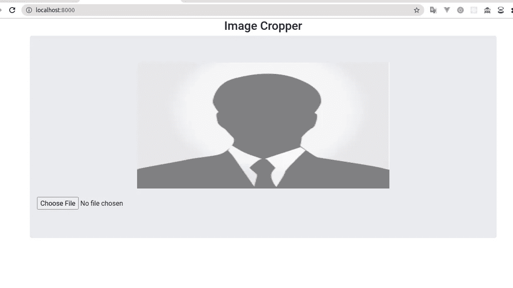
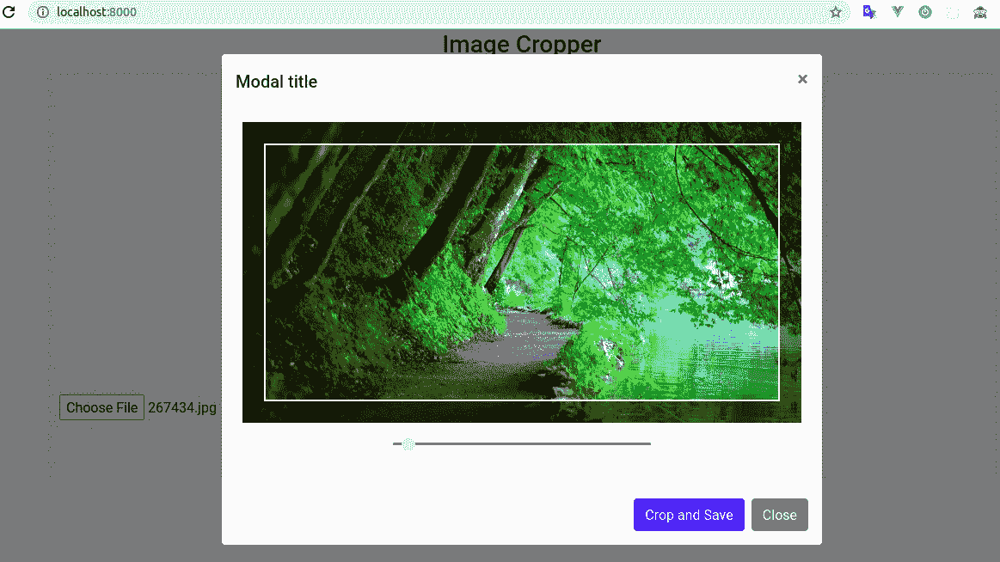
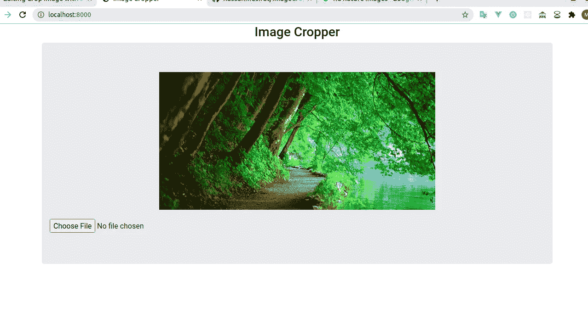

# 带有作物的作物图像

> 原文：<https://medium.com/analytics-vidhya/crop-image-with-croppie-26146a4b933?source=collection_archive---------1----------------------->

我一直在为一个必须使用图像裁剪器的项目构建一个功能。要求就像，用户必须上传一个固定的纵横比(对我来说是 600 * 170)的图像。于是，我在谷歌和 youtube 上搜索，找出教程。但是我发现的还不够有说服力。我选择使用 JQuery Croppie 来满足需求，但是文档不够好，无法正确理解。我不得不挣扎一下。但对你来说是个好消息，你不用像我一样挣扎。因为我要写一个描述性的教程，这样你就可以在任何地方方便地使用图像裁剪功能。那么，让我们开始吧。

我将使用 django 作为后端，但你可以使用任何框架来处理后端，因为我将主要关注如何将该功能集成到前端，并将其传递给后端。

**设置 HTML**

。注意:我用的是 bootstrap 4，Jquery CDN，Croppie CDN。

1.  **设定头像:**

```
<head>
    <title>Image Cropper</title>
    <link *rel*="stylesheet" *href*="https://stackpath.bootstrapcdn.com/bootstrap/4.5.0/css/bootstrap.min.css" *integrity*="sha384-9aIt2nRpC12Uk9gS9baDl411NQApFmC26EwAOH8WgZl5MYYxFfc+NcPb1dKGj7Sk" *crossorigin*="anonymous">
    <link *rel*="stylesheet" *href*="https://cdnjs.cloudflare.com/ajax/libs/croppie/2.6.5/croppie.css" />
</head>
```

2.**设置主体:**

*   有两个部分。第一部分是建立一个输入字段，从用户输入。
*   当用户选择图像时将打开的模式。

```
<!--This is for taking picture input form user -->
<div *class*="row">
    <div *class*="col-lg-12 col-md-12 text-center">
        <h3>Image Cropper</h3>
    </div>
    <div *class*="col-lg-12">
        <div *class*="jumbotron text-center">
            <div *class*="row">
                <div *class*="col-lg-12">
                    
                </div>
                <div *class*="input-group mt-3">
                    <div *class*="custom-file">
                        <input *type*="file" *accept*="image/*" *id*="cover_image">
                    </div>
                </div>
            </div>
        </div>
    </div>
</div>
```

输出如下所示。



```
<!-- This is the modal -->
<div *class*="modal" *tabindex*="-1" *role*="dialog" *id*="uploadimageModal">
    <div *class*="modal-dialog" *role*="document" *style*="min-width: 700px">
        <div *class*="modal-content">
            <div *class*="modal-header">
                <h5 *class*="modal-title">Modal title</h5>
                <button *type*="button" *class*="close" *data-dismiss*="modal" *aria-label*="Close">
                    <span *aria-hidden*="true">&times;</span>
                </button>
            </div>
            <div *class*="modal-body">
                <div *class*="row">
                    <div *class*="col-md-12 text-center">
                        <div *id*="image_demo"></div>
                    </div>
                </div>
            </div>
            <div *class*="modal-footer">
                <button *type*="button" *class*="btn btn-primary crop_image">Crop and Save</button>
                <button *type*="button" *class*="btn btn-secondary" *data-dismiss*="modal">Close</button>
            </div>
        </div>
    </div>
</div>
```

3.**设置脚本文件。**

```
<!-- All Sctipt File --><script *src*="https://code.jquery.com/jquery-3.5.1.js" *integrity*="sha256-QWo7LDvxbWT2tbbQ97B53yJnYU3WhH/C8ycbRAkjPDc=" *crossorigin*="anonymous"></script>
<script *src*="https://cdn.jsdelivr.net/npm/popper.js@1.16.0/dist/umd/popper.min.js" *integrity*="sha384-Q6E9RHvbIyZFJoft+2mJbHaEWldlvI9IOYy5n3zV9zzTtmI3UksdQRVvoxMfooAo" *crossorigin*="anonymous"></script>
<script *src*="https://stackpath.bootstrapcdn.com/bootstrap/4.5.0/js/bootstrap.min.js" *integrity*="sha384-OgVRvuATP1z7JjHLkuOU7Xw704+h835Lr+6QL9UvYjZE3Ipu6Tp75j7Bh/kR0JKI" *crossorigin*="anonymous"></script>
<script *src*="https://cdnjs.cloudflare.com/ajax/libs/croppie/2.6.5/croppie.js"></script>
<script *src*="https://unpkg.com/sweetalert/dist/sweetalert.min.js"></script><!-- This one is custom js file -->
<script *src*=""></script>
```

4.**设置 JavaScript 文件(趣味部分)**

*   首先，让我们看一下场景。用户将点击“选择图像”，并从他的机器选择一个图像。所以，现在我想要的是当“选择图像”将被按下，我将打开我的模态与 croppie 初始化在我的“图像 _ 演示”div 模态。(不要忘记将所有内容都放在$(document)中)。准备好)

```
*/// Initializing croppie in my image_demo div**var* image_crop = $('#image_demo').croppie({
    viewport: {
        width: 600,
        height: 300,
        type:'square'},
    boundary:{
        width: 650,
        height: 350
    }
});/// catching up the cover_image change event and binding the image into my croppie. Then show the modal.$('#cover_image').on('change', *function*(){
    *var* reader = *new* FileReader();
    reader.onload = *function* (event) {
        image_crop.croppie('bind', {
            url: event.target.result,
        });
    }
    reader.readAsDataURL(*this*.files[0]);
    $('#uploadimageModal').modal('show');
});
```

*   此时的输出将如下图所示。



*   现在怎么办？(请击鼓……)现在，当用户单击“裁剪并保存”按钮时，我将捕获当前裁剪的图像，并通过 ajax post 请求将其发送到我的后端服务器。我更喜欢 blob，但也有一些其他的方法可以遵循。

```
/// Get button click event and get the current crop image
$('.*crop_image*').click(*function*(event){
    *var* formData = *new* FormData();
    image_crop.croppie('result', {type: 'blob', format: 'png'}).then(*function*(blob) {
        formData.append('cropped_image', blob);
        ajaxFormPost(formData, '/upload-image/'); /// Calling my ajax function with my blob data passed to it
    });
    $('#uploadimageModal').modal('hide');
});/// Ajax Function
*function ajaxFormPost*(formData, actionURL){
    $.ajax({
        url: actionURL,
        type: 'POST',
        data: formData,
        cache: *false*,
        async: *true*,
        processData: *false*,
        contentType: *false*,
        timeout: 5000,
        beforeSend: *function*(){
        },
        success: *function*(response) {
            *if* (response['status'] === 'success') {
///Some Fancy UI, that you won't probably need swal({
                    title:'Success!',
                    text: response['message'],
                    type:'success',
                    timer:2000
                }).then(*function*() {
/// But this part you may need, reset the input value and put the cropped image inside my image attribute. $('#cover_image').val("");
                    $('#uploaded-image').attr('src', response['url']);
                },*function*(){
                });
            } *else* {
                swal({
                    title:'Failed!',
                    text: response['message'],
                    type:'error'
                });
            }
        },
        complete: *function*(){
        }
    });
}
```

5.**后端代码:**

*   这部分可能会因你而异，我用的是 django-framework(因为我擅长用它)
*   不打算解释太多，但主要的概念是，我将通过 ajax 向我的 url 端点发送一个请求(“对我来说，它就像是[localhost:8000/](http://localhost:8000/)upload-image/”)，然后通过 request.FILES 获取我从前端发送的 blob 文件，并将其存储到 media 文件夹中，并发送一个成功的 JsonResponse 以及上传的图像 url。如果保存失败，我将发送另一个带有“失败”状态的 JsonResponse。

```
*from* django.core.files.storage *import* FileSystemStorage
*from* django.http *import* JsonResponse
*from* django.views *import* View
*from* django.views.decorators.csrf *import* csrf_exempt @csrf_exempt
*def* upload_image(request):
    fs = FileSystemStorage()
    *try*:
        *if* request.FILES.get('cropped_image'):
            file_obj = request.FILES['cropped_image']
            file_name = 'email_cover_image.png'
            filename = fs.save(file_name, file_obj)
            file_path = fs.url(filename)
            *return* JsonResponse({
                'status': 'success',
                'message': 'Image Uploaded Successfully',
                'url': file_path
            })
    *except Exception as* E:
        *print*(E)
    *return* JsonResponse({
        'status': 'failed',
        'message': 'failed_to_upload_image'
    })
```

6.**最终输出:**

*   所以，我们的任务终于完成了。输出是。



7.**结论:**

*   很难用文字来解释一切。
*   但是我试着一步一步地解释，这样你就不会像我一样卡住，并得到一个教程参考。
*   阅读 Croppie 的文档以获得更多示例。[https://foliotek.github.io/Croppie/](https://foliotek.github.io/Croppie/)
*   完整代码:【https://github.com/hassanmdsifat/ImageCropper 

谢谢你，祝你愉快！！！！