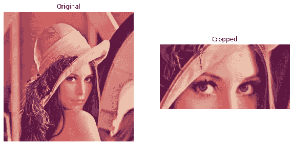
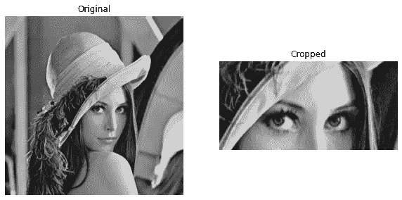

# 直观地裁剪图像— NumPy

> 原文：<https://medium.com/analytics-vidhya/crop-the-image-intuitively-numpy-d19ef55c2207?source=collection_archive---------6----------------------->


尤里克·兰格纳在 [Unsplash](https://unsplash.com?utm_source=medium&utm_medium=referral) 上的照片

在这篇博客文章中，我们将学习如何使用 NumPy 作为理想的库在 Python 中裁剪图像。当我们谈论图像时，它们只是 2D 空间中的矩阵。当然，这取决于图像，如果它是一个 **RGB** 图像，那么图像的大小将是(宽度，高度，3)，否则-灰度将只是(宽度，高度)。但最终，图像只是一个大矩阵，其中每个值都是一个相应地按行和列定位的像素。

裁剪图像就是获得图像矩阵的子矩阵。子矩阵(裁剪图像)的大小可以由我们选择，主要是高度和宽度。要裁剪的图像需要有一个重要的东西，即 ***起始位置*** 。 ***起始位置*** 有助于从该位置获取子矩阵，根据高度和宽度，我们可以轻松地裁剪图像。

三件重要的事情是:

*   起始位置
*   长度(高度)
*   宽度

基于这三件事，我们可以完全准备好构造我们的裁剪函数。

# 编码时间到了

我们主要使用的软件包有:

*   NumPy
*   Matplotlib
*   OpenCV →仅用于读取图像。


作者图片

## 导入包

## 阅读图像

上述函数读取灰度或 RGB 图像，并返回图像矩阵。

## 裁剪图像

我们需要在函数中传递上述三个参数。但在此之前，让我们尝试用 NumPy 裁剪(切片)矩阵。

```
>>> import numpy as np
>>> m = np.array([
...     [1, 2, 3, 4, 5, 6, 7],
...     [5, 3, 4, 2, 1, 7, 6],
...     [6, 4, 3, 5, 1, 2, 7],
...     [5, 6, 3, 1, 4, 2, 7],
...     [1, 2, 3, 4, 5, 6, 7]
... ])
>>>
>>> print(m)
[[1 2 3 4 5 6 7]
 [5 3 4 2 1 7 6]
 [6 4 3 5 1 2 7]
 [5 6 3 1 4 2 7]
 [1 2 3 4 5 6 7]]
>>>
>>> crop_m = m[1:4, 2:7]
>>> print(crop_m)
[[4 2 1 7 6]
 [3 5 1 2 7]
 [3 1 4 2 7]]
>>>
```

上面的代码是一个我们如何裁剪图像矩阵的例子。注意 ***crop_m*** 是从原矩阵 ***m*** 切片而来的裁剪矩阵(子矩阵)。子矩阵 ***crop_m*** 从***【1:4，2:7】***中取值，即从**第 1 行**到**第 4 行**以及从**第 2 列**到**第 7 列**的值。我们应该对图像进行类似的操作，以获得裁剪后的图像。让我们来编写裁剪图像函数。

让我们来理解这个函数实际上会产生什么结果。

1.  在第一步中，我们读取灰度或 RGB 图像并获得图像矩阵。
2.  我们获得图像的高度和宽度，这将进一步用于验证代码。
3.  我们确保 ***长度*** 和 ***宽度*** 都是正整数。因此考虑绝对值。
4.  我们计算对矩阵切片有用的四个重要值——***【start _ row】******end _ row******start _ column******end _ column***。我们通过传递的三个参数得到这个结果——***start _ pos***， ***length*** ， ***width*** 。
5.  我们通过对矩阵进行切片来获得裁剪后的图像。
6.  我们为可视化绘制原始图像和裁剪后的图像。

让我们测试一下上面的函数—

## 对于 RGB 图像

```
start row 	-  199
end row 	-  299
start column 	-  199
end column 	-  399
```



作者图片

## 对于灰度图像

```
start row 	-  199
end row 	-  299
start column 	-  199
end column 	-  399
```



作者图片

就是这个！！！我们最终能够通过知道裁剪图像的起始位置和长度和宽度来裁剪图像。是不是很棒？我们还可以添加许多定制选项，如在图像周围添加边框等。想知道如何给图片添加边框，可以参考我的[文章](/analytics-vidhya/adding-a-border-to-the-image-using-numpy-efa23f7f1cdf)。

其他类似的文章可以在我的个人资料中找到。有一个伟大的时间阅读和实施相同的。

如果你喜欢，你可以从这里的[给我买咖啡。](https://www.buymeacoffee.com/msameeruddin)

[](https://www.buymeacoffee.com/msameeruddin)