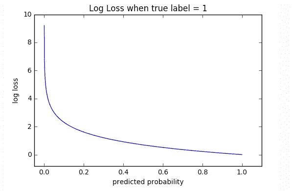

# 交叉熵

> 原文：<https://medium.com/analytics-vidhya/cross-entropy-fca0c6ea5006?source=collection_archive---------16----------------------->

在[信息论](https://en.wikipedia.org/wiki/Information_theory)中，如果用于集合的编码方案针对估计的概率分布而不是真实分布进行了优化，则同一底层事件集合上的两个[概率分布](https://en.wikipedia.org/wiki/Probability_distribution) p 和 q 之间的**交叉熵**测量识别从集合中提取的事件所需的平均[比特数](https://en.wikipedia.org/wiki/Bit)。(参考:维基百科)

从纯数学的角度来看，**交叉熵**是一种误差度量，将一组预测概率与一组预测概率进行比较。交叉熵是一种误差度量，它将一组计算出的输出节点与来自训练数据的值进行比较。简单地说，举个例子，如果骰子四个面的概率是(0.15，0.35，0.20，0.30)，但是经过上千次试验，如果我们确定真实概率是(0.20，0.30，0.25，0.25)，那么交叉熵将是

交叉熵表示模型认为的输出分布和原始分布之间的距离。它被定义为，

交叉熵度量是广泛使用的平方误差的替代方法。当节点激活可以被理解为表示每个假设可能为真的概率时，即当输出是概率分布时，使用该函数。因此，它被用作在输出层具有 softmax 激活的神经网络中的损失函数。

**交叉熵损失**或对数损失，衡量分类模型的性能，其输出是 0 到 1 之间的概率值。交叉熵损失随着预测概率偏离实际标签而增加。因此，当实际观察值为 1 时，预测 0.015 的概率将是糟糕的，并导致高损失值。完美的模型的对数损失为 0。

我们在上面看到，当预测概率接近 1 时，测井曲线损失缓慢减少，而当预测概率减少时，测井曲线损失呈指数增加。

在二进制分类中，类的数量等于 2，交叉熵可以计算为:

> −(ylog(p)+(1−y)log(1−p))−(ylog⁡(p)+(1−y)log⁡(1−p))

在多类分类中，我们为每个观察值的每个类标签计算单独的损失，并对结果求和。

> ylog(p)

其他损失函数的简短参考。

## **交叉熵或均方误差**

对于分类问题，交叉熵(或 softmax loss，但交叉熵效果更好)可能是优于 MSE 的选择。

为什么这样分类任务中的决策边界很大(与回归相比)。MSE 没有对错误分类进行足够的惩罚，但对于回归来说是正确的损失，其中两个可预测值之间的距离很小。

如果我们的网络输出层具有 sigmoid 或 softmax 非线性，交叉熵是更好的选择，我们的目标是最大化分类的可能性。现在如果我们假设目标是连续的和正态分布的，并且更可能使用 MSE(与线性输出层相结合)。然而，我们可以用 MSE 损失来训练分类器，它可能会工作得很好(然而，在 sigmoid/softmax 非线性的情况下不太好，在这种情况下，线性输出层将是更好的选择)。对于回归问题，我们大多倾向于使用 MSE。另一种分类方法是使用边际损失，这基本上相当于在你的网络上放置一个(线性)SVM。

CE 是一组预测概率和一组实际概率(或 N 选 1 编码的训练标签)之间的误差的度量。交叉熵误差也称为对数损失。SE 是一种常见的错误形式。它只是一组预测值和一组实际值之间的平方差之和。通常，当使用反向传播训练时，交叉熵往往比 SE 更快地给出更好的训练结果，但是 SE 比 CE 更不稳定。