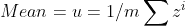
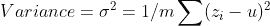
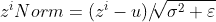
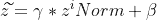
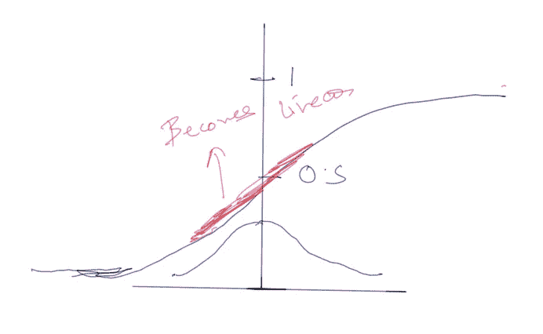
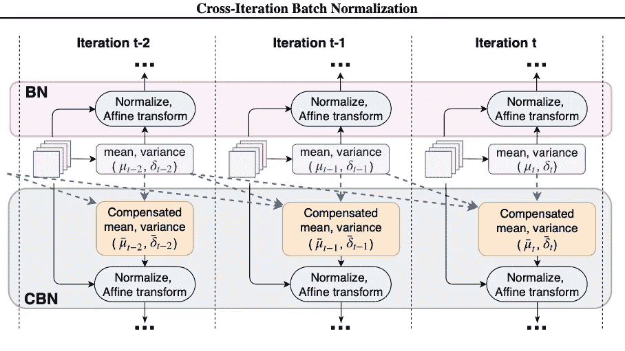
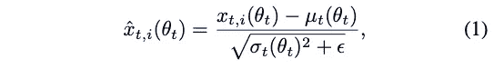
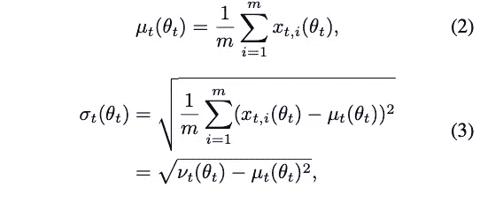
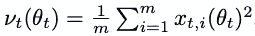
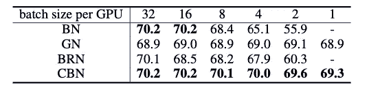

# 低批量高精度—交叉迭代批量标准化

> 原文：<https://medium.com/analytics-vidhya/cross-iteration-batch-normalization-a50fdf9e085?source=collection_archive---------11----------------------->

## 使用[交叉迭代批量标准化](https://arxiv.org/abs/2002.05712)将 mAP 提高 1%-2%

**批量正常化**

> 由两位研究人员 Sergey Ioffe 和 Christian Szegedy 创建的生命安全算法[1]。BN 有助于用更少的历元快速训练你的网络，并使你的网络更加健壮。归一化输入影像或要素对于网络的概化非常重要。

**L 层**的批次定额是多少:

1.  计算 Z(L)的平均值和方差

2.使用之前计算的批次统计数据对图层输入进行归一化。

现在 Z 的每个分量都有均值 0 和标准单位方差。

3.但是我们并不总是希望隐藏单元有 mean 0 和 SD 1，但是在实践中，我们通过引入 gamma 和 beta 让单元有不同的分布。

现在网络可以改变伽马值，这反过来会使所有隐藏单元偏离平均值 0。

*问:你可能会问我们为什么要这么做？*

我们这样做是为了**利用激活函数**的非线性。

**BN 的问题:**

在 BN 中，假设**每个小批量内的样本的分布统计反映了整个训练集**的相似统计。虽然这个假设**对大批量一般有效，**但是当我们采用*小批量制度*(彭等，2018[2]；吴&何，2018[3]；Ioffe，2017[4])，这导致从小样本集计算的噪声统计。

**BN 到物体检测等消耗内存的任务**(任等，2015[5]；戴等，2017[6])，语义切分(龙等，2015[7]；Chen 等人，2017[8])和动作识别(Wang 等人，2018b[9])，其中批大小是有限的，由于存储器限制，这是高度资源消耗的。

为了解决这个问题，已经提出了许多替代的规格化器。其中包括图层归一化(LN) (Ba 等，2016[10])、实例归一化(IN) (Ulyanov 等，2016[11])、组归一化(GN) (Wu & He，2018[3])。

**利用以前迭代的统计数据:**

为了解决小批量的 BN 问题，一种容易受骗的方法是计算当前和过去迭代的平均值和方差。

观察到，由于基于梯度的训练的性质，网络权重在连续迭代之间平滑地变化。这允许我们通过泰勒多项式来近似均值和方差。

[来源](https://arxiv.org/pdf/2002.05712.pdf)

让我们做一点数学计算，理解正在发生的事情:

[来源](https://arxiv.org/pdf/2002.05712.pdf)

其中θt 和 Xt，i (θt)为第 t 个小批量中第 I 个例子的网络权重和某层的特征响应。

[来源](https://arxiv.org/pdf/2002.05712.pdf)

Xt，i (θt)是均值和单位方差为零的白化激活，ε是为数值稳定性增加的小常数，μt(θt)和σt(θt)是当前小批量所有样品的均值和方差。

[来源](https://arxiv.org/pdf/2002.05712.pdf)

m 表示当前小批量中的样本数量。

**利用先前迭代的统计数据:**

[来源](https://arxiv.org/pdf/2002.05712.pdf)

为了找出函数在某个数的邻域中的样子，我们使用泰勒级数。随着层指数 r 的减小，部分梯度迅速减小。早期层的网络权重变化对后期层的激活分布的影响减小，这或许可以用 BN 内部协变量位移的减小来解释。

让我们来看看 ResNet-18 上 CBN 的一些**实用** **结果**。

使用 ResNet-18 作为 ImageNet 上的基础模型时，不同批量标准化方法的最高准确度。[来源](https://arxiv.org/pdf/2002.05712.pdf)

***即使批次大小为 1，前 1 名的准确度也会提高。***

缺点:

作者仅在单一图像分类模型 ResNet-18 上进行实验。因此，这种方法是否适用于其他深度网络仍然是实验性的。

跨层的卡尔曼归一化也显示了微批次的准确性提高。

**结论:**

发现新的 CBN 优于原始的批量归一化和阿迪- rect 统计计算，优于以前的迭代，没有任何问题。而且在 ImageNet 分类和 COCO 对象检测上也达到了和 SyncBN 不相上下的性能，可以算是上界了。

**参考文献:**

[1] Ioffe，s .和 Szegedy，c .批量标准化:通过减少内部协变量偏移加速深度网络训练。在*机器学习国际会议*中，2015 年第 448–456 页。

[2]彭，陈，肖，李，赵，姜，杨，张，徐，贾，余，孙，梅:大型小批量目标检测器。在*IEEE 计算机视觉和模式识别会议论文集*第 6181–6189 页，2018 年。

[3]吴，杨，何，等.在*欧洲计算机视觉会议(ECCV)* 的会议记录中，第 3–19 页，2018 年。

[4] Ioffe，s,《批量重整化:减少批量标准化模型中的小批量依赖性》。在*神经信息处理系统进展*中，第 1945–1953 页，2017 年。

[5] Ren，s .，He，k .，Girshick，r .，和 Sun，j .更快的 r-cnn:用区域建议网络实现实时目标检测。在*神经信息处理系统进展*，第 91–99 页，2015 年。

[6]戴，张，胡，黄，李，杨，魏，等.可变形卷积网络.在*IEEE 计算机视觉国际会议论文集*，第 764–773 页，2017 年。

[7] Long，j .，Shelhamer，e .，和 Darrell，t.《用于语义分割的完全卷积网络》.在*IEEE 计算机视觉和模式识别会议论文集*第 3431–3440 页，2015 年。

[8] Chen，L.-C .，Papandreou，g .，Kokkinos，I .，Murphy，k .，和 Yuille，A. L. Deeplab:用深度卷积网、atrous 卷积和全连接 CRF 进行语义图像分割。 *IEEE 模式分析与机器智能汇刊*，40(4):834–848，2017。

[9]王，x .，Girshick，r .，Gupta，a .，和何，k .非局部神经网络.在*IEEE 计算机视觉和模式识别会议记录*中，第 7794–7803 页，2018b。

[10] Ba、J. L .、Kiros、J. R .和 Hinton，G. E .图层标准化。 *arXiv 预印本 arXiv:1607.06450* ，2016。

[11] Ulyanov，d .，Vedaldi，a .，和 Lempitsky，v . Instance normalization:快速风格化的缺失成分。 *arXiv 预印本 arXiv:1607.08022* ，2016。

批量卡尔曼归一化:[用微批量训练深度神经网络](https://papers.nips.cc/paper/7288-kalman-normalization-normalizing-internal-representations-across-network-layers.pdf)

[交叉迭代批量归一化 arxiv.org](https://arxiv.org/abs/2002.05712)