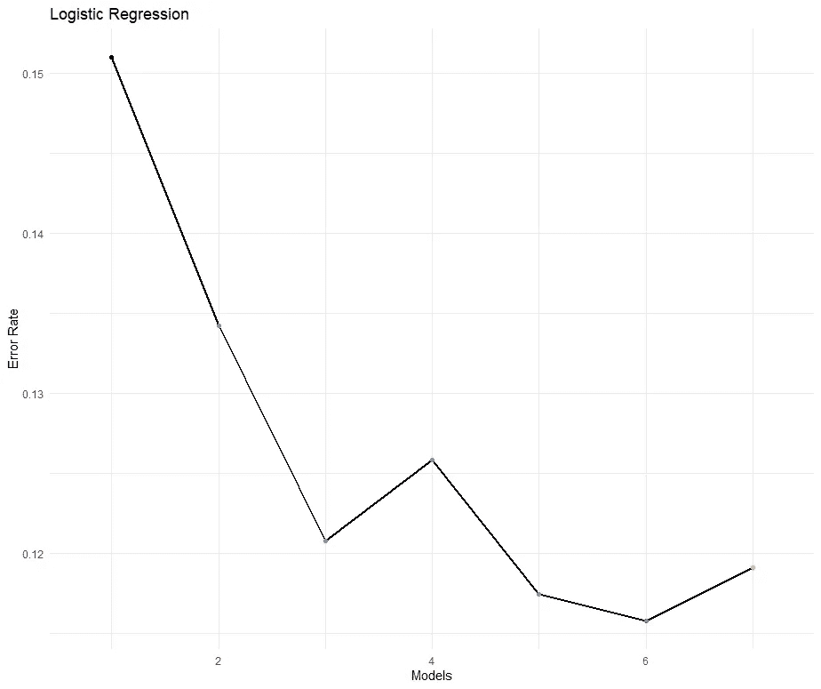

# 分类模型的交叉验证

> 原文：<https://medium.com/analytics-vidhya/cross-validation-for-classification-models-9bb6506dee00?source=collection_archive---------4----------------------->

在我之前的博客[新冠肺炎使用分类预测死亡率](/analytics-vidhya/covid-19-predicting-death-rate-using-classification-9a095eba9e57)中，建立了不同的分类机器学习模型来预测很可能死于新冠肺炎的患者的死亡率的准确性，并进行了比较。在这篇博客中， **K 倍交叉验证**被执行来验证和评估先前使用的机器学习模型使用相同的[数据集](https://www150.statcan.gc.ca/t1/tbl1/en/tv.action?pid=1310078101)的技能。使用的机器学习模型有**支持向量机、逻辑回归、决策树、随机森林。**


照片由[邦妮·莫兰](https://flickr.com/photos/icetsarina/36119331606/)拍摄，版权所有

# k 倍交叉验证

通常，在为任何数据构建机器学习模型时，为了检查模型是否在看不见的数据下表现良好，数据集的 20–30%被分割成测试数据并保持隐藏。训练数据集用于训练模型，测试数据集用于验证模型。在 K 倍交叉验证中，整个数据集被分成 K 个部分，而不是 2 个部分。这些裂缝被称为褶皱。根据数据大小，通常会使用 5 或 10 倍。

K 倍交叉验证的程序是将数据集中的所有观察值随机抽样到 K 倍的近似相等的大小中。并且该模型将被训练有 K-1 个折叠，保持 1 个折叠以验证该模型，对每个折叠重复相同的过程。最后考虑了平均错误率/准确率。下图说明了 5 重交叉验证的过程。


**图 1。5 折交叉验证** ( [来源](https://scikit-learn.org/stable/_images/grid_search_cross_validation.png))

# 我们为什么要使用交叉验证？

1.  **使用总数据**

有时数据集可能太小。在这种情况下，如果数据被分割用于验证，剩余的数据可能不足以训练机器模型来识别导致*欠拟合* *的模式，这反过来增加了由偏差引起的误差。*这就是 K 倍交叉验证发挥作用的地方，使用 K 倍交叉验证总是有足够的数据来训练模型并验证模型。

**2。型号一致性**

如果模型只用一个测试集测试，有可能*过度拟合，从而增加方差。*通过使用交叉验证，我们可以用更多的数据来验证我们的模型，这有助于证明我们的模型在看不见的数据上的一致性。即，如果所有测试集的准确度/错误率一致，则证明我们的机器学习模型是一致的。

# 相互关系


**图二。所有变量的相关矩阵。**

绘制相关矩阵以确定所有变量的皮尔逊相关系数值。这些值有助于我们测量不同变量之间的关联，并提供关于关联或相关性大小以及关系方向的信息。

相关系数值越高，当一个变量增加时，如果负相关，则另一个变量趋于减少，如果正相关，则另一个变量趋于增加。

# 使用的模型

与我之前的[博客](/analytics-vidhya/covid-19-predicting-death-rate-using-classification-9a095eba9e57)不同，在那里只有两个模型被比较来预测死亡，一个模型包含所有剩余变量，另一个模型包含 3 个与死亡变量高度相关的变量。这次**使用所有 7 个变量构建了 7 个不同的模型**，并通过增加每个模型的复杂性进行比较，从只使用一个与模型 1 的死亡变量具有高相关系数值的变量(Age_group)开始，到逐个使用所有变量。使用的模型有

```
Model[1] <- "Death~ Age_group"
Model[2] <- "Death~ Age_group+Hospital_status"
Model[3] <- "Death~ Age_group+Hospital_status+Asymptomatic"
Model[4] <- "Death~ Age_group+Hospital_status+Asymptomatic+Region"
Model[5] <- "Death~ Age_group+Hospital_status+Asymptomatic+
Region+Tramssion"
Model[6] <- "Death~ Age_group+Hospital_status+Asymptomatic+ Region+Tramssion+Occupation"
Model[7] <- "Death~ Age_group+Hospital_status+Asymptomatic+ Region+Tramssion+Occupation+Gender"
```

从这里开始，为了简单起见，每次比较时，只使用模型名称，而不是每个模型的命名变量。这个时间误差率被用作比较不同模型的度量。对所有 7 个模型进行比较，并使用 **5 重交叉验证**来评估使用不同机器学习模型的模型性能。使用的机器学习模型有支持向量机、逻辑回归、决策树和随机森林。并且**使用一个标准误差**规则来选择最佳模型。

**一个标准误差规则**

对于那些不知道一个标准误差规则的人，在交叉验证中使用一个标准误差规则，其中我们采用最简单的模型，其误差在最佳模型(误差最小的模型)的一个标准误差内。

这样做的原因是我们应该承认交叉验证的每个模型的错误率有变化，因为它们是从数据中随机选择的。由于最小标准误差也有变化，一个标准误差规则说，我们将选择误差率在最小误差率的一个标准误差内的最简单的模型，而不是选择具有最小误差率的模型，因为如果模型的误差率在彼此误差率的一个标准误差内，我们无法根据我们拥有的样本数据区分它们。

**支持向量机**

图三。显示了使用 SVM 模型时所有 7 个模型的平均错误率。


**图 3。使用 SVM 的所有模型的标准误差平均误差率**

可以看出，随着模型复杂度的增加，错误率在下降。从模型 5 观察到的误差率最小，误差率为 0.129(87.1%的准确度)，并且模型 6 和模型 7 的误差率相同。此外，可以看出，模型 1、模型 2、模型 3 的平均误差率相同，误差率为 0.151(84.9%的准确度)。

根据图 3 中的图表。用支持向量机预测死亡，只需要年龄组就足够了。为了获得稍好的准确性，可以使用年龄组、医院状况、无症状、地区、传播变量。

图 4。显示了所有 7 个模型在执行 5 倍交叉验证后的平均误差率，并绘制了标准误差图，以使用一个标准误差规则确定最佳模型。


**图 4。使用 SVM 的所有模型的 5 倍交叉验证误差率和标准误差**

从图 4 中可以看出。**模型 5** (死亡~年龄组+医院状况+无症状+地区)相比其他所有模型，误差率最小。并且随着模型复杂度的增加，错误率降低，直到模型 5，然后开始增加。但是模型 1，模型 2，模型 3，模型 4 都低于模型 5 的标准误差。因此，根据一个标准误差规则，应在这 4 个模型中选择最简单的模型，即只有一个变量的模型 1。所以对于支持向量机来说，预测死亡率只需要年龄组就足够了。

此外，在进行交叉验证后，错误率的范围是相同的，这证明我们的模型是一致的。

**逻辑回归**

图五。显示了使用逻辑回归模型时所有 7 个模型的平均错误率。



**图 5。使用逻辑回归的所有模型的平均误差率和标准误差**

在逻辑回归的情况下，**模型 6** 表现最佳，误差率为 0.115 (88.5%的准确率)，其次是模型 5 和模型 3。模型 1 表现最差，错误率为 0.151 (84.9%的准确率)。即使在这里，错误率也随着模型复杂性的增加而降低，直到模型 3，模型 4 稍微增加，然后再次降低。

根据图 5 中的图表。如果我们有年龄组、医院状况、无症状、地区、传播和职业，我们可以以 88.5%的准确度预测死亡率。

图六。显示了在进行 5 倍交叉验证后使用逻辑回归的所有 7 个模型的平均误差率，并绘制了标准误差以使用一个标准误差规则识别最佳模型。


**图六。使用逻辑回归的所有模型的 5 倍交叉验证误差率和标准误差**

从图 6 来看。执行交叉验证后的最佳 is 模型是模型 3，错误率为 0.1356(准确度= 86.44)。落在模型 3 的标准差下的最简单的模型是**模型 2** 。使用一个标准误差规则，模型 2 被选为最佳模型。使用年龄组、医院状况变量进行逻辑回归可以预测死亡率，准确率为 86.5%。此外，在进行交叉验证后，错误率的范围是相同的，这证明我们的模型是一致的。

**决策树**

图 7。显示了使用决策树模型时所有 7 个模型的平均错误率。


**图 7。使用决策树的所有模型的平均误差率和标准误差**

在决策树的情况下，**模型 3** 和**模型 4** 是表现最好的模型，错误率为 12.1(准确度= 87.9)，在模型 4 之后，随着模型复杂性的增加，错误率开始增加。模型 1 表现最差，错误率为 0.151 (84.9%的准确率)。在模型 4 之前，错误率随着模型复杂性的增加而降低，模型 5 的错误率略有增加，而模型 6、7 的错误率保持不变。

图 8。显示了所有 7 个模型在执行 5 倍交叉验证后的平均错误率，并绘制了标准误差，以使用决策树使用一个标准误差规则来识别最佳模型。


**图 8。使用逻辑回归的所有模型的 5 倍交叉验证误差率和标准误差**

从图 8 来看。可以看出，在执行 CV 之后，模型 4 和模型 5 的误差率保持相同，误差率为 0.122(准确度= 88.8)。属于模型 4，5 的标准偏差的最简单的模型是模型 3。使用一个标准误差规则**选择模型 3** 作为最佳模型。死亡率可以使用决策树来预测，使用年龄组、医院状况、无症状、地区，准确率为 87.6%。此外，在进行交叉验证后，错误率的范围是相同的，这证明我们的模型是一致的。

**随机森林**

图九。显示了使用随机森林模型时所有 7 个模型的平均错误率。


**图九。使用随机森林的所有模型的标准误差平均误差率**

这里随机森林的最佳表现模型是**模型 6** ，错误率为 0.119(精确度= 88.1)，错误率与模型 7 相同。这里表现最差的模型还是模型 1，错误率为 0.151(准确度= 84.9)。令人惊讶的是，仅用年龄组变量，每个模型都能够以 85%的准确度预测患者是否会死亡。即使在这里也可以看出，错误率随着模型复杂性的增加而不断降低。

图 10。显示了所有 7 个模型在执行 5 倍交叉验证后的平均错误率，并绘制了标准误差，以使用随机森林的一个标准误差规则来识别最佳模型。


**图 10。使用随机森林的所有模型的 5 倍交叉验证误差率和标准误差**

从图 10 来看。模型 4 和模型 5 的错误率相同，错误率为 0.1301。属于模型 4 和模型 5 的标准偏差的最简单的模型是模型 3。使用一个标准误差规则**选择模型 3** 作为最佳模型。因此，对于随机森林，死亡率可以使用年龄组、医院状况和无症状变量进行逻辑回归预测，准确率为 87%。此外，在进行交叉验证后，错误率的范围是相同的，这证明我们的模型是一致的。

# 结论

在使用支持向量机、逻辑回归、决策树和随机森林机器学习模型比较了所有 7 个模型之后。决策树机器学习模型可以更准确地预测死亡率，其次是随机森林。使用一个标准误差规则，我们可以看到，模型 3 是决策树和随机森林的最佳表现模型，变量有年龄组、医院状态、无症状，这些变量与我在以前的博客中用于预测死亡率的变量相同。因此，这表明之前使用加拿大统计局的数据来预测死亡率以确定死亡风险最高的患者的模型是准确的。

## 数据

所有的图形都是在 R Studio 中使用 R 语言生成的。用于生成这些图形和模型的所有代码和数据都可以在我的 GitHub repo 中找到，这里:[https://GitHub . com/JaswanthBadvelu/IENG-3304-Data-Management-and-Analytics/tree/master/lab 4% 20 cross % 20 validation](https://github.com/JaswanthBadvelu/IENG-3304-Data-Management-and-Analytics/tree/master/Lab4%20Cross%20Validation)