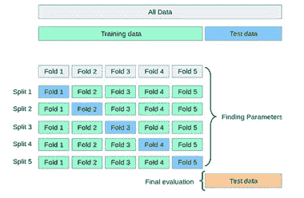
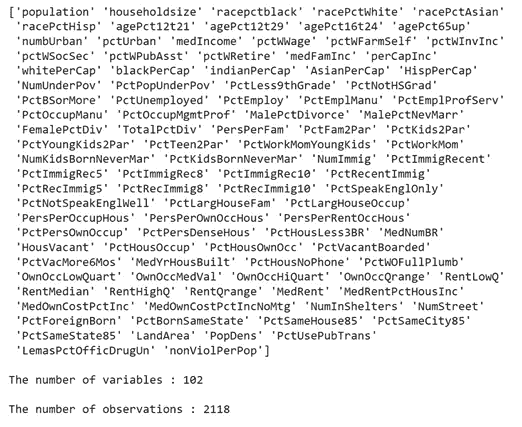
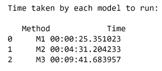
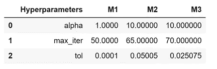
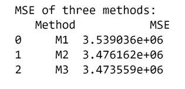
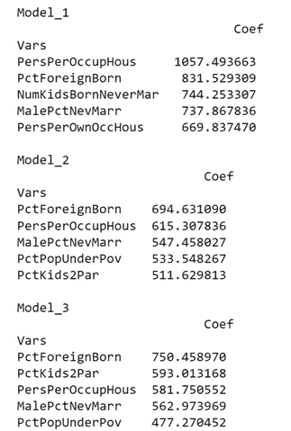

# 交叉验证—简介

> 原文：<https://medium.com/analytics-vidhya/cross-validation-introduction-faa394f229f4?source=collection_archive---------12----------------------->

## python 中不同的验证方法及其性能比较。


约翰·麦克唐纳在 [Unsplash](https://unsplash.com/s/photos/train-test?utm_source=unsplash&utm_medium=referral&utm_content=creditCopyText) 上的照片

在本文中，我们将回顾一些在机器学习模型中广泛使用的验证方法及其优缺点。我们将使用 Python 中的真实数据集来看它们的实际应用。

## 一般理论

我们为什么要分割数据集？最简单的答案是评估模型的性能，即确定模型的预测能力。

数据集通常被分成 2 或 3 部分——分别是训练/测试，或训练/有效/测试集。

分成三部分有两种风格:

1)训练/有效/测试分割

2)使用维持集的交叉验证

额外的验证集有利于超参数调优。

在训练/测试/分割方法中，训练集用于调整超参数。我们使用训练数据在超参数值的所有组合中拟合模型。然后，使用拟合的模型，我们可以预测验证集，并使用超参数值的所有组合来评估性能。选择产生最佳结果的超参数组合。最佳性能模型取决于我们选择的评估指标——准确度、精确度和召回率。我们使用通过验证集过程获得的超参数组合来预测测试集。测试集是不可见的，并且不用于拟合模型，因此它有助于不带任何偏见地评估模型性能。

训练/有效/测试分离方法的缺点是只有一个验证集来调整参数。这种拆分方法存在很高的“几率”或“运气”风险。为了克服这个缺点，我们可以利用**交叉验证。**该方法与训练/有效/测试分割方法类似，但我们会多次重复分割步骤。有不同类型的交叉验证类型- k-fold CV，留一法(LOO)，嵌套 CV 等。我们来看看 k 倍 CV。

## 具有维持设置的 k 倍 CV

这是交叉验证的最简单形式。



图片来源[此处](https://scikit-learn.org/stable/modules/cross_validation.html)

这就是 K 折叠 CV 的工作原理

*   一个测试集被放在一边以供最终评估
*   对于剩余的数据，数据被分成 k 个折叠。然后，使用褶皱的 k-1(训练数据)来训练该模型。然后，使用第 k 个集合(验证集合)，使用不同的超参数值执行预测，并选择给出最佳验证分数的超参数。
*   最后，通过使用最佳超参数的测试集来评估模型。

# Python 中的比较

我们将使用来自 UCI 知识库的数据集。这是来自不同社区的犯罪率数据。有 101 个预测变量，如家庭规模、警察人数、人口等。目标是预测每 100，000 人的非违法犯罪总数(答案)。

代码和数据集可以在找到[。](https://github.com/divyar2630/Validation-methods)

我们将使用 Lasso 回归作为我们的预测模型。由于有许多变量，套索是一个伟大的工具，过滤掉不必要的功能。在所有其他因素都相同的情况下，我们将实施不同的验证方法来确定每个因素的最佳超参数。

数据集中的要素:



变量名的快照

我们将测试的验证方法如下:

1.训练/验证/测试分割。

2.五重交叉验证。

3.10 重交叉验证

**数据集分割**

让我们做一个 70%-30%的训练测试分割，并进一步将训练集分成两个相等的部分，分别用于训练集和有效集。

```
X_train_valid, X_test, y_train_valid, y_test = train_test_split(X, y, test_size = 0.3, random_state = 1)
X_train, X_valid, y_train, y_valid = train_test_split(X_train_valid, y_train_valid, test_size = 0.2857, random_state = 1)
```

**超参数选择**

让我们在这个练习中使用三个超参数，Alpha，最大迭代次数，容差

```
alphas = np.logspace(-10,10,21) 
max_iters = np.arange(50,75,5) 
tols = np.linspace(0.0001,0.1,5)
```

## 1.训练/验证/测试分割。

我们将一步一步地查看 python 中发生了什么。

使用`itertools.product(alphas,max_iters,tols)`创建超参数三元组。我们已经创建了 525 个 3 个超参数的独特组合。接下来，我们将对数据进行标准化。将 Lasso 回归的数据标准化至关重要，这样我们就可以为所有变量提供公平的竞争环境。为此，我们使用一个`StandardScaler()`。参考 sklearn [文档](https://scikit-learn.org/stable/modules/generated/sklearn.preprocessing.StandardScaler.html)了解更多关于在`sklearn.preprocessing.`可用的标准定标器的详细信息。使用 for 循环，我们使用所有 525 超参数组合拟合训练数据。然后，我们预测验证集的犯罪率(y)。我们选择的评估指标是*均方误差。*我们的超参数三重奏获胜者是产生误差最少的那个。然后，我们缩放(拟合)训练+有效数据，并将缩放应用于测试数据。使用从验证集获得的最佳结果，我们拟合训练+有效数据并预测测试集的犯罪率(y)。整个过程的 python 代码如下:

```
hyperparameter_trio=list(itertools.product(alphas,max_iters,tols)) 
print("The number of trios in total: {}".format(len(hyperparameter_trio)))
#scaling the data
scaler=StandardScaler() # Instantiate
scaler.fit(X_train)
X_train=pd.DataFrame(scaler.transform(X_train))
X_valid=pd.DataFrame(scaler.transform(X_valid))
Validation_Scores=[]start = datetime.now()
for a in hyperparameter_trio:
    lm_trainlasso=linear_model.Lasso
    (alpha=a[0],max_iter=a[1],tol=a[2])
    lm_trainlasso.fit(X_train,y_train)
    Validation_Scores.append(metrics.mean_squared_error                                                             
    (lm_trainlasso.predict( X_valid),y_valid))
end = datetime.now() 
M1 = end - start
minerror_M1 = min(Validation_Scores) 
besttrio_M1 = hyperparameter_trio[np.argmin(Validation_Scores)]scaler = StandardScaler()
scaler.fit(X_train_valid)
X_train_valid = pd.DataFrame(scaler.transform(X_train_valid))
X_test = pd.DataFrame(scaler.transform(X_test))
M1_terror = metrics.mean_squared_error(lm1.predict(X_test),y_test)
print("The prediction error for the test set is : {}".format(M1_terror))
```

## 2.五重交叉验证。

我们将使用 sklearn 库中可用的 **GridSearchCV** 包进行交叉验证。GridSearchCV 将调整我们的超参数值的所有组合(搜索网格中指定的参数)。GridSearchCV 执行一个 **K 折叠交叉验证**，默认情况下，它执行 5 次折叠。估计器参数对训练数据执行*拟合*功能，对每个网格点的有效数据执行*变换*功能。我们在估计器中包含了转换，其中转换是按顺序执行的，并且每个转换都应该准备好接受*拟合*和*转换*方法。`param_grid`参数允许您指定超参数值，GridSearchCV 迭代该网格中的所有值。此过程的 python 代码如下:

```
start = datetime.now()
estimator = Pipeline([(‘scale’, StandardScaler()), (‘lasso’,Lasso())]) 
parameters = {‘lasso__alpha’:alphas, ‘lasso__max_iter’:max_iters, ‘lasso__tol’:tols}
lm2 = GridSearchCV(estimator = estimator, param_grid = parameters, cv = 5, scoring = ‘neg_mean_squared_error’, n_jobs = -1) 
lm2.fit(X_train_valid, y_train_valid) 
end = datetime.now()
M2 = end — start
```

## 3.10 重交叉验证

就 python 实现而言，10 折交叉验证方法类似于 5 折方法。在`GridSearchCV`中，我们将 CV 参数设置为 10。

## 根据 3 种不同的标准比较上述三种验证方法

1.  基于代码运行所花费的时间进行比较
2.  比较超参数值
3.  比较选择的系数
4.  比较预测结果。

获得的结果如下



模型 1-训练/有效/测试分割方法花费的时间最少。随着折叠次数的增加，模型花费的时间也越来越多。



模型收敛所需的最大迭代次数是第三个模型的最大迭代次数(10 倍 CV)。5 倍 CV 和 10 倍 CV 的 alpha 值相同



10 倍 CV 在测试集上产生的误差最小。



上面描述了以降序排列的系数的绝对值。这些是每种认证方法的前 5 个系数。三个模型中的大部分系数是相似的。`PctForeignBorn`、`PersPerOccupHous`和`MalePctNevMarr` 是所有三个模型的预测值的前几名。

训练/有效/测试方法缩减了一个系数。然而，CV 模型缩小了以下系数。

```
Index(['population', 'racePctWhite', 'racePctAsian', 'racePctHisp',
'agePct65up', 'numbUrban', 'medIncome', 'pctWWage', 'perCapInc','NumUnderPov', 'PctOccupManu', 'PersPerFam', 'PctYoungKids2Par','PctTeen2Par', 'PctWorkMomYoungKids', 'NumImmig', 'PctImmigRec8',PctRecImmig5', 'PctRecImmig10','PctNotSpeakEnglWell',
'PctLargHouseFam', 'PctHousLess3BR', 'PctHousOwnOcc',       'PctVacantBoarded', 'OwnOccHiQuart', 'OwnOccQrange', 'RentMedian',
'MedRent', 'NumStreet', 'PctSameHouse85'],dtype='object', name='Vars')Total features shrinked to zero by M1: 1
Total features shrinked to zero by M2: 30
Total features shrinked to zero by M3: 32
```

在 101 个预测值中，训练/有效/测试方法仅将一个特征缩减为零。5 折 CV 模型提供了比训练/有效/测试方法更好的结果，因为它将 30 个特征缩减到零。最后，10 折 CV 方法执行得甚至更好，因为它将 32 个无用特征缩减为零。

## 最后的想法

选择哪种交叉验证方法取决于业务问题。在时间和评估指标之间经常有一个权衡。

交叉验证是一个巨大的话题。这篇文章是高水平的。概念概述

感谢您的阅读。我很想听听你对我的文章的想法和反馈。请在下面的评论区留下它们。