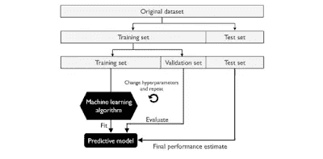
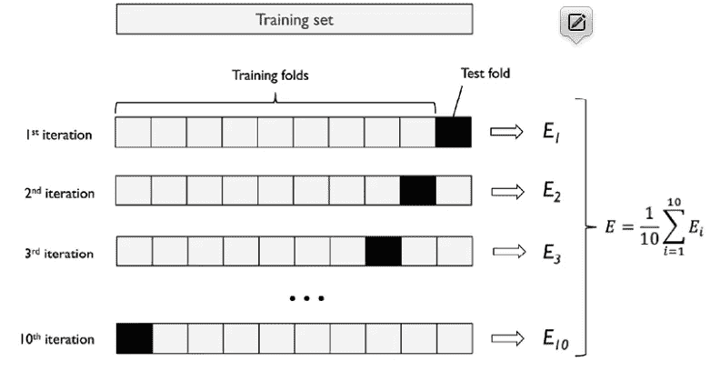

# 交叉验证技术

> 原文：<https://medium.com/analytics-vidhya/cross-validation-techniques-a925782517e8?source=collection_archive---------11----------------------->

建立机器学习模型的关键步骤之一是在模型之前没有见过的数据上估计其性能。让我们假设我们在训练数据集上拟合我们的模型，并使用相同的数据来估计它在新数据上的表现如何。如果模型太简单，模型可能会拟合不足(高偏差)，或者如果模型对于底层训练数据太复杂，模型可能会拟合过度(高方差)。为了找到一个可接受的偏差-方差权衡，我们需要仔细评估我们的模型。

常见的交叉验证技术 **holdout 交叉验证**和 **k 重交叉验证**，可以帮助我们获得模型泛化性能的可靠估计，即模型在看不见的数据上表现如何。

# 保持方法

用于估计机器学习模型的泛化性能的经典且流行的方法是保持交叉验证。使用维持方法，我们将初始数据集分为单独的训练和测试数据集，前者用于模型训练，后者用于估计其泛化性能。然而，在典型的机器学习应用中，我们也对调整和比较不同的参数设置感兴趣，以进一步提高对未知数据进行预测的性能。这个过程被称为**模型选择**，其名称指的是给定的分类问题，我们要为该问题选择*调整参数*(也称为**超参数**)的*最优值*。然而，如果我们在模型选择期间一次又一次地重复使用相同的测试数据集，它将成为我们训练数据的一部分，因此模型将更有可能过度拟合。尽管有这个问题，许多人仍然使用测试数据集进行模型选择，这不是一个好的机器学习实践。

使用维持方法进行模型选择的更好方法是将数据分成三部分:定型数据集、验证数据集和测试数据集。训练数据集用于拟合不同的模型，然后验证数据集上的性能用于模型选择。拥有模型在训练和模型选择步骤中从未见过的测试数据集的优势在于，我们可以获得对其归纳为新数据的能力的偏差较小的估计。下图说明了维持交叉验证的概念，其中我们使用验证数据集在使用不同的超参数值进行训练后重复评估模型的性能。一旦我们对超参数值的调整感到满意，我们就可以评估模型在测试数据集上的泛化性能:

维持方法的一个缺点是，性能估计可能对我们如何将训练数据集划分为训练和验证子集非常敏感；对于不同的数据示例，估计值会有所不同。在下一小节中，我们将了解一种更健壮的性能估计技术，k 倍交叉验证，其中我们对训练数据的 *k* 子集重复保持方法 *k* 次。

# k 倍交叉验证

在 k-fold 交叉验证中，我们随机将训练数据集分成 *k* 个折叠，不进行替换，其中 *k* — 1 个折叠用于模型训练，一个折叠用于性能评估。这个过程被重复 *k* 次，以便我们获得 *k* 模型和性能估计。

**有替换和无替换的采样**

如果您不熟悉术语采样“有”和“没有”替换，让我们来做一个简单的思维实验。让我们假设我们正在玩一个彩票游戏，我们从一个瓮中随机抽取号码。我们从一个装有五个唯一数字 0、1、2、3 和 4 的骨灰盒开始，每一轮我们抽取一个数字。在第一轮中，从瓮中抽出一个特定数字的机会是 1/5。现在，在没有替换的抽样中，我们不在每回合之后把数字放回到瓮中。因此，下一轮从剩余数字集中抽取特定数字的概率取决于前一轮。例如，如果我们有一组剩余的数字 0、1、2 和 4，那么在下一轮抽中数字 0 的机会将变成 1/4。

然而，在有替换的随机抽样中，我们总是将抽取的数字返回到瓮中，以便在每一轮抽取特定数字的概率不变；我们可以多次抽取同一个数字。换句话说，在用替换的采样*中，样本(数字)是独立的，并且协方差为零。例如，五轮抽取随机数的结果可能如下所示:*

*   无替换的随机抽样:2，1，3，4，0
*   替换随机抽样:1，3，3，4，1

然后，我们基于不同的独立测试折叠来计算模型的平均性能，以获得与维持方法相比对训练数据的子划分不太敏感的性能估计。通常，我们使用 k-fold 交叉验证进行模型调整，即找到产生令人满意的泛化性能的最佳超参数值，这是通过评估测试折叠上的模型性能来估计的。

一旦我们找到满意的超参数值，我们就可以在完整的训练数据集上重新训练模型，并使用独立的测试数据集获得最终的性能估计。在 k-fold 交叉验证后将模型拟合到整个训练数据集背后的基本原理是，向学习算法提供更多的训练示例通常会导致更准确和更稳健的模型。

由于 k-fold 交叉验证是一种无需替换的重采样技术，因此这种方法的优势在于，每个示例将仅用于一次训练和验证(作为测试折叠的一部分),从而产生比维持方法更低的模型性能方差估计。下图用 *k* = 10 总结了 k 重交叉验证背后的概念。训练数据集分为 10 个折叠，在 10 次迭代过程中，9 个折叠用于训练，一个折叠将用作模型评估的测试数据集。

此外，估计的性能，

(例如，分类精度或误差)，然后用于计算模型的估计平均性能 *E* :

经验证据显示，在 k 倍交叉验证中， *k* 的一个好的标准值是 10。

如果我们使用相对较小的训练集，增加折叠次数会很有用。如果我们增加 *k* 的值，在每次迭代中将使用更多的训练数据，这导致通过平均单个模型估计来估计泛化性能的悲观偏差降低。然而， *k* 的大值也将增加交叉验证算法的运行时间，并且产生具有更高方差的估计，因为训练折叠将彼此更加相似。另一方面，如果我们正在处理大型数据集，我们可以为 *k* 选择较小的值，例如 *k* = 5，并且仍然可以获得模型平均性能的准确估计，同时降低在不同褶皱上重新调整和评估模型的计算成本。

**留一交叉验证**

k 重交叉验证的一个特例是**留一交叉验证** ( **LOOCV** )方法。在 LOOCV，我们设置折叠的数量等于训练样本的数量( *k* = *n* )，这样在每次迭代中只有一个训练样本用于测试，这是处理非常小的数据集的推荐方法。

对标准 k-fold 交叉验证方法的一点改进是分层 k-fold 交叉验证，它可以产生更好的偏差和方差估计，特别是在类别比例不相等的情况下。