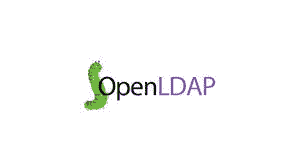

# 使用 python ldap3 对 openLDAP 进行 CRUD 操作

> 原文：<https://medium.com/analytics-vidhya/crud-operations-for-openldap-using-python-ldap3-46393e3122af?source=collection_archive---------1----------------------->

## python 中的 OpenLDAP CRUD 操作

## 使用 python 在 openLDAP 服务器中进行添加、搜索、删除、修改操作


保罗·花冈在 [Unsplash](https://unsplash.com?utm_source=medium&utm_medium=referral) 上的照片



## OpenLDAP

OpenLDAP 是 OpenLDAP 项目开发的轻量级目录访问协议的免费开源实现。许多需要 OpenLDAP 的组织在大多数技术解决方案中都需要它。由于它的灵活性，IT 和 DevOps 工程师可以自由地以各种方式使用它

【https://www.openldap.org/doc/admin22/intro.html 

我已经在这里提供了安装 openLDAP 服务器和 phpLDAPAdmin [的步骤。](/@dineshkumarkb/install-openldap-with-phpldapadmin-on-ubuntu-9e56e57f741e)

LDAP 目录服务基于*客户机-服务器*模型。一个或多个 LDAP 服务器包含构成目录信息树(DIT)的数据。客户端连接到服务器，并向它提出一个问题。服务器用一个答案和/或一个指向客户机可以从哪里获得附加信息的指针(通常是另一个 LDAP 服务器)来响应。无论客户机连接到哪个 LDAP 服务器，它看到的都是相同的目录视图；呈现给一个 LDAP 服务器的名称引用它在另一个 LDAP 服务器上的相同条目。这是全局目录服务的一个重要特性，如 LDAP。

ldap3 是一个严格遵循 RFC4510 的纯 Python LDAP 3 客户端库，在 LGPL v3 开源许可下发布。RFC4510 是 IETF 的当前 LDAP 规范(2006 年 6 月),取代了以前的 LDAP RFCs 2251、2830、3771(1997 年 12 月)。

ldap3 可以用于从 2.6 开始的任何 Python 版本，包括所有 Python 3 版本。它也适用于 PyPy 和 PyPy3。

我们将讨论如何使用 python 的 ldap3 库从 openLDAP 服务器创建、读取、更新和删除用户/组

## 使用 pip 安装 ldap3 库

```
pip install ldap3
```

## 将连接绑定到 LDAP 服务器

*绑定操作允许在客户端和服务器之间交换凭证，以建立新的授权状态。*

## 从打开的 LDAP 中搜索用户/组数据

*搜索操作用于请求服务器根据访问控制和其他限制返回一组与搜索过滤器匹配的条目。这可用于从单个条目、直接从属于特定条目的条目或条目的整个子树中读取属性*

## 在 openLDAP 服务器中创建新组

*添加操作允许客户端请求在 LDAP 目录中添加条目。添加操作仅用于新条目，即 dn 必须引用不存在的对象，但父对象必须存在。*

## 向 openLDAP 服务器添加新用户

## 从 LDAP 服务器中删除用户

*删除操作允许客户端请求从 LDAP 目录中删除条目。要执行删除操作，必须指定条目的 dn。*

## 更新用户的现有值

*修改操作允许客户端请求修改 LDAP 目录中已经存在的条目。要执行修改操作，必须指定条目的 dn 和请求的更改种类。*

## 将用户添加到现有 ldap 组，或将多个组添加到现有用户

对于向 ldap 组添加现有用户，我发现 ldap v2 比 ldap3 容易得多。因此发布 ldapv2 的代码。ldapv2 接受字节作为输入值，在调用 add_s(同步调用)之前，所有值都被转换为字节。

参考资料:

[https://ldap3.readthedocs.io/en/latest/index.html](https://ldap3.readthedocs.io/en/latest/index.html)