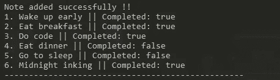

# 现代 JavaScript 中的 CRUD 操作

> 原文：<https://medium.com/analytics-vidhya/crud-operations-in-modern-javascript-5f9567764b2c?source=collection_archive---------11----------------------->

信用:**blog.ostrainer.com**

> 大家好，我叫 Gitanshu Choudhary，是一名热情的 JavaScript 学习者。
> 
> 首先，我要感谢所有读者花时间阅读我的“第一个媒体故事”。同时，我也要为 MEDIUM 提供这样一个伟大的创新平台大声疾呼。
> 
> 我是这个 JavaScript 大世界的新手，我的第一次真正进步是在 JavaScript 中执行 CRUD 操作。

RUD 的操作就像是每个渴望学习编程语言的程序员的第一步。

要成为一名核心开发者，我们必须加强我们的基础&‘CRUD’是每一种编程语言的核心。

我们将用纯现代 JavaScript 编写一个“笔记应用程序”来展示 CRUD 操作的工作原理。

现在让我们根据“笔记应用程序”来定义“CRUD”操作。这个应用程序存储了一个注释，其字符串数据类型为“标题”,布尔数据类型为“状态”。每个便笺将被存储为一个对象，并且应用程序中的所有便笺将被一起存储为一个对象数组。

首先，我们将创建一个名为“notesList”的对象数组，其中包含对象形式的注释。

notes 对象列表

C ***为了创建>*** 这里，我们将创建一个名为“addNote(title，status)”的函数，它将向应用程序添加一个新的注释。该函数的参数需要新注释的标题和状态。Title 将包含字符串名称，status 将包含 true 或 false 值，其中 true 表示便笺的状态为完成，false 表示便笺的状态为未完成。

在 addNote()函数中，我们将使用 push()方法在名为“notesList”的对象数组中添加新的 Note 对象。

addNote()函数

输出:addNote()函数

R 这个函数没有参数。

在 displayNotes()函数中，我们将使用 forEach()循环遍历数组并显示给用户。

displayNotes()函数

输出:displayNotes()函数

U ***对于更新>*** 在这里，我们将创建两个名为 updateNote(oldtitile，new title)&Update notestatus(title，newStatus)的函数。

updateNote(oldtitile，newtitle)将更新现有便笺的标题名称。该函数将使用 findIndex()方法来搜索现有的注释，并将返回其索引号。然后使用返回值，我们将更新笔记的标题。

updateNote()函数

输出:updateNote()函数

updateNoteStatus(title，newStatus)将更新注释的完成状态。该函数还将使用 findIndex()方法来搜索现有的注释，并将返回其索引号。然后使用返回值，我们将更新注释的状态。

updateNoteStatus()函数

输出:updateNoteStatus()函数

D ***对于删除>*** 在这里，我们将创建一个名为 deleteNote(title)的函数，它将根据函数中作为参数传递的标题来删除注释。

该函数还将使用 findIndex()方法来搜索现有的注释，并将返回其索引号。然后使用返回值，我们将实现 splice()方法来删除注释。

deleteNote()函数

输出:deleteNote()函数

# ***最后*** ，我们已经用纯现代的 JavaScript 编码实现了 CRUD 操作。

# 通过公共 GitHub gist 链接附在代码下面。

gitanshu-choudhary 的代码 GitHub Gist

> 如果你喜欢我的努力，请用评论和反馈来鼓励这个故事。
> 
> 谢谢大家！