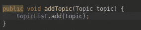

# 使用 Spring Boot 的 CRUD API:第 1 部分(没有数据库)

> 原文：<https://medium.com/analytics-vidhya/crud-using-spring-boot-part-1-without-db-385a48e8578b?source=collection_archive---------0----------------------->

**背景和为什么弹簧开机**

你好，可能正在读这篇文章的人，我刚刚在我的家庭办公室的办公桌前，决定重新整理一下我的春季书籍技能集。就像每个人都说最好的学习方法是通过做和写你正在做的事情，所以我决定试一试。Java 是最稳定和安全的框架之一(*如果不是最好的话)*也是我的第一个编程语言，因为 ***Html，CSS*** 现在都不被认为是编程语言


Html 是一种编程语言

我发现自己对 [Java(Spring)](https://spring.io/) 的好感超过了最时髦的[***Python***](https://www.python.org/)***(到时候学我会考虑的)。*** 我的观点是，对质量来说，有一个更微不足道的编程基础就是修补一个 CRUD 应用程序(创建、读取、更新、删除)

什么是 Spring Boot！

这是一个基于 Spring 的框架，采用 Spring 平台和第三方库的观点来创建企业应用程序。它使用依赖注入来帮助您快速引导应用程序投入生产。

**开始(项目设置)**

我们将使用大多数 IDE 提供的 spring starter，或者您可以从这里的[生成 if。由于这里的重点是让我们的应用程序尽快运行，所以我不会深入到依赖注入的问题中。遵循为 spring 设置 web 应用程序的步骤，以及在此构建该应用程序的要求](https://start.spring.io/)[。确保你已经运行了我们在本教程中使用的 Tom-cat dependency。](https://spring.io/guides/gs/spring-boot/)

**测试我们的网络应用**

完全设置好之后，我们就可以尝试和测试我们的应用程序了(我们在这里不是写测试用例，我们只是确认一切正常)。创建一个名为 Home Controller 的类，使我们能够服务于我们的应用程序并编写下面的代码。我会试着解释每一个

```
@SpringBootApplication
public class DemoApplication {

    public static void main(String[] args) {

        ConfigurableApplicationContext c = SpringApplication.*run*(DemoApplication.class, args);

        System.*out*.println("Welcome to Spring Boot");
    }

}
```

点击运行应用程序(我正在使用对我来说更简单的集成开发环境)，您可以使用自己选择的集成开发环境。这应该是你的输出**汤姆猫将为我们的应用服务，如下所示。**


**我们将在第 1 部分创建什么**

我们将为编程课程创建一个 api

创建一个 java 类(projo)并将其命名为 Topics，将变量初始化为 id、名称和描述。然后创建相同的 getter 和 setter。包括一个构造函数，当我们创建一个主题对象时，首先调用这个构造函数

```
public class Topic {

    private String id;
    private String name;
    private String description;

    public Topic() {

    }

    public Topic(String id, String name, String description) {
        this.id = id;
        this.name = name;
        this.description = description;
    }

    public String getId() {
        return id;
    }

    public void setId(String id) {
        this.id = id;
    }

    public String getName() {
        return name;
    }

    public void setName(String name) {
        this.name = name;
    }

    public String getDescription() {
        return description;
    }

    public void setDescription(String description) {
        this.description = description;
    }

}
```

创建一个服务，我们将把它作为与数据交互的接口(现在我们还在数组列表中使用虚拟数据)

```
@Service
public class TopicsService {

    private List<Topic> topicList = new ArrayList<>(Arrays.*asList*(

            new Topic("_spring", "_Spring FrameWork", "_Spring Description"),
            new Topic("spring", "Spring FrameWork", "Spring Description"),
            new Topic("java", "Java FrameWork", "Java Description")

    ));
```

上面的代码创建了一个可变数组列表，我们将在其中添加条目，查看单个条目，删除和更新条目，就像我们在应用程序中使用数据库连接一样。


创建一个 TopicsController 来操作我们的数据。用“@RestController”对其进行注释。这使您能够从每个函数中获取 json 对象，而无需显式地告诉函数返回 json 对象。初始化 TopicService 并用@Autowired 对其进行注释(spring framework 的特性使您能够隐式地注入对象依赖)

在 TopicController 类中创建五个函数/方法。

**查看所有话题**


这是一个 get 方法，用于显示我们的模拟数据库(主题数组)中的所有主题。它有一个“@RequestMapping”的注释。这使得 api 的访问器(无论是邮差客户端的浏览器)能够到达如下所示的请求 api。该函数调用主题服务类中的一个方法，该方法加载所有主题。附上主题服务中的方法。


该方法返回的类型是 topic 类型的列表。运行 spring-boot 应用程序来启动服务器。

当您启动 spring boot 应用程序时，您在端口 8080(默认配置)为它提供服务。访问你的博文“localhost:8080/topics”中的这个链接，它会列出你所有的项目。

**查看单选题**

**添加话题**


查看单个主题

将请求映射到一个特定的 id，并使用“@PathVariable”注释来获取被解析为参数的 id。


添加以主题为参数的主题

使用 java 的 filter 方法找到解析了 id 的主题，并获取第一个匹配项

在主题控制器中创建一个名为 addTopic 的方法，该方法接受 post 请求并映射到服务中的 addTopic 方法。该函数接受 body 类型的参数，并用“@RequestBody”进行注释



服务类中的 add topic 方法将解析后的 topic 对象添加到现有主题的数组列表中。这是邮递员的复制品。


**注意:**请求方法为 put，头的内容类型(Content-Type)为 json (application/json)


**更新和删除**

Update 和 delete 函数是相同的，你放置方法(DELETE /UPDATE ),然后放置主题作为请求体和主题的 id。两者都调用 topicService 中各自的方法，并执行更新主题值或删除主题的替代操作。


更新方法检查整个对象，检查主题的 id 是否与被解析的 id 匹配，并更新内容。

delete 检查主题的 id 是否与数组中的 id 相匹配，它是从数组中删除的。

**结论**

这是一个非常基本的方法，在未来的部分将做一个更好的方法，包括数据库。**注:**这是一种自以为是的做法。

如果对你有所启发，请鼓掌。