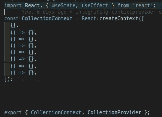

# 带有反应钩的污物

> 原文：<https://medium.com/analytics-vidhya/crud-with-react-hooks-a5b186b4732?source=collection_archive---------10----------------------->


[张](https://unsplash.com/@alexcpl?utm_source=medium&utm_medium=referral)在 [Unsplash](https://unsplash.com?utm_source=medium&utm_medium=referral) 上的照片

这些就是我们下面要讲的东西；

*   管理您的数据收集
*   了解 flux 如何与 ***上下文*** API 一起工作
*   自己用本地存储持久化数据。

之前，我在[***vanilla JavaScript***](/@princewillchime43/crud-with-vanilla-javascript-ff1f54e93cf5?source=friends_link&sk=2d27c1eca6cf57bfce6772e25dfa2a91)*中写过一篇关于***crud***操作的文章，其中使用了一个产品列表应用程序来演示 ***创建*** 、 ***读取*** 、 ***更新*** 和*

***不要再拖延了，让我们开始执行前面的任务吧。***

******先决条件******

*   ***系统上安装的节点和 npm***
*   ***了解 HTML 和 JAVASCRIPT***
*   ***了解 REACT 的工作原理。***

***让我们创建一个新的 react 项目。在您的终端上运行以下命令:***

```
***cd Desktopnpx create-react-app data_collectioncd data_collectioncode .***
```

***上面，我们导航到我们的桌面文件夹，我们创建了一个名为***data _ collection***的新 react 项目，我们最终在 visual studio 代码上打开了该项目。***

***我们已经在 visual studio 代码上打开了我们的项目，让我们使用 vscode 终端运行它；***

```
***ctrl + ` //to open the vscode terminalnpm start***
```

***回到项目并创建我们将在此项目中使用的 ***上下文*** 组件。***

***在终端上，将 cd 放入 src 文件夹，创建一个名为 data_storage 的文件夹，在其中创建我们将在本项目稍后使用的文件(组件)***

```
***cd srcmkdir data_storagecd data_storagetouch useContext.js form.js table.js thead.js tbody.js data_statistics.js***
```

***在 ***useContext*** 组件内部，让我们创建我们的提供者。***

***让我们先了解一下 ***context API*** 及其工作原理，然后再将其应用到我们的项目中。***

******上下文*** *提供了一种通过组件树传递数据的方法，而不必在每一层手动向下传递* ***道具*** *。—* [***反应文档***](https://reactjs.org/docs/context.html#when-to-use-context)***

******上下文*** API 持有一个 ***提供者*** 和 ***消费者*** 属性。provider 属性包含一个名为 ***的道具值*** ，我们将在其中传递我们希望子道具能够访问的值。下面是 ***提供者*** 函数和 ***上下文*** 值的截图，这些值将被传递给 ***子道具******

******

***创造环境***

***我们创建了一个常量变量来保存我们的 ***上下文*** 值。我们传递了一个数组，该数组包含一个包含七(7)个未定义函数的空对象。我们导入了 useState、useEffect 挂钩，我们将在项目的后面使用它们，导出了***collection context***，以及 ***provider 函数*** ，我们将在已知的时间内创建它们。***

******

***创建提供者功能***

***如我所承诺的，截图是抱着 ***提供者*** 功能的。我们声明了 ***数据*** (状态)选项，并将其传递给上下文 ***provider*** 的值 props。***

***让我们在 app 组件中导入 context provider 函数，并用它包装所有应该访问 ***上下文*** ***数组*** 的组件。***

***app 组件应该如下图所示:***

******

***app.js 文件***

***在 app 组件中，我们导入了***data statistics***组件(我们很快就会创建这个)，还有 ***collectionProvider 组件*** 。***

******data statistics***组件与 collectionContext 提供程序包装在一起，以便能够从子道具访问提供程序值***

***让我们继续向导入到 app 组件的 ***数据统计*** 组件添加一些代码。***

******

***数据统计组件***

***我们导入了 ***表*** 和 ***表单*** 组件，它们作为其子组件返回。基本上，如果不使用 ***上下文*** API，我们会像传递 ***道具*** 一样向下传递到 ***表单*** 和 ***表格*** 组件，鼓励数据单向流动，从顶部到最后一个子节点。***

***让我们创建将收集用户项目/集合的表单字段。***

***在 ***表单*** 组件内部，我们添加下面的代码；***

******

***form.js 组件***

***我们导入了保存 ***上下文*** 值的 ***集合上下文*** 和 ***使用上下文*** 钩子 API。***

***在钩子中提取 ***上下文*** ，上下文在***use context***API 内部传递。通过这样做，它赋予我们访问*的 ***提供者*** 的能力，这将类似于下面的代码，如果我们使用一个 ***类组件*******

```
****<collectionContext.consumer>{context => <form onSubmit={context.handleSubmitFunc}><input value={context.data.item}/></form>
</collectionContext>****
```

****像我之前说过的，上下文包含两个属性，称为 ***提供者*** 和 ***消费者*** 。定义值时，使用 ***提供者*** ，而 ***消费者*** 属性用于呈现 ***提供者*** 。****

****如果仔细观察上面的截图，会发现没有使用 ***消费者*** 属性，而是使用了导入的 ***useContext*** 并在其中传递我们的上下文提供者。这使我们能够访问上下文提供者 ***。数据*** 是这样从 ***提供者*** 中析构出来的；****

```
****const [data] = useContext(collectionContext)****
```

****表单元素包含输入字段。将 **d *ata*** 属性分配给输入字段的值，还将一些函数传递给表单元素，一旦提交表单，这些函数将运行。****

****让我们看看这个函数是如何以及在哪里创建的。在 useContext 组件内部，让我们添加***handle change***函数****

********

****onChange 功能****

*******handleChange*** 功能是将用户收藏设置为状态。在该函数中， ***目标*** 被析构，以在输入字段每次改变时获取特定的输入字段。****

*******setData*** 类似于类组件中的 ***setState 方法*** 。这是一个获取输入字段值的函数。它检查名称值是否在 ***数据*** (状态)中定义，如果是，它循环通过 ***数据*** 并将输入值分配给与该输入字段的名称值相匹配的数据字段。****

****完成这些后，现在让我们添加 ***handleChange*** 函数，该函数将在 ***provider*** 值中创建，如下所示；****

********

****向 value 属性添加了句柄更改****

****在表单组件中，析构如下的 ***handleChange*** 函数。****

********

****从 useContext 中析构 handlechange****

****上面是一个 [***数组析构***](https://javascript.info/destructuring-assignment) ***方法*** ，它用来从上下文中提取 ***提供者*** 到 ***子道具*** 。****

******注意:*数组*** 使用析构方法是因为 ***上下文提供者*** 持有一个 ***数组*** 。阅读更多关于解构*[***这里***](https://javascript.info/destructuring-assignment) 。*****

****接下来，让我们创建如下所示的提交函数****

********

****从 useContext 中析构 handleFormSubmit****

****首先，防止表单试图返回避免使用***e . prevent default***方法，状态值从 ***数据*** 中被**析构。******

****我们将*的 ***集合*** 属性展开，在里面增加了用户 ***集合*** ( **用户表单值**)。*****

****在 useContext 组件中，添加集合字段作为数据属性之一，如下所示；****

********

****集合属性****

*******集合*** 字段被条件化，我们检查**存储数据**是否存在，如果存在，我们将 ***解析******存储数据*** 。否则它将返回一个空数组。目前， ***storageData*** 为空，因此集合将返回一个空的 ***数组*** 。****

****现在我们已经创建了***handleDataSubmit***函数，让我们到浏览器看看我们到目前为止做了什么…****

********

****获取表单字段值****

****哇！我们的代码正在有效地工作。我们刚刚添加了一些值并打印这些值。查看控制台中的 ***数据*** 对象， ***集合*** 数组保存着用户集合， ***数据*** 也保存着输入值。****

****既然 ***handleChange*** 和 ***handleSubmit*** 函数工作正常，让我们创建一个函数来处理总价计算。之后，我们将输入的总价设置为 ***只读*** 。****

********

****handleCalculate 函数****

****我们创建了一个函数来处理每个集合的商品数量和价格的动态相乘。 ***数字构造函数*** 用于将输入字段的值转换为纯数字。****

****最后，我们检查*字段是否已经有值，如果有，它将 ***总变量*** 设置为状态( ***数据*** )*****

******注意**:在*上下文中声明的所有函数都被传递给 ***提供者值*** ***道具*** ，以便 ***上下文提供者*** 组件的 ***子道具*** 访问。*****

****从 useContext 中析构***handle calculation***函数。因为我们希望 ***totalPrice*** 字段注意 ***price*** 字段中的变化，所以我们将把***handle calculate***函数传递给 ***onInput*** 函数 props of***price***输入，如下所示。****

********

****价格输入字段****

****继续进行， ***totalPrice*** 输入将不会在其中保存任何函数，物品价格和物品数量的结果被动态地设置给它。让我们看看下面的 ***总价*** 输入字段。****

********

****总价输入字段****

****上面没有传递任何函数，输入被改为只读*，输入的 ***只读*** 属性被设置为 ***真*** 。 ***readOnly*** 方法限制用户直接向输入中添加值。*****

****表单组件已经准备好，可以有效地工作了。让我们继续将用户集合保存到 [***本地存储***](/@princewillchime43/local-storage-with-vanilla-javascript-c87e3923163a?source=friends_link&sk=85673734d89b5926166023b806067643) 。****

*******创建收藏*******

****使用 ***ctrl + p*** 在你的 ***vscode*** 中打开搜索文件提示框，快速搜索你想要打开的文件，在我们的例子中，就是 useContext 组件。****

****我们将创建一个***handleLocalStorage***函数来帮助我们将用户集合添加到 ***本地存储中。*** 下面是功能截图；****

********

****将集合添加到本地存储****

*******handleLocalStorage***是在 ***useEffect*** 函数中定义的。每当组件更新时，使用 ***useEffect*** 方法更新 ***数据*** 。useEffect 函数与 ***类组件*** 中的***componentDidUpdate***相同。****

****在***handleLocalStorage***函数中，集合字段被从 ***数据(状态)中析构。*** 一个名为[***try…catch***](https://javascript.info/try-catch)*的错误处理方法用于在使用 [***存储 API setItem***](/@princewillchime43/local-storage-with-vanilla-javascript-c87e3923163a?source=friends_link&sk=85673734d89b5926166023b806067643)***将 ***jsonState*** 设置到本地存储之前管理错误。********

******阅读收藏******

******

***获取存储集合。***

******

***将集合保存到表中***

***我们从本地存储中获取用户集合，并将其作为检查添加到集合字段中。每当组件更新时， ***会自动读取*** 用户数据。请看一个 [***的演示这里***](https://res.cloudinary.com/hobbyluv07/video/upload/v1600014140/Screencast_from_13-09-2020_17_16_01_srtg9k.webm) ***。******

******更新收藏******

***在 ***表格*** 组件中我们将导入 ***Thead*** 和 *Tbody* 组件，并将其作为表格子道具返回如下；***

******

***表格组件***

***让我们给 ***Thead*** 组件添加一些代码，如下图所示***

******

***该表头组件***

******head***组件正在返回一个表行( ***tr*** )，该表行包含一个已声明的 ***headingArr*** 的循环。首先，检查 ***集合*** 数组是否不为空。如果不是，则进行循环，最后从地图返回表格标题( ***th*** )。***

***既然我们已经看到了表格标题是如何得到的，以及它是如何呈现的，那么让我们转到 ***Tbody*** 组件，用下面的屏幕截图检查一下。***

******

***表体组件***

******Tbody*** 组件包含一个函数，该函数获取将被单击的每一行( ***tr*** )的索引和值。导出的值和索引将被设置为数据( ***状态*** )***

***该组件正在返回保存有集合 ***数组*** 的循环的 ***tbody*** ，它正在返回一个表行( ***tr*** )和一个保存集合值的 ***表数据(td)*** 。***

***让我们在下面的 ***useContext*** 组件中添加***handleEditData***函数***

******

***函数来处理集合的编辑***

***真是简单。一如既往，我会一步一步来。***

***我们循环存储数据以获得集合的索引，该集合将被点击用于 ***更新*** 。我们移除了被点击的集合，并使用数组的拼接方法用 ***数据*** (状态)的当前数据更新它。反过来，更新后的集合被 ***字符串化*** 并设置回本地存储***

***换句话说，在获得 ***更新的*** 存储集合之前一直刷新浏览器会有一点压力，我发现如果一旦存储数据被*更新，数据可以同步就好了。为此，这就是为什么 ***更新*** 集合同时 ***更新*** 中的 ***数据*** (状态)****

*******删除收藏*******

********

****删除功能****

****这个截屏展示了从本地存储和表中删除集合的神奇之处。我们 ***解析******storage data***，析构 ***keyHolder*** ，它保存了被点击的行的索引。****

****我们使用名为 ***filter 方法、*** 的数组方法循环通过 ***parseStorage*** ，该方法用于过滤掉被点击的集合，并将剩余的集合设置回 ***本地存储。*******

****最后但同样重要的是，在应用了 ***crud*** 操作之后，我发现这是一个管理 ***集合*** 的所有缓存清除的好方法。为此，我将添加一个 ***handleCache*** 函数来帮助我们做到这一点。****

********

****缓存功能****

****这是一个快速的问题，我想非常简单。提醒你一下，如果你误按了它的按钮，这个功能会让你想发疯。****

****将 ***数据*** (状态 ***)*** *集合设置为空数组，最后，我们返回了****setItem****方法来使我们能够将****storage data***设置为空数组。****

****我们终于走到了桥的尽头，这是一件了不起的事情。对此，我愿意相信我们现在都可以使用 ***react 钩子*** 和 ***上下文 API*** 创建一个*。别忘了点击 ***鼓掌图标*** 。*****

****跟随 [***me***](https://github.com/chibuike07/data_collection_react) 访问源代码，查看演示 [***这里***](https://chibuike07.github.io/data_collection_react/) ***。*** 关注我上我的 [***中***](/@princewillchime43)*想看更多我的牛逼文章，你也可以关注我上我的[***LinkedIn***](https://www.linkedin.com/in/chime-princewill-3a2b1b192/)***。*** 谢谢，我保持忠诚。*****