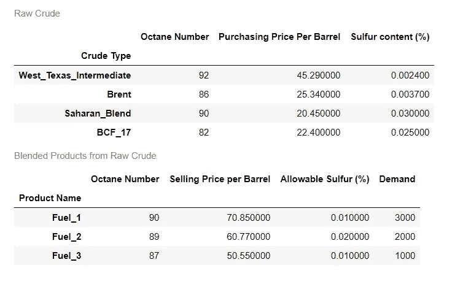
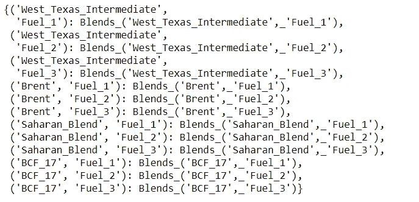
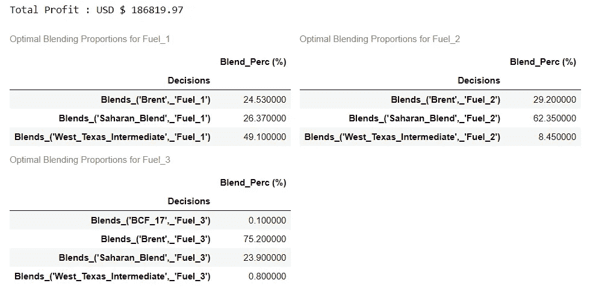

# 原油混合——通过线性规划在石油和天然气行业获得竞争优势

> 原文：<https://medium.com/analytics-vidhya/crude-blending-gaining-a-competitive-edge-in-the-oil-gas-industry-through-linear-programming-32c0709c5d6a?source=collection_archive---------20----------------------->


图片提供:[https://fin feed . com/features/oil-and-gas-juniors-looking-goods/](https://finfeed.com/features/oil-and-gas-juniors-looking-goods/)

石油和天然气行业被全球视为仅次于医疗保险和养老基金的第三大行业，在过去 5 年中创造了近 3.3 万亿美元的收入。它被广泛认为是维持国防、航空和运输等主要行业业务的生命线。

原油，通常被称为“黑金”,是一种稀缺资源，当在炼油厂经过一系列化学过程仔细蒸馏后，可以合成出有用的产品，用于我们的日常生活，如汽油(或汽油)、柴油、煤油、石蜡、喷气燃料等。这是由于全球原油稀缺，加上在炼油厂建立复杂流程的若干地理、技术和社会政治挑战，使得全球石油公司为了获得全球主导地位而相互角力。

# 原油混合概述

对于一个已经受到限制的组织来说，在石油和天然气行业中获得竞争优势的方法之一是通过“原油混合”,或者简单地说，以不同的比例组合不同等级的原油来生产分销产品的过程，通过最大化其利润率和满足其客户的日常需求，而不损害产品质量或对环境造成任何重大影响。通过本文，我们将尝试逐步了解炼油厂的混合操作如何在 Python 中建模为线性规划问题，并解决它以获得最佳混合比例。

# 定义一个虚构的炼油厂的问题

正在导入所需的库。

```
import pandas as pd
import numpy as np
import itertools
from tqdm import tqdm
from pulp import *
import matplotlib.pyplot as plt
from IPython.core.display import display, HTMLdef display_side_by_side(dfs:list, captions:list):
    """Display tables side by side to save vertical space
    Input:
        dfs: list of pandas.DataFrame
        captions: list of table captions
    """
    output = ""
    combined = dict(zip(captions, dfs))
    for caption, df in combined.items():
        output += df.style.set_table_attributes("style='display:inline'").set_caption(caption)._repr_html_()
        output += "\xa0\xa0\xa0"
    display(HTML(output))import warnings
warnings.filterwarnings("ignore")
```

> 本文中使用的所有数据和代码都可以通过我的 GitHub 资源库访问:【https://github.com/mohiteprathamesh1996/Crude-Blending.git

让我们读一下文件，看看数据，

```
raw_crude_df = pd.read_excel("Crude Blending.xlsx", sheet_name="Raw Crude")
raw_crude_df.set_index(["Crude Type"], inplace=True)products_df = pd.read_excel("Crude Blending.xlsx", sheet_name="Products")
products_df.set_index(["Product Name"], inplace=True)# Display data
display_side_by_side(dfs=[raw_crude_df, products_df], 
                     captions=["Raw Crude", "Blended Products from Raw Crude"])
```



我们可以看到，炼油厂通过混合 5 种不同类型的原油，即西德克萨斯中质原油、布伦特原油、撒哈拉混合原油和 BCF-17，生产 3 种石油产品，即燃料 1、燃料 2 和燃料 3。通过线性规划方法，我们必须建立一个模型，最大化炼油厂运营的净运营收入。

# 决策变量

让我们来定义决策变量

> X(c，p) =生产所有 c *∈(* 西德克萨斯中质油、布伦特、撒哈拉混合油和 BCF-17 *)和 p∈(* 燃料 _1、燃料 _2 和燃料 _3 *)* 石油产品“p”所需的“c”类原油的桶数

```
# List of crude types
crude_types = raw_crude_df.index.to_list()# List of petroleum products
products = products_df.index.to_list()# Dictionary of decision variables
var_dict = LpVariable.dicts("Blends", 
[(crude, product) 
for crude in crude_types 
        for product in products], 
                            lowBound=0, 
                            cat="Integer")# Display decision variables
print(var_dict)
```



# 定义目标函数

将上述 LP 框定为最大化问题，我们可以将目标函数定义为:

> **最大化，Z =售价—(购买成本+转换成本)**

在哪里，

**每种原油的采购成本****=σCost(c)*σ(X(c，p))** 所有 c *∈(* 西德克萨斯中质油、布伦特、撒哈拉混合油和 BCF-17 *)和 p∈(* Fuel_1、Fuel_2 和 Fuel_3 *)*

假设每桶原油转化为成品的成本为 4 美元，

**转换成本****=σ(X(c，p))** 对于所有 c *∈(* 西德克萨斯中质油、布伦特、撒哈拉混合油和 BCF-17 *)和 p∈(* 燃料 _1、燃料 _2 和燃料 _3 *)*

**每种成品石油产品的销售价格****=****σ成本(p)*σ(X(c，p))** 所有 c *∈(* 西德克萨斯中质油、布伦特、撒哈拉混合油和 BCF-17 *)和 p∈(* 燃料 _1、燃料 _2 和燃料 _3 *)*

```
# Model initialization
model = LpProblem("Optimized Blending of Crude Oil Types", LpMaximize)# Objective Function
purchasing_cost = lpSum(
[raw_crude_df.loc[c, "Purchasing Price Per Barrel"] * var_dict[(c,p)]for c in crude_types for p in products])conversion_cost = lpSum(
[4 * var_dict[(c, p)] for c in crude_types for p in products])selling_price = lpSum(
[products_df.loc[p, "Selling Price per Barrel"] * var_dict[(c, p)] \
        for p in products for c in crude_types]) model += selling_price - (purchasing_cost + conversion_cost)
```

# 设置约束

假设上述炼油厂有预算每天最多购买 7500 桶每种类型的原油，即

**σX(c，P1)+σX(c，p2)+…+σX(c，pN)≤7500**对于所有 c *∈(* 西德克萨斯中质油、布伦特、撒哈拉混合油和 BCF-17 *)和 p∈(* 燃料 _1、燃料 _2 和燃料 _3 *)*

```
#1 Upto 7500 barrels of each crude type can be purchased per day
for c in crude_types:
    model += lpSum([var_dict[(c, p)] for p in products]) <= 7500
```

接下来，我们必须确保每种混合成品必须满足最低辛烷值，即

**σ(辛烷值(c)*X(c，p)) ≥辛烷值(p)*σX(c，p)** 对于所有 c *∈(* 西德克萨斯中质油、布伦特、撒哈拉混合油和 BCF-17 *)和 p∈(* 燃料 _1、燃料 _2 和燃料 _3 *)*

```
#2 Fuel quality based on Octane number
for p in products:
    model += lpDot(
[var_dict[(c,p)] for c in crude_types],
[raw_crude_df.loc[c, "Octane Number"] for c in crude_types])\
               >= products_df.loc[p, "Octane Number"] * lpSum([var_dict[(c, p)] for c in crude_types])
```

此外，炼油厂受到劳动法和其他内部物流问题的限制，每天最多生产 50，000 桶成品，即

**σX(c，p) ≤ 50，000** 对于所有 c *∈(* 西德克萨斯中质油、布伦特、撒哈拉混合油和 BCF-17 *)和 p∈(* 燃料 _1、燃料 _2 和燃料 _3 *)*

```
#3 Maximum production capacity of 50000 barrels per day
model += lpSum(
[var_dict[(c, p)] for c in crude_types for p in products]) <= 50000
```

炼油厂还必须满足每天特定桶数的日常客户需求，即

**σX(C1，p)+σX(C2，p)+…+σX(cN，p) =所有 c 的需求(p)***∈(*西德克萨斯中质油、布伦特、撒哈拉混合油和 BCF-17 *)和 p∈(* 燃料 _1、燃料 _2 和燃料 _3 *)*

```
#4 Fulfill daily customer demand 
for p in products:
    model += lpSum([var_dict[(c,p)] for c in crude_types]) == products_df.loc[p, "Demand"]
```

最后，成品必须符合某些环境标准，以限制其硫浓度，即

**σ(硫含量(c)*X(c，p)) ≤硫含量(p)*σX(c，p)** 对于所有 c *∈(* 西德克萨斯中质油、布伦特、撒哈拉混合油和 BCF-17 *)和 p∈(* 燃料 _1、燃料 _2 和燃料 _3 *)*

```
#5 Sulfur content limitations
for p in products:
    model += lpDot(
[var_dict[(c,p)] for c in crude_types],
[raw_crude_df.loc[c, "Sulfur content (%)"] for c in crude_types])\
               <= products_df.loc[p, "Allowable Sulfur (%)"] * lpSum([var_dict[(c, p)] for c in crude_types])
```

# 最优解

最后一步，我们解决上述 LP 问题，并获得每种原油生产成品的最佳混合比例。

```
# Solve the mode
model.solve()# Saving the optimal solution results
if LpStatus[model.status]=="Optimal":
    optimal_soln = pd.DataFrame(
[(v.name, 
int(v.varValue)) for v in model.variables() if v.varValue!=0],
                        columns=["Decisions", "Number of Barrels"])
```

得到的最优解如下。

```
print("Total Profit : USD $ {}".format(round(value(model.objective), 2)))display_side_by_side(
    dfs=[round(100 * np.divide(optimal_soln[optimal_soln["Decisions"].str.contains(p)]\
                   .set_index("Decisions"),
                   optimal_soln[optimal_soln["Decisions"].str.contains(p)]\
                   .set_index("Decisions").sum()), 2).rename(columns={"Number of Barrels":"Blend_Perc (%)"})\
         for p in products], 
    captions=["Optimal Blending Proportions for "+i for i in products])
```



# 参考

1.  [https://fin feed . com/features/oil-and-gas-juniors-looking-goods/](https://finfeed.com/features/oil-and-gas-juniors-looking-goods/)
2.  [https://OCW . MIT . edu/courses/斯隆管理学院/15-071-the-analytics-edge-spring-2017/integer-optimization/](https://ocw.mit.edu/courses/sloan-school-of-management/15-071-the-analytics-edge-spring-2017/integer-optimization/)
3.  [https://www . ibis world . com/global/industry-trends/maximum-industries-by-revenue/](https://www.ibisworld.com/global/industry-trends/biggest-industries-by-revenue/)
4.  [https://medium . com/synced review/how-ai-can-help-the-oil-industry-b 853 DDA 86 be 6](/syncedreview/how-ai-can-help-the-oil-industry-b853dda86be6)
5.  [https://www . sensia global . com/Measurement/Types/Blending/原油-凝析油-混合#:~:text=Overview，最低% 20 higher % 20 cost % 20 round % 20 Oil](https://www.sensiaglobal.com/Measurement/Types/Blending/Crude-Oil-Condensate-Blending#:~:text=Overview,minimum%20higher%20cost%20crude%20oil)。
6.  [https://medium . com/protoil-tank-farm/oil-blending-d 2503 ea 91 CFD](/protoil-tank-farm/oil-blending-d2503ea91cfd)

我真的希望你喜欢读这篇文章。请随时提出你的意见或建议。谢了。

让我们在 LinkedIn 上连线:https://www.linkedin.com/in/prathameshmohite96/