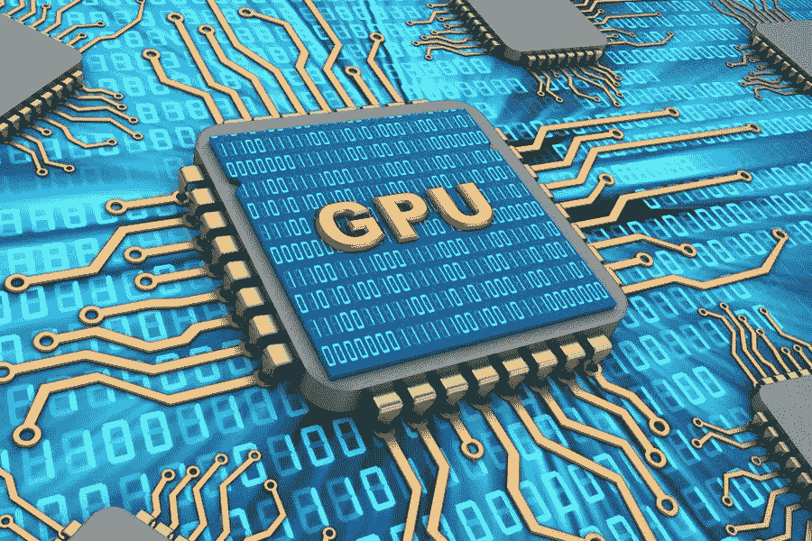
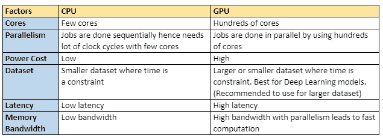

# 图形处理器(GPU)的关键

> 原文：<https://medium.com/analytics-vidhya/crux-of-gpu-28fe7d37dd28?source=collection_archive---------11----------------------->

读者们好！

图片来自[https://www . HPC wire . com/2018/03/27/NVIDIA-riding-high-as-GPU-workloads-and-capabilities-soar/](https://www.hpcwire.com/2018/03/27/nvidia-riding-high-as-gpu-workloads-and-capabilities-soar/)

P 对这个关于智能微处理器图形处理单元(GPU)的博客表示不满。可以毫不夸张地说，人工智能和人工智能是近年来最热门的领域之一。时间推进的燃烧，正与许多燃烧的创新和编程技术相处。深度学习刚推出时，对多核 CPU 来说还不够，有时需要几天时间才能运行。因此，另一种微处理器 GPU(早期用于游戏技术)也开始用于深度学习模型。

**什么是 GPU 计算？**

*   图形处理单元(GPU)是具有数百个内核的微处理器。
*   GPU 是 CPU 的协处理器，通过执行繁重的计算来提高 CPU 的性能，从而获得更快的结果..
*   它是一种并行架构处理器，遵循并行编程模型，使高效和有效地运行深度学习模型成为可能。
*   一些 GPU 制造商如英伟达，AMD，华硕，英特尔等。最重要的是 NVIDIA 通过引入其核心技术 CUDA 来制造其处理繁重计算的最佳 GPU，因此 CUDA 核心被引入。
*   CUDA 和 NVIDIA GPUs 主导市场。
*   *NVIDIA GPU*:GeForce，Quadro，Tesla。

**什么是 CUDA？**

*   NVIDIA 的 GPU 通过使用其 CUDA 内核来执行并行计算。GPU 中的数百个内核是一个并行计算平台，用于在 GPU 上执行密集型应用程序。
*   数百个内核使其在带宽和计算时间方面优于 CPU。
*   tensorflow、torch、CNTK、H2O.ai、Keras、Theano、PyTorch 等很多深度学习技术都委托 CUDA 进行 GPU 支持。
*   GPU 被大量用于需要密集计算的深度学习模型和重型机器学习模型。要了解如何在 Keras 和 Tensorflow 上使用 GPU，请访问 Keras 和 Tensorflow 上的[GPU](/@shachikaul35/gpu-on-keras-and-tensorflow-357d629fb7e2)。

那么，是否意味着不再使用 CPU，转而使用 GPU 呢？好吧，战士还是战士。GPU 和 CPU 都是特定需求所必需的。因此，根据你的需要明智地选择你的立场。

**GPU 比 CPU 优越吗？**

还在纠结选哪边？同样，取决于上述因素。CPU 和 GPU 都有各自的用处。

从深度学习的角度来看，最好使用 GPU 进行繁重的计算，其中数据集可能需要 CPU 运行更长的时间。但是对于较小的数据集，CPU 是最好的，因为较小的数据无法充分利用 GPU 的优势。此外，GPU 更高的延迟可以通过数百个内核并行计算的更高带宽(携带大量数据)来抑制。因此，它使 GPU 比 CPU 快很多。

虽然 GPU 看起来比 CPU 快，但在将大量数据从 CPU 传输到 GPU 时会消耗大量时间，这取决于架构。

NVIDIA 本身提供了许多命令行实用工具来监控和跟踪你的 GPU。
几个如下:

1.  ***nvidia-smi* :** 监控你的 GPU。在 nvidia-smi 的[解释输出中详细了解该实用程序。](/@shachikaul35/explained-output-of-nvidia-smi-utility-fc4fbee3b124)

2.***【NVIDIA-SMI–a***】:除了详细显示的信息之外，该工具与上面类似。

3.***watch–n1 NVIDIA-SMI****:它每秒都在监控你的 GPU，每秒都在刷新和跟踪输出本身。*

4.****watch–n 1 free–m***:这个工具在运行模型时跟踪你的 GPU 的内存使用情况，每秒一次。*

*关于这些实用程序的更多详细信息，值得一读。*

*[https://www . microway . com/HPC-tech-tips/NVIDIA-SMI _ control-your-GPU/](https://www.microway.com/hpc-tech-tips/nvidia-smi_control-your-gpus/)*

*快乐阅读！*

****可以通过***[***LinkedIn***](https://www.linkedin.com/in/kaul-shachi)***取得联系。****