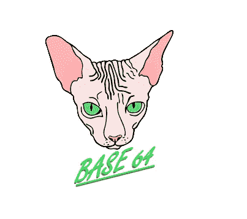

# 加密基础:了解并使用 Python 创建自己的 base64 编码

> 原文：<https://medium.com/analytics-vidhya/crypto-basics-understand-create-your-own-base64-encoding-with-python-a1481686a35a?source=collection_archive---------15----------------------->



我们在日常生活中会遇到 base64 编码(是的，书呆子)。

例如，我们使用 base64 编码将图像数据直接嵌入到 HTML 源代码中，或者在通过互联网发送附件时，防止二进制数据以原始形式损坏。

如果你是一个活跃的 CTF 玩家，你可能已经比你的家人看到更多了。

# 让我们直接进入**base64 是如何工作的**:

> ASCII 编码和 Base64 编码不可互换。不要陷入这种常见的误解。它们用于不同的目的。

Base64 是一种二进制到文本的编码方案。因此可以加密任何二进制数据或非 ASCII 字符，结果给出 ***ASCII 字符*** 。

> **步骤 1:**Base64 编码算法接收一个 8 位字节的输入流。

```
**input**: 
**->** oz9un
**Binary Represantation(8-bit sequences)**:
**->** 01101111 01111010 00111001 01110101 01101110
```

> **第二步:**将输入拆分成 6 位块。在最后一个组的末尾填充“0”位，除非它被分成完整的 6 位组。

```
**Binary Represantation(6-bit sequences):
->** 011011 110111 101000 111001 011101 010110 1110**00**
```

> **步骤 3:** 现在我们有了 6 位组，我们需要将它们转换成 ASCII 字符。但是怎么做呢？通过将 6 位序列编入 Base64 索引表。

```
**The 6-bit sequences above correspond to:
->** 27 55 40 57 29 22 56
```

让我们看一下 base64 索引表


这张表摘自[维基百科](https://en.wikipedia.org/wiki/Base64)

正如您所看到的，6 位序列可以接受的 63 个不同数字都有相应的 ASCII 字符。

## 那个**‘填充’**到底是什么意思？

冷静，这是为了你的健康。正如你可能注意到的，我们将三个 8 位数据块分割成四个 6 位数据块(这很简单，明白了)。

记住我们在第二步中做了什么。我们简单地添加了 0 位，使序列可拆分成 6 位的块。当添加“0”位时，我们有两种选择。要么 2，要么 4。并且在将 6 位序列转换成相应的 base64 字符后，我们应该在编码版本的末尾添加 ***(附加‘0’字节的数量)/2*** 填充字符(=)。

## 好吧…我能问一下我们为什么这么做吗？

Imm，我完全同意你的观点。这在今天是不必要的。但是 base64 编码是非常古老的，在它年轻的时候，计算机的 CPU/ram 有限，编写软件并不容易。所以，解码器的人想很容易地将输入分成 4 块，并从每 4 块中提取 3 个字符。填充过程允许他们这样做，而不经过输入的结尾。

是啊，那是个悲伤的故事。但是不要担心。我们可以在不需要任何填充字符的情况下进行编码(我们有大于 10mb 的 ram)。

现在是时候在 base64 索引表的帮助下将这些数字转换成 ASCII 字符了:

```
**The 6-bit sequences above correspond to:
->** 27 55 40 57 29 22 56
**Corresponding ASCII characters:
->** b3o5dW4=
```

现在你肯定知道这个等号是从哪里来的了。


## 还没有，我们开始吧:

首先，我可以肯定地说，我们不需要导入任何模块，因为我们得到了逻辑。这是最酷的部分。

> **代码步骤 1:** 我们要初始化一个变量来保存 base64 索引表。

**【1】**你可以通过导入*字符串*模块来实现。但是我们当然不会选择这种方式(没有导入的代码，谢谢)。

```
*import* string**base64_table** = (string.ascii_uppercase+string.ascii_lowercase+string.digits+'+/')
```

**【2】**容易猜，自己写字母表不会累手指。但我还是留给你抄。

```
**ascii_lowercase** = 'abcdefghijklmnopqrstuvwxyz'
**ascii_uppercase** = 'ABCDEFGHIJKLMNOPQRSTUVWXYZ'
**digits** = '0123456789'**base64_alphabet** = ascii_uppercase + ascii_lowercase + digits + '+/'
```

> **编码步骤 2:** 让我们将输入分解成 8 位块。(但是……我们没有采纳任何意见。好吧，那就拿着吧。)

```
**to_encode** = input("base64 encoder ->  ")**chunks_8bit** = ''***.***join([format(bits***,***'08b') **for** bits **in** to_encode***.***encode('utf8')])
```


如果您在阅读上面的代码片段时有困难

我们使用*格式(bits，' 08b')* 将整数转换为二进制保留前导零。

使用 *join，* **chunks_8bit** 输出如下所示:


> **代码第三步:**是时候把 8 位组块转换成 6 位组块了，如果需要的话在字符串末尾加‘0’位。

```
**chunks_6bit** = [chunks_8bit[bits***:***bits+6] **for** bits **in** range(0***,***len(chunks_8bit)***,***6)]**padding_amount** = ( 6 - len(chunks_6bit[len(chunks_6bit)-1]) )**chunks_6bit[**len(chunks_6bit)-1**]** += padding_amount * '0'
```


如果您在阅读上面的代码片段时有困难

如果需要的话，这段代码就是将 8 位数据块转换为 6 位数据块所需的全部内容，并使用“0”填充。

在计算 **padding_amount 的帮助下，**我们可以在后面加上' = '。

**chunks_6bit** 输出看起来像:


> **代码第四步:**最后一步。我们所要做的就是将这些 6 位块值映射到我们的 base64 字母表中。

```
**encoded** = ''***.***join([base64_alphabet[int(bits***,***2)] **for** bits **in** chunks_6bit])**encoded** += int(padding_amount/2) * '='print('Base64 encoded version of **{to_encode}** is: **{result}**'***.***format(***to_encode*** = to_encode***,*** ***result*** = encoded))
```


如果您在阅读上面的代码片段时有困难

我们使用 *int(bits，2)* 将二进制转换为十进制。每两个额外的“0”位对应一个填充字符(“=”)。这就是我们将 padding_amount 除以 2 的原因。

然后，我们就把它打印出来。


你可以在这里找到完整的代码。当我写新的作品时，我会在这个库中分享它们的代码。

> [https://github . com/oz9un/crypto _ basics/blob/master/base _ world/base64 _ manually . py](https://github.com/oz9un/crypto_basics/blob/master/base_world/base64_manually.py)

# 结尾:


这是我第一篇关于加密基础的文章的结尾。我计划在有时间的时候写更多关于这个主题的东西。如果你能给我一个反馈，我会很高兴。保持联系！

## 联系我:

> ozgunkultekin@gmail.com
> 
> **Github:**[https://github.com/oz9un](https://github.com/oz9un/crypto_basics)
> 
> **推特:**[https://twitter.com/oz9un](https://twitter.com/oz9un)(新来的，不过会活跃)。
> 
> CTFtime: oz9un
> 
> **领英:**【https://www.linkedin.com/in/oz9unkultekin】T2