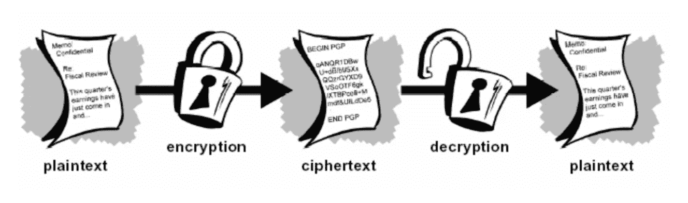
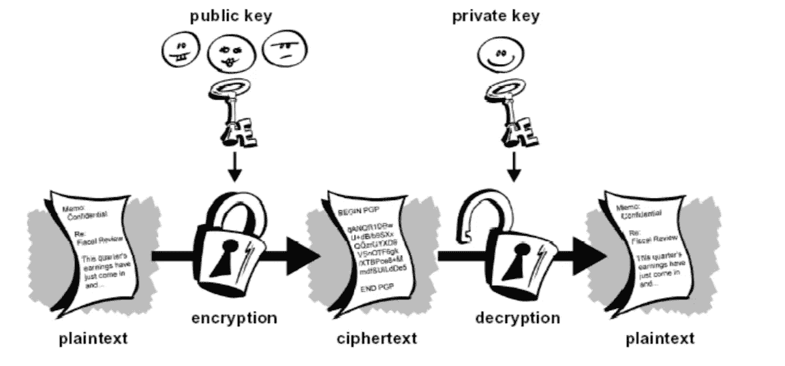

# 密码学和数据安全

> 原文：<https://medium.com/analytics-vidhya/cryptography-in-data-security-cf610303fd46?source=collection_archive---------19----------------------->

从古至今，人类有两个基本需求。虽然这些需求可能有不同的解释，但首先是交流或共享信息，其次是有选择地交流。这两种需求创造了一个系统，在这个系统中，只有想要的人才能访问信息。在这个系统下，未经授权的人不能解码加密的信息。人们改进了不同的方法，但这些都表明这个系统是可靠的。这种在信息安全中引入秘密的系统被认为是密码术。“密码术”这个词是由两个希腊词组合而成的，“Krypto”的意思是隐藏，“graphene”的意思是书写。

# 密码学的历史

估计密码学的艺术是和书写的艺术一起诞生的。随着文明的进化，人类组织成部落、团体和王国。这种力量导致了诸如战争、优越和政治的思想。这些想法进一步刺激了人们与选择性接收者秘密通信的自然需求，这导致了密码学的不断发展。密码学的根源可以在罗马和埃及文明中找到。

在欧洲文艺复兴期间和之后，各种意大利和教皇国导致了加密技术的扩散。在此期间，研究了各种分析和攻击技术来破解密码。随着该领域的发展，政府活动、军事单位和一些机构开始采用加密应用。他们使用密码术来保护他们的秘密不被他人知道。现在，计算机和互联网的出现给普通作品的访问带来了有效的加密。

现代密码学是计算机和通信安全的基石。它的基础是基于数论、概率论等数学的各种概念。

## 密码学的背景

密码学，研究密码系统，可以细分为两个分支

*   密码系统
*   密码分析学

密码学是制造能够提供信息安全的密码系统的科学。加密技术为数字数据提供了真正的安全性。表达基于提供基本信息安全服务的数学算法的机制设计。我们可以将密码学描述为安全应用中一大套不同的技术。

密码分析，破解密码文本的科学被称为密码分析。加密产生用于传输或存储的密文。它涉及到破解它们的密码机制。当设计新的密码技术来测试安全力量时，也使用密码分析。

密码学关注的是密码系统的设计，密码分析研究的是密码系统的破解。

# 技术方法

## 密码系统

密码系统是密码技术及其相关基础设施的应用，用于提供信息安全服务。密码系统也称为密码系统。



## 密码系统的组成部分

*   明文，这是在传输过程中要保护的数据。
*   加密算法，它是一个数学过程，为任何纯文本和加密密钥生成一个加密文本。它是一种加密算法，接收纯文本和加密密钥作为输入，并生成加密文本。
*   密文，由加密算法使用特定密钥生成的明文的加密版本。密文没有被保护。它在公共频道上流动。任何有权访问该通信信道的人都可以破坏它。
*   解密算法，它是一个数学过程，为任何加密文本和解密密钥生成唯一的明文。它是一种加密算法，接收加密文本和解密密钥作为输入，并输出明文。解密算法基本上与加密算法相反，因此与加密算法密切相关。
*   拦截器(攻击者)是试图确定明文的未授权实体。他可以看到密文，并且可能知道解密算法。然而，他绝不能知道解密密钥。

## **密码系统的类型**

基本上，根据系统中执行加密-解密的方式，有两种类型的加密系统。

*   对称密钥加密
*   非对称密钥加密

**对称密钥加密，**

使用相同密钥对信息进行加密和解密的加密过程称为对称密钥加密。

对称密码系统有时也称为密钥密码系统。这些系统的优点是速度快，缺点是在识别和向各方传送公钥时遇到的问题。

对称密钥加密方法的几个众所周知的例子是数字加密标准(DES)、三重 DES (3DES)、IDEA 和 BLOWFISH。

**1。**DES(数据加密标准)

DES 是块加密的一个例子。也就是说，通过简单地将待加密的公开文本分成多个部分(块)，它彼此独立地加密每个部分，并对块执行相同的操作以打开加密的文本。这些块的长度是 64 位。它是世界上使用最广泛的加密算法之一。DES 是由 IBM 开发的。它于 1975 年由《联邦登记册》出版。DES 使用 56 位密钥加密 64 位数据。另外，使用经典的 Feistel 网络，加密过程和解密过程基本相同。使用的技术是传播和混合。DES 的主要缺点是密钥长度为 56 位。这个发表于 1975 年的算法在面对现代计算机攻击(BruteForce)时显得力不从心。由于需要更安全的加密，DES 被开发为三重 DES。Triple -DES 算法使用 2 个 56 位密钥来支持向后兼容性。

Triple-DES 由 IBM 开发，并于 1977 年被采纳为标准。但是在 1997 年，它被以色列人打破了。虽然加密方法被解决了，但它仍在今天的银行系统中使用。Triple-DES 算法是 DES 算法在加密、解密、加密形式上的实现。标准 DES 是一种加密技术，通过连续运行两个或三个 112 或 168 位的密钥来创建。

**2。两条鱼**

该算法于 1993 年发表，是由布鲁斯·施奈尔—约翰·凯尔西—道格·怀汀—戴维·瓦格纳—克里斯·霍尔—尼尔斯·费格森创造的对称分组加密算法。它使用 Feistel 结构，就像 DES 一样。

与 DES 的一个不同之处是，它有使用密钥创建的变量 S 盒。它还将 128 位纯文本分割成 32 位段，并对 32 位值执行大多数操作。

**3。熨斗**

像其他两个算法一样，它使用 Feistel 结构。IRON 用于使用 128 位密钥加密 64 位数据块。回合数在 16 到 32 之间。子开关取决于循环次数。子项的数量等于循环的数量。因此，该算法是密钥相关的。

这就是 IRON 和现有算法的区别。这种算法的优点是用 16 进制(hex)数代替位，缺点是为软件设计的。

**4。AES(高级加密标准)**

AES 是由约翰·代蒙和文森特·里门以 Rijndael 的名字开发的，并于 2002 年成为标准。AES 使用长度为 128 位的块和 128、192 或 256 位的密钥。使用的一些技术是字节位移、应用于分布在 4x4 矩阵上的文本片段行的换行操作。

截至 2010 年，它是最流行的对称算法之一。如果计算机能在 1 秒钟内破解 DES，128 位 AES 密钥可能在 149 万亿年后破解。

**5。RC4 算法**

RC4 算法将待加密的数据检测为比特流。RC4 是一种用指定密钥加密数据的算法。RC4 的主要特点是:

*   通常用于需要速度的应用中。
*   加密速度高，MB/s 级别。
*   安全性取决于随机密钥的使用。
*   128 位 RC4 加密被认为是强加密。
*   广泛用于银行和文档(PDF)加密。

**6。MD5(消息摘要算法 5)**

它是一种单向加密算法，由 Ron Rivest 于 1991 年开发，是一种用于测试数据完整性的加密算法。无论输入大小如何，该算法都会产生 128 位输出，即使输入中最轻微的位变化也会导致输出完全改变。MD5 使用最多的地方之一是检查数据是否被正确传输或更改。

**非对称密钥加密**

1976 年，斯坦福大学的研究人员 Diffie 和 Hellman 提出了两种不同的基于密钥的加密系统。该系统有一个用于加密的密钥(公钥)和一个用于解密的密钥(私钥)。无法从公钥获得私钥。



**1。RSA 算法**

世界上使用最广泛的非对称算法是以其发明者(罗纳德·L·李维斯特、阿迪·萨莫尔和伦纳德·阿德曼)的姓名首字母命名的。基于大数的模运算有一个非常简单的原理。密钥由两个大素数生成。所以算法的安全性是建立在产生大数的问题上的。

**2。DSA**

DSA 是一种算法，因其支持 TLS(传输层安全)加密协议的 PFS(完美前向保密)而闻名，该协议在密钥生成中使用对数函数，并提供互联网上的安全通信。换句话说，PFS 基本上是一种功能，如果其中一个密钥在将来遭到破坏，它可以保护其他密钥。

因此，非对称加密系统使用复杂的数学方法来生成密钥，这是它们比对称加密系统慢得多的主要原因。它们的使用比对称加密系统更受限制，并且它们在实践中较慢的操作导致它们不能被有效地使用。

# Java 中的用例

DES 加密算法显示在使用 Java 编程语言的程序上。这个程序可以用来使用 DES 算法加密或解密一个加密的字符串。在编码过程中使用了 Java 编程语言中的相关库。

```
import java.io.UnsupportedEncodingException;
import javax.crypto.Cipher;
import javax.crypto.IllegalBlockSizeException;
import javax.crypto.KeyGenerator;
import javax.crypto.SecretKey;public class DesEncrypterExample {
        Cipher encCipher;
        Cipher decCipher;DesEncrypter(SecretKey key) {
            try {
                encCipher = Cipher.getInstance("DES");
                decCipher = Cipher.getInstance("DES");
                encCipher.init(Cipher.ENCRYPT_MODE, key);
                decCipher.init(Cipher.DECRYPT_MODE, key);} catch (javax.crypto.NoSuchPaddingException e) {
            } catch (java.security.NoSuchAlgorithmException e) {
            } catch (java.security.InvalidKeyException e) {
            }
        }public String encrypt(String str) {
            try {
                byte[] utf8 = str.getBytes("UTF8");// Encryption
                byte[] enc = encCipher.doFinal(utf8);// Convert Bytes to BASE64
                return new sun.misc.BASE64Encoder().encode(enc);
            } catch (javax.crypto.BadPaddingException e) {
            } catch (IllegalBlockSizeException e) {
            } catch (UnsupportedEncodingException e) {
            } catch (java.io.IOException e) {
            }
            return null;
        }
        public String decrypt(String str) {
            try {
                byte[] dec = new sun.misc.BASE64Decoder().decodeBuffer(str);// Decryption
                byte[] utf8 = decCipher.doFinal(dec); return new String(utf8, "UTF8");
            } catch (javax.crypto.BadPaddingException e) {
            } catch (IllegalBlockSizeException e) {
            } catch (UnsupportedEncodingException e) {
            } catch (java.io.IOException e) {
            }
            return null;
        }public static void main(String[] args) {
            try {
                // Creating a temporary key
                SecretKey key = KeyGenerator.getInstance("DES").generateKey();// Create the object to encrypt
                DesEncrypter encrypter = new DesEncrypter(key);// Encryption
                String encrypted = encrypter.encrypt("sefaarslan");
                System.out.println(encrypted);// Decrypt
                String decrypted = encrypter.decrypt(encrypted);
                System.out.println(decrypted);
            } catch (Exception e) {
            }
        }
}
```

程序的输出:

```
tRlpGfnpImZX+7nAL+IlsQ==
sefaarslan
```