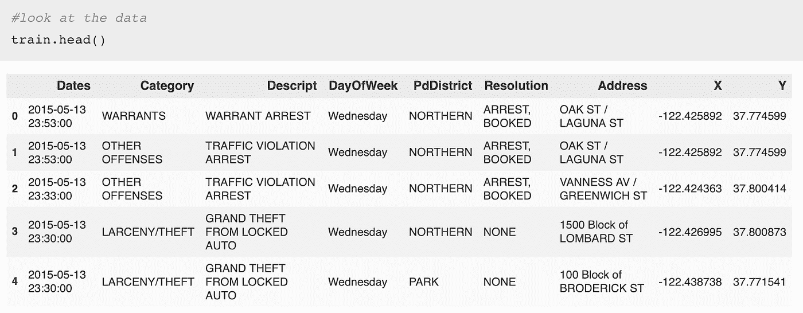

# CSI: SF —数据科学家

> 原文：<https://medium.com/analytics-vidhya/csi-sf-ep-1-the-data-scientist-9399c642ff64?source=collection_archive---------14----------------------->

**此处跟随代码:* [*GitHub*](https://github.com/cbmitchell1/CSI-SF-The-Data-Scientist)

欢迎收看《犯罪现场调查:旧金山》第一集。你在节目中是一名有抱负的侦探，你获得了面试 SFPD 数据科学职位的机会。当你走进面试官的办公室时，你注意到她脸上一副心烦意乱的表情。她递给你一台笔记本电脑，然后问了你一个看似不可能的问题:

“在我们的网络安全团队加强我们的防御之前，一名黑客闯入了我们的数据库，删除了我们一半犯罪记录的描述。如果我告诉你犯罪发生的时间和日期，它的地址和 GPS 坐标，以及它发生在哪个警察局辖区，你能告诉我是什么类型的犯罪吗？我们的团队正在尽可能多地恢复细节，但我们不确定会得到多少。”

你梦想中的工作就在眼前，你能做到吗？

仅仅使用一个基本的数据科学工具包和一台计算机，答案是肯定的。这篇博文将教你如何通过三个步骤成为像夏洛克·福尔摩斯一样的大明星。作为一个不错的奖励，你还可以将你的结果提交给[这场 kaggle 挑战赛。](https://www.kaggle.com/c/sf-crime/)完整代码可以在[这个 Github repo 中找到。](https://github.com/cbmitchell1/CSI-SF-The-Data-Scientist)

# 第一步:探索

完成必要的 NDAs 后，您就可以登录笔记本电脑了。它让您可以访问包含历史犯罪详细信息的数据库，包括犯罪类型、犯罪时间、犯罪地点以及负责的警察局提供的描述。首先，[下载所有数据](https://www.kaggle.com/c/4458/download-all)。你需要尽可能多的钱。

现在打开一个 iPython 笔记本(确保数据文件在同一个文件夹中！)并查看您正在处理的数据。这是解决任何数据科学问题的第一步，因为探索数据会告诉您在训练模型之前需要进行什么(如果有)数据清理(“预处理”)，并突出显示数据集中可能影响性能的任何弱点。

您应该使用 pandas 来读取数据集，因为 pandas DataFrame 数据结构灵活、直观，并且与常见的 NumPy 函数紧密相关。此外，像 head()和 describe()这样的 pandas 函数可以提供您正在处理的数据集的完整概述。这是一个需要养成的好习惯。

看起来在训练数据集中有 8 列，包括时间(日期)和空间(地址，X，Y)列，其中包含面试官告诉你她会提供的信息。确保您也检查了测试集，以确保没有必要进行重新格式化(例如将一个元组转换为单独的列)。

啊哦。虽然时间和空间列是一致的，但黑客做得很好。测试数据集缺少类别、说明和分辨率。你不能用它们来训练你的模型，因为你不能用它们来对被黑的数据集进行预测(“测试”)。

说到这里，您应该检查您的目标变量(“类别”)在您的训练数据集中的分布。您拥有的犯罪类别的干净记录越多，您的模型需要学习的样本就越多，以便识别类似的未来样本。

为了利用 X 和 Y 要素列更好地了解这些犯罪发生的位置，您还应该查看地图犯罪密度分布图。这对于理解训练数据集的空间分布以及位置作为不良预测器的可能性非常重要。要创建一个，你应该导入你可靠的数据可视化库 Folium，使用 google maps 确定旧金山的地理中心来居中地图(SF_Coordinates)。

现在，为了可视化城市的区域，您需要它们的地理边界，您可以通过下载 json 数据将它们直接导入到您的环境中。

是的，是的。你做了一张漂亮的地图，但不要分心。你的工作岌岌可危，时间是最重要的。这张地图告诉了你什么？大量的颜色表示广泛的犯罪密度分布，这意味着某些地区的犯罪训练数据的样本量会很低。地图不会告诉您可能会发生什么类型的犯罪，但这正是我们建模的目的。犯罪密度的多样性表明了地区级别的差异，这支持将位置用作预测模型中的一个特征。

但是，在进入将位置转换为有用信息的功能工程阶段之前，您需要探索空值和异常值:这两种类型的数据点都可能扭曲您的结果或破坏您的代码。使用 Pandas 的 describe()函数是发现异常值的好方法，因为它提供了数据帧中非分类变量的汇总统计。

纬度 90 度？根据你之前确定的 SF 坐标，你知道这是一个异常值。在进行建模之前，您必须处理它们，否则您将面临 Y 列特性权重倾斜的风险。希望不是很多。您可以通过查看大于旧金山地区合理上限的 Y 坐标值来进行检查。

唷，真幸运。无论您是否选择估算他们的位置值，都不会对您的模型性能产生太大影响。但是空值呢？

哇！训练数据集中没有空值？在你作为数据科学家的经历中几乎闻所未闻。你的面试官的一个同事一定事先清理了数据集……希望重要的部分完好无损。请记住，数据科学是一项团队运动。

# 步骤 2:工程师

现在，您已经通过一些探索建立了对数据的直觉，并处理了沿途遇到的空值和异常值，是时候为您的模型设计一些更多的解释变量了。但是，在深入研究之前，后退一步，考虑一下您需要构建的模型类型。

面试官向你提出的问题是需要预测犯罪的“类别”。唯一类别的数量大于两个意味着这是一个多类分类问题。这意味着您将要求您的模型估计一个函数，该函数可以将您的数据分成 N 维空间中的不同图形区域，这些区域可以被标记为具有良好准确性的特定类别，其中 N 是数据集中的要素数量。您拥有的维度或特征越多，您的分类器就有越多的自由度来识别犯罪类别之间的准确分隔符，但这需要权衡计算复杂性，并有过度适应数据集的风险。

记住这一至理名言，你就可以开始了。

一些懒惰的数据科学家新手可能会简单地将“日期”时间戳转换成数字日期列，但对于精明的功能工程师来说，它包含其他有用的信息。通过一些省时的矢量化计算([请参见此处快速回顾矢量化](https://www.geeksforgeeks.org/vectorization-in-python/)的优点)，您可以向训练和测试集添加列，以识别犯罪发生的时间、当天是否是假日以及季节。犯罪发生在一周的哪一天已经给了你，所以这只是节省了你一点工作，但它有一个字符串数据类型。有问题吗？

不是为了熊猫！您可以有效地将其转换为 7 个虚拟变量列(一周中的每一天一个)。每一列都是一个二进制指示器，指示犯罪是发生在那一天(值= 1)还是没有发生(值= 0)。您还应该将警察局功能转换为虚拟变量，但是不要忘记维数灾难！你要确保你的模型收敛。

空间要素通过将公开可用的人口普查数据映射到邮政编码，为要素工程提供了另一种途径。邮政编码内的人口密度、社会经济信息和年龄分布是包含在模型中的理想要素。但是没有提供每起犯罪的邮政编码，只有它的位置坐标。幸运的是， [uszipcode 库](https://pypi.org/project/uszipcode/)提供了一种简单的方法来获得距离坐标对**最近的邮政编码，并且**允许访问人口普查数据！一个烤饼两只鸟。通过使用文档作为指南，您可以编写一个函数来执行半径为 5 英里范围内的邮政编码查找，并编写另一个函数来选择您想要包含在模型中的功能。

特性选择函数是您需要应用数据结构知识的地方，因为像 uszipcode 这样的自制外部库通常将数据管理留给用户。在这种情况下，您需要进行大量的试错和大量的打印功能来过滤嵌套的字典，以提取干净的数据。

经过时间和空间特征工程，你应该有信心进入这个任务的建模阶段。虽然人口密度和家庭收入等特征在传统上是可预测的，但它们受到邮政编码级别粒度的限制，这意味着每个特征只有 25 个唯一值。

# 第三步:建模

除了测试集中缺失的“Category”标签列之外，功能工程训练和测试集看起来完全相同，现在您已经准备好构建多类分类器了。要实现的另一个重要的数据科学实践是使用模型比较，尤其是当您不确定哪一个在给定任务中表现最佳时。每个数据集都有不同的特征(线性与非线性、高/低方差等)。)哪些不同的建模方法专门处理。一个好的第一个问题是你是否认为你的数据集是线性可分的。如果不是，那么线性参数模型(LPM)如支持向量机不会产生最好的结果，除非你用核变换数据。

由于任务的时间限制，您决定测试三种合理多样性的常见模型:多项式逻辑回归、随机森林分类器和 KNearestNeighbors，并信任默认的超参数

多项式逻辑回归将线性组合函数拟合到输入数据中，以便为属于每个类别的样本生成概率估计值。该函数中每个特征的系数是通过使用 logit 函数分别回归每个特征的结果变量来确定的。

随机森林分类器使用一组随机生成的决策树(每个决策树使用完整数据集的子样本，默认情况下使用替换采样(“引导”)来对每个样本进行平均类预测。与逻辑回归相比，每个决策树包含的要素数量可能少于输入数据集的总数量，这也使其对过度拟合更具鲁棒性。由于决策树是非线性的，在预测器/特征和类别之间的关系是非线性的情况下，它为逻辑回归提供了很好的补充。

K-最近邻或 KNN 是一种简单的算法，它在 X 维空间(其中 X =数据集中的要素数量)中绘制所有训练数据样本及其已知类，当要求对未知数据点进行分类时，它会找到与未知点最近的 K 个点，并聚合它们的类来生成预测。如果 K = 1，那么只有未知点会以最近点的类为例。

您为评估模型而选择的度量标准也很重要。您首先想到的可能是最大化精度(正确分类的点数除以总点数)，但这不适用于多类分类问题，因为不同类别的精度可能会有很大差异。相反，你的目标应该是最小化对数损失分数，它解释了你的模型在预测中的不确定性。(巧合的是，这也是 kaggle 竞赛使用的度量标准)。

既然您已经有了模型和度量标准，那么是时候训练模型了。请确保将定型集分为定型集和验证集，以便从模型中保留一些已知样本进行测试。这可能看起来很明显，因为提供给你的被黑掉的测试集丢失了它的类别标签，但是即使它有类别标签，最好分割你的训练集并接受训练样本的减少，以避免你的模型过度适应测试集并降低它的泛化能力。

虽然随机森林分类器和 KNN 模型的运行效率都比多项式逻辑回归高得多，但它们的损失性能更差。如果您需要经常运行您的模型(而不是由您的访问者提供的一次性数据生成任务)，那么您可能愿意接受更差的性能以支持更快的运行时间，但这不是这里的情况。那么为什么即使是线性模型，逻辑回归的表现也更好呢？

一些谷歌搜索可以让你发现，当噪声变量的数量少于解释变量的数量时，逻辑回归的表现优于随机森林(Kirasich 等人，2018)。如果是真的，这表明你设计的大多数特征都是可预测的；干得好！

# 第四步:预测

一旦选择了性能最佳的模型(逻辑回归)，就可以生成缺失的类了。您在整个训练数据集(这次包括验证集)上使用相同的超参数重新训练它，并在测试集上估计类别预测。

导出包含您预测的数据框架后，您就可以将您的结果提交给面试官了(或者只需将 csv 文件上传到 Kaggle，以便计算您的最终对数损失误差)。在现实世界中，你无法判断你的分类是否准确，但是卡格尔神可以告诉你。假设上传时的日志丢失度量接近您的验证集日志丢失度量，您就可以放心了，因为它并没有过度匹配。另一方面，如果测试集的对数损失远大于验证集的对数损失，那么您需要重新检查超参数或模型选择，以减少过度拟合。

无论如何，对于一个你还没有被雇佣加入的组织来说，你能够在时间压力下合理轻松地产生合理的结果。不管你的面试官在与她的团队可以恢复的任何数据进行比较后，是否用你的模型的预测替换了缺失的历史犯罪细节，她都对你的数据科学技能印象深刻。也许你还没有达到夏洛克·福尔摩斯的水平，但你得到了这份工作…而且总会有下一集。

# 参考

k .基拉西奇、t .史密斯和 b .萨德勒(2018 年)。随机森林与逻辑回归:异类数据集的二元分类。 *SMU 数据科学评论*， *1* (3)，9。

胡，S. (2019)。uszipcode。检索 2019 年 11 月 6 日，发自 https://pypi.org/project/uszipcode/