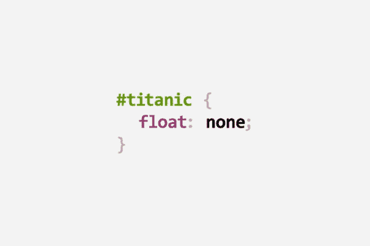
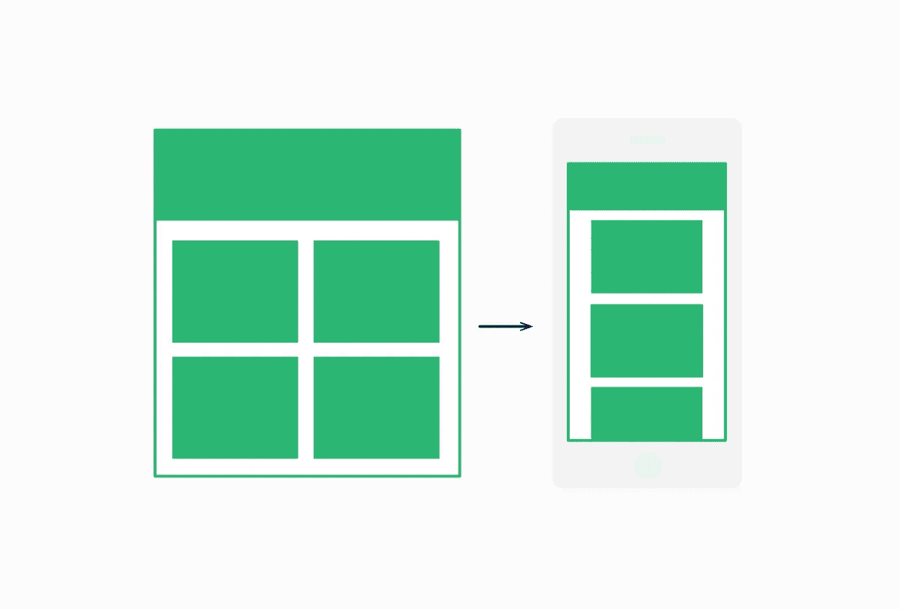
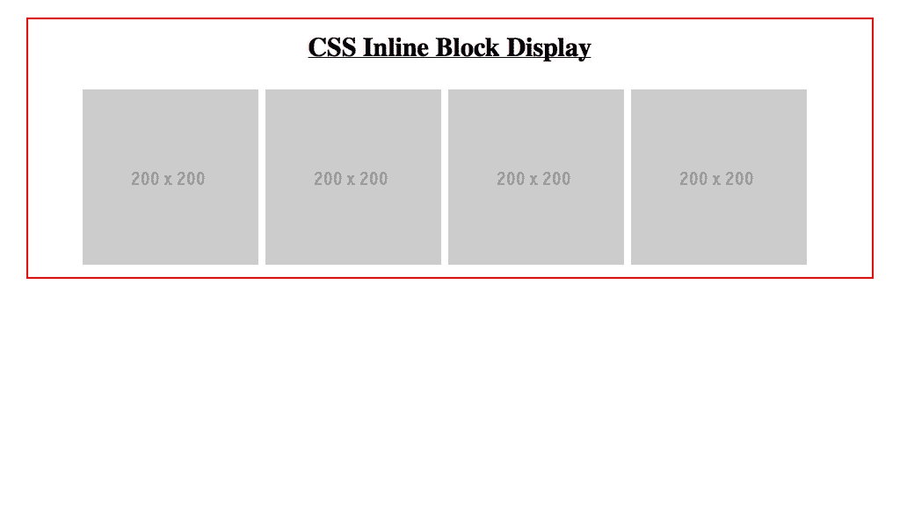
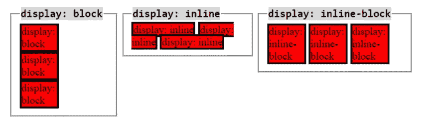
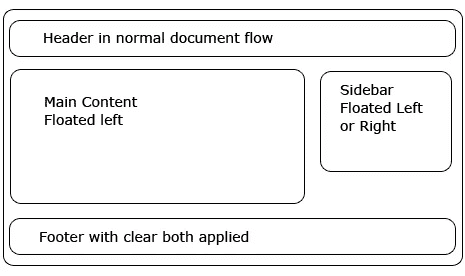
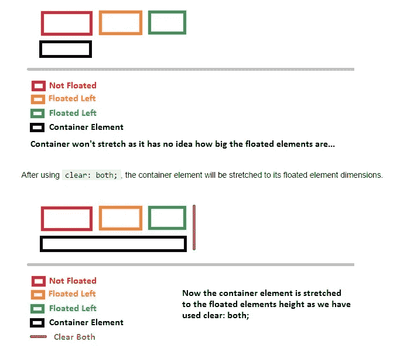

# CSS 显示和定位 101-内联-块和浮动

> 原文：<https://medium.com/analytics-vidhya/css-displays-and-positioning-101-inline-blocks-and-floats-4b33e0141d6d?source=collection_archive---------8----------------------->

继续我们之前的文章，在这里找到我们现在可以用我们的基本 CSS 知识来控制我们的网页布局了！在这里，我们将触及内联、块、内联块的概念，以及如何浮动我们的 CSS 显示和定位。

之前我们了解到，静态、相对和绝对(包括 z-index 的分层)属性允许我们找出如何让我们的项目位于页面上我们想要的区域。现在，通过 CSS 元素中的显示功能，我们可以看到这些项目如何占用空间，以及如何相对于页面上的其他元素/组件放置。

# 我们的展示是什么？

当处理一个包含一个 HTML 文件和一个 CSS 文件的项目时，我们必须认识到我们的每个 HTML 元素对于它们的**显示值**都有一个默认值。这个值保存每个元素的信息，关于它是否可以与其他元素*水平*共享任何空间。有时，我们放入网站或应用程序的元素会占据整个屏幕，而其他元素只会占据特定内容所需的空间(包括其盒子模型；填充、边距、边框等)。

使用 display 属性，我们可以将元素设置为三个不同值之一: **inline** 、 **block** 或 **inline-block** 。某些元素(例如< a >或< strong >)的默认显示属性被设置为 inline，而其他元素可能没有此特定设置。那么到底什么是内联显示设置，它与其他显示属性设置有什么不同呢？

# 内嵌显示

将一个元素的 display 属性设置为 *inline* 会使这个特定的元素有一个非常紧密的边框环绕在元素周围，因此这个元素只占用站点上显示内容所需的空间。这意味着对于每个新添加的元素，每个新元素后都不需要新的一行。

因此，如果内容是固定长度的(即，如果内容被设置为显示一定数量的文本，或者具有固定大小的图像)，那么元素已经将其大小设置为 inline 被紧密包装。因此，我们**不能为我们的内联显示元素设置**宽度或高度属性，因为它们已经基于内容进行了设置。

现在我们的元素可以排好了没问题！这很容易做到。在我们的 CSS 文件中，如果我们想要改变，比如说，我们的 h1 元素，我们只需在我们的 h1 CSS 中写“display:inline；现在我们有了。关于内联样式的一件好事是，我们可以将该属性设置为**不默认**为内联的元素(例如< p >或< div >标签)以进行更多的定制。

# 块显示

对于块显示，我们使用与上面完全相同的语法，但是只写“块”而不是“内联”块显示属性在它们自己的行上；它们不与页面上的其他元素共享水平空间。他们有地盘！

块显示的不同之处在于，由于它们占据了页面上的整个水平空间，我们实际上可以定制它们的大小，这与基于内联的元素不同。我们可以设置块元素的宽度，从而改变它们水平空间的大小。除非另有说明，否则高度将默认为内容的高度。

之前我们说过，有些元素是默认的，而有些不是。对于默认的块元素，我们有

# 到

###### 、

、

和。这一切都有道理，因为他们似乎需要自己的空间(至少默认情况下)来传递信息。

如果我们知道这一点，那么什么是内嵌块显示呢？

# 内嵌块显示

正如人们所猜测的，内联块显示是同一元素的内联和块属性的混合。使用内嵌块显示，我们可以设置一个元素的高度和宽度，并使它们能够相邻显示。非常可定制！

如上图所示，考虑内联块；我们用来排队的积木！一个很好的例子就是图片。我们可以用 CSS 属性设置图像的尺寸，然后用 inline-block 属性将它们对齐。

# 浮动的

浮动是一个属性，我们可以将它设置到我们的 HTML 元素中，根据其他元素和设置到该元素的其他属性，尽可能地将它们放在最左边或最右边。语法很简单:要么“float:right；或“浮动:左；”为元素。

这是一个非常简单的方法，可以让您的元素在页面上移动，并且其他先决条件仍然存在！尝试在 DOM 中或项目中浮动一些元素，看看它们能走多远，或者随着新添加的元素和属性移动。

# 用漂浮物清理

浮动很简单，但有时会有点混乱。尤其是当您一次将属性应用于多个元素时。请记住，当我们浮动时，其他属性仍在发挥作用，因此，如果您的网站或应用程序中的不同元素具有不同的高度，我们可能会以一个真正混乱的显示结束。

有了 clear 属性，我们就可以控制这些元素在偶然相遇时会发生什么。Clear 可以用四种不同的方式声明:左、右、两者或无。Left 和 right 表示另一个元素不能接触我们声明的元素的这一边。两者的意思是一样的，但是在左边和右边。如果没有，任何其他元素都可以接触到我们的元素的任何一边。

记住这些简单的技巧，关注更多 CSS、React 和游戏开发博客！