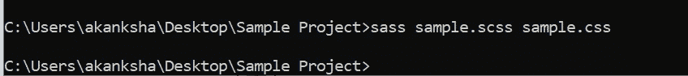

# CSS 预处理器…现在这是什么？

> 原文：<https://medium.com/analytics-vidhya/css-preprocessors-what-is-this-now-bae60c0bfedb?source=collection_archive---------5----------------------->

有一次，我接到一个招聘人员的电话，询问我是否有资格成为前端工程师，她问我——你知道 **CSS 预处理器**吗？

我就像…..，现在这是什么鬼地方，❓❓❓🤷‍♀️

一直以来，我都以为自己很了解 CSS。但是，我错过了吗？必须知道吗？我的自信心下降了。😥

这就是我开始了解 CSS 预处理器的地方。💡⚡🏇我读得越多，越发现我所知道的只是冰山一角。CSS 中还有很多有趣的东西有待展示，预处理程序无疑是其中之一。

在我寻找预处理器的过程中，我问过自己几个问题。在这里分享它们-

# 1.什么是 CSS 预处理器？

很明显，你可以谷歌一下找到定义。其中之一是-

> CSS 预处理程序是扩展 CSS 默认功能的脚本语言。它们使我们能够在 CSS 代码中使用逻辑，比如变量、嵌套、继承、混合、函数和数学运算。

这是我对它的理解

CSS 预处理程序概述

以下是几种类型的预处理程序-

预处理程序类型

## **我该用哪一个？🤔**

这完全取决于需求和开发人员的可用知识。

下面是总结流行类型利弊的文章，你可以参考-

 [## 最好的 CSS 预处理器是哪个？

### 市场上有许多 CSS 预处理器。你可能听说过 Less 和 Sass(如果没有，看看…

www.creativebloq.com](https://www.creativebloq.com/features/best-css-preprocessor)  [## 值得考虑的 10 个 CSS 预处理程序

### 在本帖中，我们收集了一些目前可用的最好的 CSS 预处理程序，你…

envato.com](https://envato.com/blog/css-preprocessors/) 

# 2.谁用 CSS 预处理器？

据报道，超过 3000 家公司在其技术栈中使用 **Sass** (一种预处理器)，包括 **Airbnb、StackShare、**和 **Robinhood** 。

 [## 为什么开发人员喜欢 Sass

### 语法上很棒的样式表 Sass 是 CSS3 的扩展，增加了嵌套规则、变量、混合、选择器…

stackshare.io](https://stackshare.io/sass) 

# 3.为什么我应该知道 CSS 预处理器？

当我们开发大规模的 UI 需要大量的样式表时，CSS 预处理程序就派上了用场。

**优点**:

1.  创建可以导入的可重用代码片段
2.  促进更简单高效的开发
3.  使代码更有组织，更干净，并有助于避免重复
4.  具有嵌套语法 CSS 中的类嵌套使得定位 DOM 元素变得容易并节省了时间。嵌套也使得编辑 CSS 文件变得非常容易。
5.  具有将多个样式表合并成一个的特殊功能
6.  减少错误和代码膨胀的数量
7.  CSS 预处理器有许多内置函数变暗和变亮，例如函数
8.  确保向后兼容。

**缺点:**

1.  调试更加困难
2.  编译降低了开发速度
3.  他们可以生成非常大的 CSS 文件
4.  维护和过度设计
5.  保存(或不保存)生成的文件
6.  能力和理解
7.  开发人员可用的知识

# 4.它有哪些内置功能可以帮助我？

有许多可用的内置功能，但我将分享一些我觉得非常有趣的功能。我从来不知道你可以通过 CSS 做到这一点！

1.  @import —帮助在其他样式表中包含 CSS 片段
2.  @extend —允许在同一样式表中从一个选择器到另一个选择器共享一组 CSS 属性
3.  @mixin —帮助创建可在整个网站重复使用的 CSS 代码。
4.  运算符-启用数学计算

让我们用问题 6 中的例子来深入研究它们。

# 5.我如何将它包含在我的代码中？

这里，我指的是 SaSS 预处理器。

**先决条件:**

1.  CSS 知识
2.  对 DOM 结构的理解

**设置:**

1.  **操作系统** —平台无关
2.  **浏览器支持** —适用于 Edge/IE(来自 IE 8)、Firefox、Chrome、Safari、Opera
3.  **安装** —我在这里使用 node 在 Windows 机器上安装 Sass。

I .通过在运行框中键入“cmd”打开命令提示符

二。键入以下命令安装 Sass —

*npm install -g sass*

三。安装完成后，您可以通过检查安装的版本来确认

安装完成。✌🏼这个视频也描述了同样的情况。

阅读此处的[了解更多详情](http://sass-lang.com/install)

4 **。魔术师⭐的时间到了🌟⭐**

**一、准备预处理文件** —

下面是一个示例 scss 文件。这个需要用 ***来保存。scss* 项目文件夹中的**扩展名。

如果你仔细观察，会发现这里有非常简单的嵌套。导航元素在这里被设计。

接下来，我们需要由此生成 CSS 文件。

**二。从预处理程序生成 CSS 文件—**

浏览器不理解预处理器。因此，代码需要转换成标准的 CSS。这个过程叫做**trans filling。**

例如，sass 文件在传输后存储为. sass。css 文件是从。sass 文件。

遍历您的项目文件夹，并在命令提示符下执行以下命令-

> *sass sample . scss sample . CSS*

Tadaa！我们得到了我们的 CSS 文件生成🕺🏼

# 6.还有更有趣的功能吗？

好吧，让我详细说明我们在问题 4 中讨论的几个有趣的特性。

1.  @导入

您可以创建包含 CSS 片段的小文件，以包含在其他 Sass 文件中。

示例:

下面是一个例子。scss 文件

重置. scss

现在，我们将在下面的文件中包含上面的样式设置-

标准. scss

生成的 css 文件将如下所示

css 文件包括重置和标准文件样式。

标准. css

2.@扩展

希望从一个选择器到另一个选择器共享一组 CSS 属性？@extend 可能会有所帮助。

这是生成的 css 文件-

在 *@extend 的帮助下，t* 他*的按钮报告*类包含了基本按钮的样式

3.@mixin

创建一个代码片段并在整个网站中一直使用它怎么样？

让我们为强调的文本创建一个代码片段

这里，我们传递颜色和字体大小的参数。

重复使用上述内容，包括如下所示的*强调文本*

接下来，我们传输一个 css 文件，如下所示

imp 类按照传递给它的参数拥有字体颜色和大小。

4.操作

您可以包含属性的数学运算。

。scss 文件

产生的 css 文件具有计算出的值

# 7.如果我不知道会没事吗？

好吧，不管我列出多少 CSS 预处理程序的优点和缺点，最好的评估方法是自己尝试，权衡它是否真的是你的项目所需要的，是否能让你顺利地解决手头的问题。

我希望这篇文章能让你熟悉 CSS 预处理程序，并激起你更多的好奇心。

期待反馈(如果有的话)。

参考资料:

 [## Sass 教程

### 组织良好，易于理解的网站建设教程，有很多如何使用 HTML，CSS，JavaScript 的例子…

www.w3schools.com](https://www.w3schools.com/sass/)  [## CSS 预处理程序的优势 TechAffinity 的技术博客

### 在样式表上直接编写 CSS 对于小型 web 应用程序来说是很好的，但是当你开发一个大用户时…

techaffinity.com](https://techaffinity.com/blog/advantages-of-css-preprocessors/)  [## CSS 预处理器的缺点|亚当·席尔瓦|设计师，伦敦，英国。

### CSS 预处理器有很多优点。但是像大多数工具一样，它们也有一些缺点，我将描述一下…

adamsilver.io](https://adamsilver.io/articles/the-disadvantages-of-css-preprocessors/)  [## 流行的 CSS 预处理程序和例子:Sass，Less & Stylus

### CSS 预处理程序是扩展 CSS 默认功能的脚本语言。它们使我们能够在…中使用逻辑

raygun.com](https://raygun.com/blog/css-preprocessors-examples/)  [## 值得考虑的 10 个 CSS 预处理程序

### 在本帖中，我们收集了一些目前可用的最好的 CSS 预处理程序，你…

envato.com](https://envato.com/blog/css-preprocessors/)  [## CSS 预处理程序解释

### CSS 预处理程序越来越成为前端 web 开发人员工作流程中的中流砥柱。CSS 是一种…

www.freecodecamp.org](https://www.freecodecamp.org/news/css-preprocessors/)  [## 安装 Sass

### 有许多应用程序可以让您在几分钟之内在 Mac、Windows 和…上使用 Sass

sass-lang.com](https://sass-lang.com/install)  [## Sass 基础

### 在使用 Sass 之前，您需要在您的项目中设置它。如果你只是想在这里浏览，请继续，但我们…

sass-lang.com](https://sass-lang.com/guide)