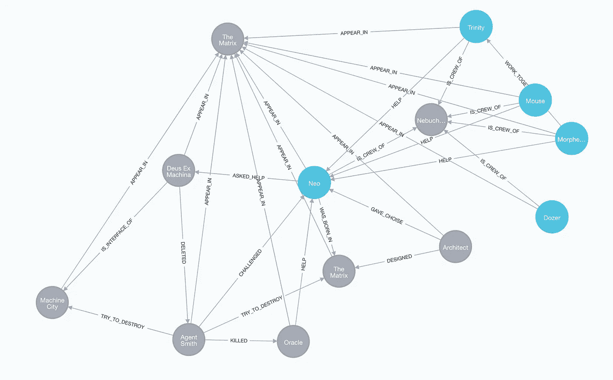

# CSV 数据导入程序 Neo4j-Bigbang

> 原文：<https://medium.com/analytics-vidhya/csv-data-importer-neo4j-bigbang-3a144056fbe2?source=collection_archive---------13----------------------->


# Neo4j-Bigbang 是什么？

Neo4j-Bigbang 是一个 python 包，允许您以最简单的方式将 CSV 数据导入 Neo4j 数据库。这提供了两个命令`bigbang-node`和`bigbang-rel`，它们将产生所有的魔法。

[PyPI 上的 Neo4j-big bang](https://pypi.org/project/neo4j-bigbang/)

# 处理 CSV 时可能会遇到的困难

你试过把 CSV 数据导入 Neo4j 数据库吗？如果是的话，你可能会成为 Neo4j 的官方`[Import CSV tutorial](https://neo4j.com/developer/desktop-csv-import/)`。你应该意识到这需要你

*   采取许多步骤
*   学习 Neo4j 特殊术语
*   编写密码脚本
*   准备 RDB 喜欢格式良好的 CSV 数据

在这种情况下，您需要手动操作应该如何处理数据。您可能需要非常小心地对每个数据做出决策。

# Neo4j-Bigbang 为您做了什么

*   通过自动类型检测导入节点、标签和属性。
*   使用单个 CSV 文件一次创建关系和节点。
*   避免两次插入同一个节点。
*   避免两次创建相同的关系。
*   更新现有节点和关系的标签和属性。
*   如果需要，可以多次强制插入同一个节点。

您不必预先定义模式，只需在 CSV 中设置属性。根本不需要写 Cypher 脚本。

你所需要做的就是，准备好你的 CSV 文件并运行 bigbang！

# 设置 Neo4j-Bigbang

在解释任何事情之前，我们先试穿一下，看看怎么样。

## 准备环境

```
$ mkdir your-dir
$ cd your-dir
$ python -m venv venv
$ source venv/bin/activate
$ export NEO4J_URI=bolt://{hostname}:7687 NEO4J_USER={username} NEO4J_PASSWORD={password}
```

## 安装 neo4j-bigbang

```
$ pip install neo4j-bigbang
```

# 运行命令，创建关系

在这个例子中，我选择了最简单的方法来展示如何创建您的图形，所以这次我将使用`bigbang-rel`命令。

## 在`importing`目录下准备 CSV 数据

```
$ mkdir importing
$ vim importing/relationships.csv
```

## CSV 关系示例

```
type,target_fields_in,target_values_in,target_labels_in,target_fields_out,target_values_out,target_labels_out,position
APPEAR_IN,name,Mouse,Character|Person,name,The Matrix,Movie,ally
APPEAR_IN,name,Neo,Character|Person,name,The Matrix,Movie,protagonist
APPEAR_IN,name,Morpheus,Character|Person,name,The Matrix,Movie,ally
APPEAR_IN,name,Dozer,Character|Person,name,The Matrix,Movie,ally
APPEAR_IN,name,Trinity,Character|Person,name,The Matrix,Movie,ally
APPEAR_IN,name,Oracle,Character|ComputerProgram,name,The Matrix,Movie,prophet
APPEAR_IN,name,Architect,Character|ComputerProgram,name,The Matrix,Movie,enemy
APPEAR_IN,name,Deus Ex Machina,Character|HardwareInterface,name,The Matrix,Movie,enemy
APPEAR_IN,name,Agent Smith,Character|ComputerProgram,name,The Matrix,Movie,enemy
APPEAR_IN,name,Machine City,City,name,The Matrix,Movie,place
APPEAR_IN,name,The Matrix,VirtualRealityWorld,name,The Matrix,Movie,virtual world
IS_CREW_OF,name,Mouse,Character|Person,name,Nebuchadnezzar,Vehicle|Battleship,
IS_CREW_OF,name,Neo,Character|Person,name,Nebuchadnezzar,Vehicle|Battleship,
IS_CREW_OF,name,Morpheus,Character|Person,name,Nebuchadnezzar,Vehicle|Battleship,captain
IS_CREW_OF,name,Dozer,Character|Person,name,Nebuchadnezzar,Vehicle|Battleship,pilot
IS_CREW_OF,name,Trinity,Character|Person,name,Nebuchadnezzar,Vehicle|Battleship,
HELP,name,Mouse,Character|Person,name,Neo,Character|Person,
HELP,name,Morpheus,Character|Person,name,Neo,Character|Person,believes Neo is the One
HELP,name,Trinity,Character|Person,name,Neo,Character|Person,girl friend
HELP,name,Oracle,Character|ComputerProgram,name,Neo,Character|Person,adviser
GAVE_CHOISE,name,Architect,Character|ComputerProgram,name,Neo,Character|Person,
CHALLENGED,name,Agent Smith,Character|ComputerProgram,name,Neo,Character|Person,
ASKED_HELP,name,Neo,Character|Person,name,Deus Ex Machina,Character|HardwareInterface,
KILLED,name,Agent Smith,Character|ComputerProgram,name,Oracle,Character|ComputerProgram,
WORK_TOGETHER_WITH,name,Morpheus,Character|Person,name,Trinity,Character|Person,
DESIGNED,name,Architect,Character|ComputerProgram,name,The Matrix,VirtualRealityWorld,
WAS_BORN_IN,name,Neo,Character|Person,name,The Matrix,VirtualRealityWorld,
IS_INTERFACE_OF,name,Deus Ex Machina,Character|HardwareInterface,name,Machine City,City,
TRY_TO_DESTROY,name,Agent Smith,Character|ComputerProgram,name,Machine City,City,
TRY_TO_DESTROY,name,Agent Smith,Character|ComputerProgram,name,The Matrix,VirtualRealityWorld,
DELETED,name,Deus Ex Machina,Character|HardwareInterface,name,Agent Smith,Character|ComputerProgram,
```

该 CSV 文件是为`bigbang-rel`命令指定的。

## 运行以生成图形

```
$ bigbang-rel -c
```

就是这样！这将为您创建一个图表。现在你知道 Neo4j-Bigbang 有多简单了吧。



# 关系 CSV 要求

当您创建`relationships.csv`时，它必须至少有`bigbang-rel`命令要求的下列字段。

*   类型:关系的类型
*   target_fields_in:第一个节点的目标属性
*   target_values_in:第一个节点上的目标属性值
*   第二个节点上的目标属性
*   target_values_out:第二个节点上的目标属性值

您还可以选择定义

*   目标 _ 标签 _ 输入
*   目标 _ 标签 _ 输出

您定义的其他所有内容都将成为关系的属性。

## 例子

如果你想在…之间建立关系

```
Node: Person {
   name: 'Mike'
}
```

和

```
Node: Person {
    name: 'Anna'
}
```

然后，您可以像这样设置 CSV 值

```
target_fields_in => name
target_values_in => Mike
target_labels_in => Persontarget_fields_out => name
target_values_out => Anna
target_labels_out => Person
```

# 运行命令，导入节点

还可以使用`bigbang-node`只导入没有关系的节点。这将集中于操纵节点。您可以使用`bigbang-rel`命令粗略地创建关系和节点，稍后您可以在这些节点上设置详细的属性，反之亦然。

## 在`importing`目录下准备 CSV 数据

```
$ mkdir importing
$ vim importing/nodes.csv
```

## CSV 节点示例

```
name,description,labels
Nebuchadnezzar,Nebuchadnezzar is a fictional hovership captained by Morpheus in the The Matrix franchise.,Vehicle|Battleship
Oracle,"She is a prophet in the Matrix. She looks like a person, but is a computer program created for some perposes.",Character|ComputerProgram
Agent Smith,Agent Smith is a fictional character and the main antagonist of The Matrix trilogy.,Character|ComputerProgram
Switch,Switch was a member of the crew of the Nebuchadnezzar.,Character|Person
```

该 CSV 文件是为`bigbang-node`命令指定的。

## 运行以生成节点

```
$ bigbang-node
```

如果您注意到了，这将只创建一个节点。这是因为，图中已经有了其他节点。但是如果你想用新的属性更新那些节点，在这种情况下描述被添加，那么你应该把`-u`选项放在那里。

```
$ bigbang-node -u
```

那么所有的节点都将被更新。

Neo4j-Bigbang 有更多的选择和灵活性。

*   您可以在现有节点之间创建关系，也可以一次创建。
*   您可以更新现有关系的属性
*   创建关系时，可以选择节点选取属性和标签
*   您可以选择导入 CSV 文件名。
*   如果您想在关系 CSV 中设置所有相同的类型，您可以将您的 CSV 文件名设置为关系类型
*   如果您想在节点 CSV 中设置所有相同的标签，您可以将您的 CSV 文件名设置为节点标签
*   您可以选择创建新节点、更新节点或跳过节点。

希望这将有助于您顺利开始 Neo4j 之旅。