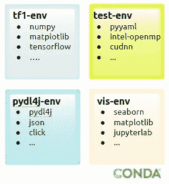
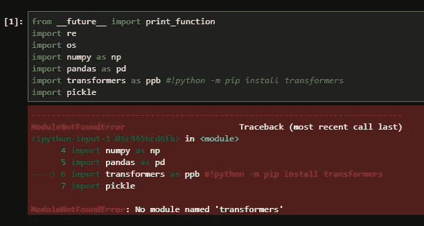
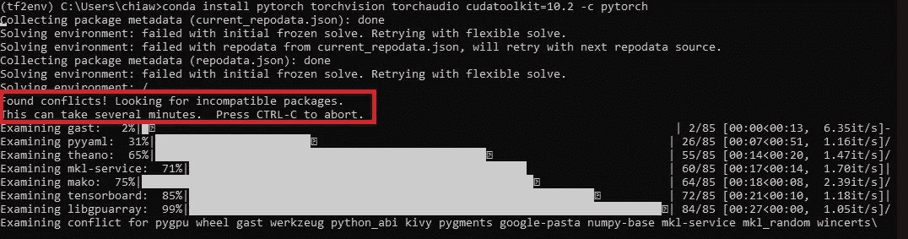
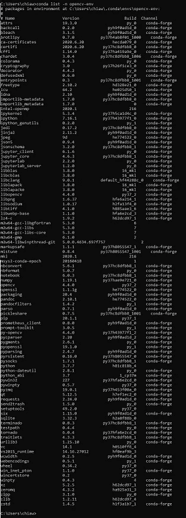
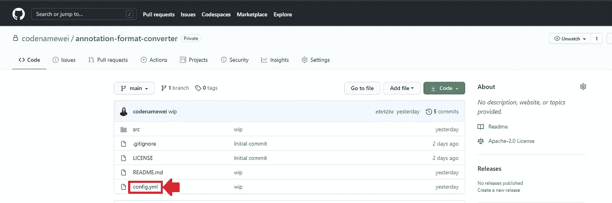

# Ctrl + c，Ctrl + v —复制数据科学 Conda 环境

> 原文：<https://medium.com/analytics-vidhya/ctrl-c-ctrl-v-replicating-data-science-conda-environment-c190ad0d93fd?source=collection_archive---------16----------------------->


图片来自[https://bit.ly/36SSsaE](https://bit.ly/36SSsaE)

Python 环境中的机器学习实践者面临的最初障碍之一是试图用所有合适的包重新创建运行环境。

通常，环境被配置为

*   开始构建人工智能项目的开发工作
*   从之前创建的 Github 库中复制结果
*   复制教程中的实现，开始学习

可以用 [miniconda](https://docs.conda.io/en/latest/miniconda.html) 、 [pipenv](https://pipenv.pypa.io/en/latest/) 进行设置，也可以直接在本地系统上设置。前两个选项更受欢迎，这样您就有了一个包含的工作环境(在构建具有不同依赖关系的多个项目时尤其有用)。这样，每个环境都是相互隔离的，并用必要的包进行压缩。
(注意:这篇文章将重点介绍如何使用 Miniconda 来管理软件包和设置环境。)



多个 conda 环境的图示

在一个有独角兽的世界里🦄和彩虹🌈，人们会立即建立一个环境，直接运行 python 脚本，没有任何错误，检查人工智能模型的性能，并计划下一步。

事实上，大部分时间都在做下面列出的事情:

*   复制具有所有依赖项的环境



由于软件包未安装，找不到模块

*   解决依赖性的冲突



安装软件包时未能解决冲突

*   下载和构建用于矢量化的数据集(本文未涉及)

一个包对另一个包的依赖冲突很容易变成一团乱麻。更不用说数据科学环境通常源于人工智能建模工作所需的大量软件包和模块。随着时间的推移，这将产生一个很长的包列表，这将使复制环境的过程更加复杂。



conda 环境的依赖项列表示例

当环境设置完成时，几天已经过去了，在实现任何里程碑之前，您可能已经筋疲力尽了。


图片来自[https://www.ldpt.co.uk/sick-tired-sick-tired/](https://www.ldpt.co.uk/sick-tired-sick-tired/)

**为了减少上述**情况的发生，使用下面列出的一种或另一种方法:

**1。(在构建环境之前)从配置文件创建 conda 环境。yml 文件)**

```
conda env create -f config.yml
```

config.yml 基本上是一个 yaml 文件，包含 conda 包和下载它们的通道。您也可以在同一个文件中包含 pip 包。这样做使事情变得简单明了，也让人们对所需的包一目了然。

配置文件遵循如下所示的框架结构:

```
name: python-dev-env
channels:
  - anaconda
dependencies:
  - python=3.7
  - pip=20.2.*
  - jupyterlab
  - pip:
    - click==7.1.*
```

***注:***

1.  星号是版本修补程序的通配符搜索。大多数软件版本都是[语义版本](https://semver.org/) — **主版本。次要版本。补丁修复**。在补丁版本中使用通配符有助于包含错误修复，同时确保它不会因为版本升级而引入新的复杂性。
2.  新安装的 conda 环境中没有隐含 Pip 包。因此，在使用 *pip* 命令安装包之前，pip 包必须首先明确包含在 config.yml 中。查看[此链接](https://www.anaconda.com/blog/using-pip-in-a-conda-environment)了解在 conda 环境中使用 pip 的最佳实践。

**2。(构建环境后)将创建的现有 conda 环境导出到配置文件**

```
conda env export -f config.yml
```

与。yml 文件，人们可以很容易地按照指令使用

```
conda env create -f config.yml
```

将配置文件包含在存储库中(通常托管在 Github 上)也是很重要的，以便它是独立的，可以被希望引用它的最终用户搜索到。



包括。Github 存储库中的 yml 文件

创建一个配置文件相对来说是一件小事，但却能带来长期的好处。大多数时候，数据科学家并不像独行侠一样工作，团队中的其他人需要利用或使用这项工作。他们会感谢你让他们的生活变得更容易。

此处有更多常用的 conda 命令列在[中。](https://github.com/codenamewei/pydata-science-env/blob/main/miniconda-guidelines.md)

## **Github 库:**

[https://github.com/codenamewei/pydata-science-playground](https://github.com/codenamewei/pydata-science-playground)

下次见。👋

## 参考资料:

*   [https://docs . conda . io/projects/conda/en/latest/user-guide/tasks/manage-environments . html](https://docs.conda.io/projects/conda/en/latest/user-guide/tasks/manage-environments.html)
*   [https://www . anaconda . com/blog/using-pip-in-a-conda-environment](https://www.anaconda.com/blog/using-pip-in-a-conda-environment)