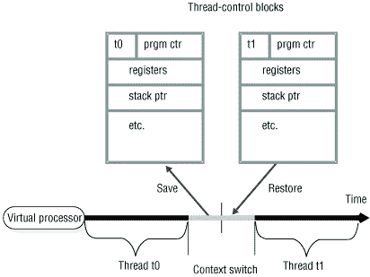

# CUDA —计算统一设备架构—第 1 部分

> 原文：<https://medium.com/analytics-vidhya/cuda-compute-unified-device-architecture-part-1-8f9ff3179440?source=collection_archive---------8----------------------->


照片由乔丹·哈里森提供

**异构计算**正在成为新常态。让我们以智能手机为例，典型的智能手机有中央处理器(CPU)、图形处理单元(GPU)、数字信号处理器(DSP)、调制解调器和各种编码器&解码器。每个计算单元都是为处理特定的工作负载而定制的，但是如果这些定制的计算单元(而不是 CPU)可以在空闲状态下用于通用计算，那么这种工作负载共享将卸载 CPU 的一部分工作负载，从而提高性能。

GPU 就是这样一种定制处理器，最初是为并行处理像素而设计的。从像素操作开始，GPU 已经走过了漫长的道路，现在 GPGPU 或通用图形处理单元变得越来越普遍。GPU 目前用于加速人工智能、高性能计算、边缘计算等的工作负载。

为了利用成千上万个 GPU 核心的能力，NVIDIA 开发了一种称为 CUDA 的编程模型。现在，成千上万的应用使用 CUDA 和 NVIDIA GPUs 加速。这一系列文章的重点是 CUDA 编程入门，从在我们的机器上使用 CUDA 开始，到编写我们自己的 CUDA 代码，理解编码时每个架构选择背后的直觉。

# 我们开始吧！


图片由马库斯·斯皮斯克提供

在这篇文章中，我将设置背景并列出某些术语。

**进程** —进程是处理器当前正在处理的应用程序的实例。

**线程** —线程是一个进程中可以由处理器独立执行的一组指令。一个进程中可以有多个线程，但至少该进程必须有一个线程，即充当该进程入口点的主线程。

**上下文** —上下文就像一个进程的元数据，存储着进程的当前状态、内存地址、计数器值等信息。

**并发** —通过上下文切换，不同的进程可以在随后的时隙中执行，因此看起来像是所有进程的并行执行。



图片由 IBM 知识中心提供

**并行处理** —指各进程线程并行执行，不在有上下文切换的时隙内执行。

**以下是 CUDA 程序的基本布局**，

1.  CPU 中数据的初始化。
2.  将数据从 CPU 上下文转移到 GPU 上下文。
3.  启动 GPU 内核，指定所需的 GPU 参数。
4.  将结果从 GPU 上下文转移到 CPU 上下文。
5.  回收 CPU 和 GPU 的内存。

从现在开始，我们将称 CPU 为主机，GPU 为设备。因此，在 CPU 上执行的代码是主机代码，在 GPU 上执行的代码是设备代码。

# “你好世界！”

```
//Pre-processor directives
#include <stdio.h>#include "cuda_runtime.h"
#include "device_launch_parameters.h"//Device code
__global__
void cuda_kernel()
{
    printf("Hello World!");
}//Host code
int main()
{
    cuda_kernel <<< 1, 1 >>> ();
    cudaDeviceSynchronize(); cudaDeviceReset();  
    return 0;
}
```

**关于代码的要点:**

1.  **__global__** 修饰符告诉编译器跟在后面的函数是设备代码。
2.  设备功能的返回类型始终为“**无效**”。应该声明显式语句来将数据从设备传输到主机。
3.  主函数中设备函数调用的语法不同。尖括号中的 1 表示一个块中的线程数和一个网格中的总块数。更多细节将在第二部分介绍。
4.  cudaDeviceSynchronize() 指示主机代码等待设备代码完成执行。如果代码中不包含此方法，则主机执行将继续进行，而不等待设备执行和结果。

# 内务工作

1.  我已经跟随这个[链接](https://developer.nvidia.com/cuda-downloads)下载了 CUDA。我已经安装了 CUDA 11.0 版本。为了安装 CUDA，我遵循了这个[链接](https://docs.nvidia.com/cuda/cuda-installation-guide-linux/index.html)。
2.  我使用 Eclipse IDE 和 NVIDIA NSIGHT 插件，因为 Eclipse NSIGHT edition 在 CUDA Toolkit 的当前版本中已被否决。此[链接](https://docs.nvidia.com/cuda/nsight-eclipse-plugins-guide/index.html)将指导您完成此操作。

# **第二部分**

在下一部分，我将详细介绍 CUDA 运行时将初始化的设备启动参数和其他隐式变量。此外，我将讨论设备启动参数的边界值，以及这些值如何影响性能。

第二部分的链接在这里是。