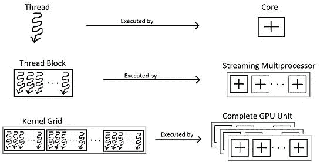
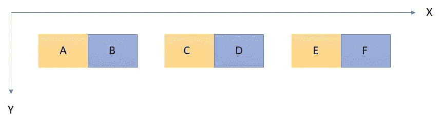
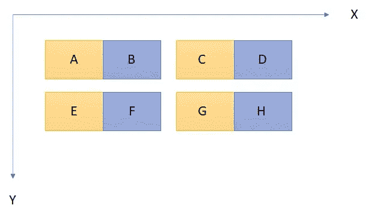
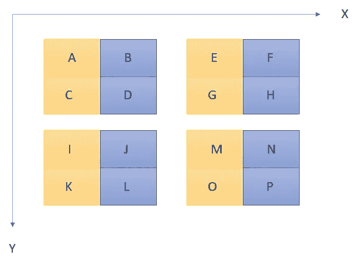

# CUDA——CUDA 内核和发布参数

> 原文：<https://medium.com/analytics-vidhya/cuda-compute-unified-device-architecture-part-2-f3841c25375e?source=collection_archive---------4----------------------->


照片由米格尔·帕德里南提供

在本文中，让我们关注设备启动参数、它们的边界值以及 CUDA 运行时在执行过程中初始化的隐式变量。这篇文章是这篇[文章](/@rajprasannap/cuda-compute-unified-device-architecture-part-1-8f9ff3179440)的续篇。

# **那么什么是设备启动参数呢？**

GPU 遵循单指令多线程(SIMT)架构，这意味着发出多个线程来处理同一条指令。这些线程被组织成块，而块被组织成网格。



图片来自维基百科

为了启动 CUDA 内核，我们需要从主机代码中指定块维度和网格维度。我会考虑同样的 Hello World！前一篇文章中考虑的代码。

```
//Pre-processor directives
#include <stdio.h>
#include "cuda_runtime.h"
#include "device_launch_parameters.h"//Device code
__global__
void cuda_kernel()
{
    printf("Hello World!");
}//Host code
int main()
{
    cuda_kernel <<< 1, 1 >>> ();
    cudaDeviceSynchronize();    
    cudaDeviceReset();  
    return 0;
}
```

在上面的代码中，为了启动 CUDA 内核，在尖括号之间初始化了两个 1。第一个参数表示网格中块的总数，第二个参数表示块中线程的总数。因此，在上面的代码中，一个块中的线程总数是 1，并且在一个网格中有一个这样的块。

所有块中的线程总数保持不变。为了简单起见，我们可以将一个块中的线程总数命名为**块**，将一个网格中的线程总数命名为**网格**。从软件角度来看，块和网格变量是三维的。让我们看一些例子。

```
int nx;    //total threads in X dimension
int ny;    //total threads in Y dimension
int nz;    //total threads in Z dimensionnx = 128;       //128 threads in X dim
ny = nz = 1;    //1 thread in Y & Z dim//32 threads in X and 1 each in Y & Z in a block
dim3 block(32,1,1); //4 blocks in X & 1 each in Y & Z
dim3 grid(nx/block.x, ny/block.y, nz/block.z) cuda_kernel <<<grid,block>>>();
```

块和网格变量有边界值，边界值取决于 GPU 设备架构。我的机器有 NVIDIA GeForce GTX 1650 卡，其设备架构是**图灵**，以下是边界值。

**块边界值** — (1024，1024，1024)和所有 3 个 dim 的乘积应小于或等于 1024。

**网格边界值**——(2147483647，65535，65535)。

我们可以通过下面几行代码获得这些值。

```
int devNo = 0;
cudaDeviceProp iProp;cudaGetDeviceProperties(&iProp, devNo);printf("Maximum grid size is: (");
for (int i = 0; i < 3; i++)
    printf("%d\t", iProp.maxGridSize[i]);printf(")\n");printf("Maximum block dim is: (");
for (int i = 0; i < 3; i++)
    printf("%d\t", iProp.maxThreadsDim[i]);printf(")\n");printf("Max threads per block: %d\n", iProp.maxThreadsPerBlock);
```

如果不满足上述边界条件，那么内核就不会启动。

# CUDA 运行时初始化的隐式变量

**threadIdx**

1.  它是一个 dim3 变量，每个维度都可以由 threadIdx.x、threadIdx.y、threadIdx.z 访问。
2.  引用块中的线程 ID，从 0 开始。因此，如果一个块中 X dim 中的线程数是 32，那么 threadIdx.x 在每个块中的范围是从 0 到 31。

**blockIdx**

1.  它是一个 dim3 变量，每个维度都可以由 blockIdx.x、blockIdx.y、blockIdx.z 访问。
2.  指网格中的块 ID，从 0 开始。

**blockDim**

1.  它是一个 dim3 变量。
2.  指在所有维度中一个块中的最大线程数，从 1 开始。
3.  所有线程块都具有相同的维度。

**gridDim**

1.  它是一个 dim3 变量。
2.  指在所有维度上网格中的最大块数，从 1 开始。

借助这四个变量，我们可以计算出每个线程的**唯一全局索引**。全局索引将帮助我们访问分配给 GPU 的数百万个线程中的单个线程。

让我们看看几种情况，以及在每种情况下如何计算全局指数。



```
int tid = threadIdx.x;
int col_offset = blockIdx.x * blockDim.x;int gid = tid + col_offset;
```



```
int tid = threadIdx.x;
int col_offset = blockIdx.x * blockDim.x;
int row_offset = blockIdx.y * blockDim.y;int gid = tid + col_offset + row_offset;
```



```
int tid = threadIdx.x;
int col_offset = blockDim.x * blockDim.y * blockIdx.x;
int row_offset = gridDim.x * blockIdx.y * blockDim.x * blockDim.y + blockDim.x * threadIdx.y;int gid = tid + col_offset + row_offset;
```

最后一种情况也可以用于前两种情况。

在下一部分中，我将讨论 warps 以及如何优化 CUDA 内核的性能，并基于**试错法**和系统地使用**分析器**来最好地利用 GPU 资源。