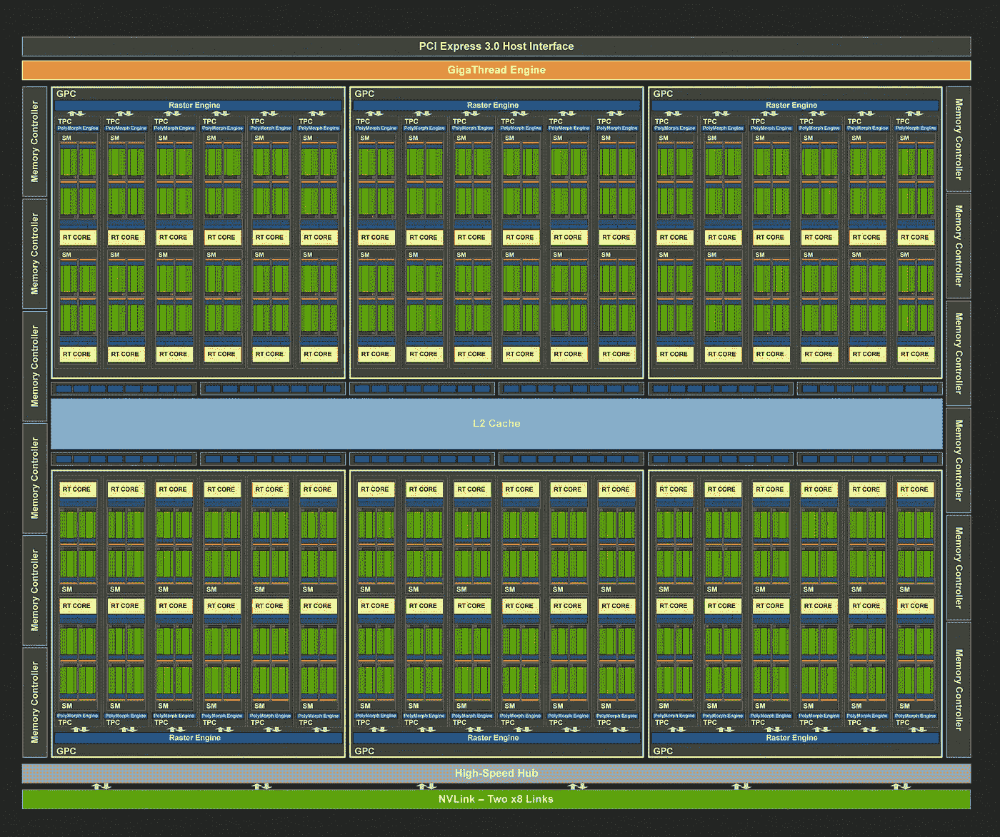
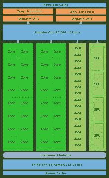
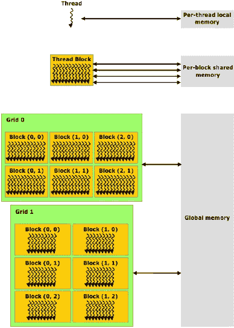

# CUDA——GPU 设备架构

> 原文：<https://medium.com/analytics-vidhya/cuda-compute-unified-device-architecture-part-3-f52476576d6d?source=collection_archive---------5----------------------->



英伟达图灵架构

在这篇文章中，我们将讨论 NVIDIA GPU 的基本架构，以及如何优化并行编程的可用资源。这篇文章是续集的第三部分。之前帖子的链接是[第一部分](/analytics-vidhya/cuda-compute-unified-device-architecture-part-1-8f9ff3179440)和[第二部分](/analytics-vidhya/cuda-compute-unified-device-architecture-part-2-f3841c25375e)。

我用的是英伟达 GeForce GTX 1650 GPU，属于英伟达图灵架构。所以，在这篇文章中分享的大部分细节都属于图灵架构，但是我会试着概括这些概念。

GPU 中的计算核心被分组为一个单元，称为流式多处理器(简称 SM)。在 GTX 1650 中，有 14 个 SMs，每个都有 64 个 CUDA 核心(FP 32 核心)和 64 个 INT 核心。每个 SM 都有自己的 warp 调度程序、调度程序、寄存器、共享内存和 L1 缓存。



流式多处理器

GPU 的指令架构是**单指令多线程(SIMT)** 。线程在一个名为 warp 的集合中执行。Warp 是 GPU 中的基本执行单位。**一般来说，经纱(经纱尺寸)中的纱线数量为 32 根。**即使要处理一个线程，warp 调度程序也会启动 32 个线程的 warp，其中 1 个线程将成为活动线程。因此，我们应该确保 warp 中的所有线程都是活动的，以便更好地利用 GPU 资源。

根据经纱的准备情况，它被分为三类:

1.  选定的扭曲-活动执行的扭曲
2.  合格 warp — warp 准备好执行，其所有参数都可用，但正在等待执行
3.  停滞翘曲-翘曲未准备好执行

# 分级存储器体系



Pic 礼貌研究门户

**寄存器** —寄存器为 32 位，一个线程最多可分配 255 个寄存器。每个 SM 总共有 64 kB 的寄存器文件可用。

**共享内存** —共享内存分配给线程块，每个 SM 有 64 kB 的共享内存。

与全局存储器传输延迟相比，寄存器和共享存储器具有非常小的存储器传输延迟。因此，我们应该充分利用可用的寄存器和共享内存来隐藏延迟。

# 潜伏隐藏

有两种类型的延迟—计算延迟和内存传输延迟。

**计算延迟**

在 Volta 和图灵架构中，核心数学运算需要 4 个时钟周期来执行。因此，我们需要流水线中每个 warp 调度程序有 4 个 warp 来隐藏这个延迟。如果每个 SM 有 4 个 warp 调度程序，那么我们需要 16 个 warp 或 512 个线程(16 x 32)来 100%利用计算核心。

在 GTX 1650 中，有 14 条短信，因此理论上需要 224 条(14 x 16)经线来隐藏计算延迟。

**内存传输延迟**

我们可以假设全局内存传输延迟为 350 个时钟周期。

我们需要知道设备的内存带宽和内存时钟速率，以计算隐藏上述延迟所需的扭曲数。这可以通过在 CLI 中使用以下命令来实现

```
$nvidia-smi -a -q -d CLOCK
```

我的系统 4 GHz GTX 1650 GDDR5 中的 GPU 内存时钟速率具有 128 GB/s 的内存带宽。使用这些值，我们可以获得 32 B/时钟周期。

所以在 350 个时钟周期内，可以传输 11200 个字节。考虑到 FP32 (4 字节)和 2 个操作数，我们需要每个 SM(11200/32/2/14/32)4 个变形来隐藏内存传输延迟。

# 占有

占用率是每 SM 的活动经线数与每 SM 允许的最大经线数之间的比率。

如果内核受计算或内存限制，那么增加占用率可能会提高性能。我们内核的占用率可以计算如下:

用下面的命令计算我们内核的寄存器和共享内存使用量

```
$nvcc --ptxas-options=-v -o output.exe cuda_file.cu
```

使用从 NVIDIA 的占用率计算器工具中获得的值。该工具基本上是一个内置宏的 excel 文件。该工具可从以下[链接](https://docs.nvidia.com/cuda/cuda-occupancy-calculator/index.html)下载。

**警告** —如果内核不受计算或内存限制，那么增加占用率不一定会提高性能。有时，添加额外的指令或不同的代码可能会降低性能。

在下一部分，我将讨论翘曲发散和几种最小化翘曲发散的方法。我们还将讨论如何使用 NVIDIA NSIGHT Compute 来分析我们的内核，以便对其进行优化。