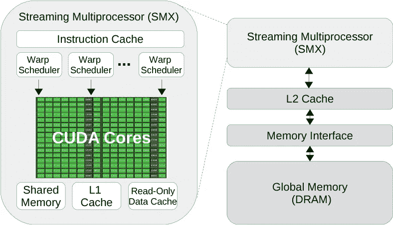
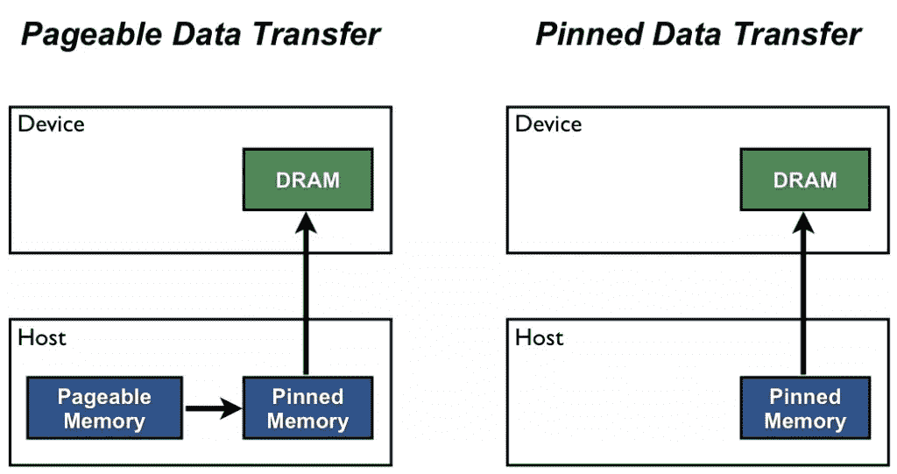
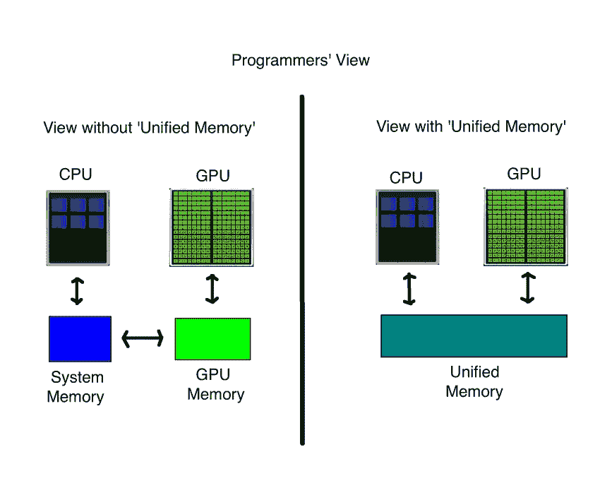
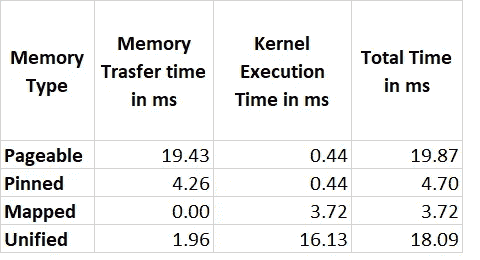

# CUDA —内存模型

> 原文：<https://medium.com/analytics-vidhya/cuda-memory-model-823f02cef0bf?source=collection_archive---------2----------------------->


图片来自 [Pexels](https://www.pexels.com/photo/analogue-business-close-up-computer-117729/?utm_content=attributionCopyText&utm_medium=referral&utm_source=pexels)

这篇文章详细介绍了 CUDA 内存模型，是 CUDA 系列的第四部分。

第 1 部分— [异构计算](/analytics-vidhya/cuda-compute-unified-device-architecture-part-1-8f9ff3179440)

第 2 部分— [CUDA 内核及其发布参数](/analytics-vidhya/cuda-compute-unified-device-architecture-part-2-f3841c25375e)

第 3 部分— [GPU 设备架构](/analytics-vidhya/cuda-compute-unified-device-architecture-part-3-f52476576d6d)

# 分级存储器体系

在计算机应用程序的执行过程中，指令更经常地倾向于在短时间内重复访问同一组存储单元。这种现象被称为局域性原理。有两种类型的局部性—时间局部性和空间局部性。

时间局部性—在相对较短的时间内重复访问同一内存位置的趋势。

空间局部性—访问与当前访问位置相对接近的内存位置的趋势。

由于这一原理的存在，任何计算机体系结构都将具有存储器的层次结构，从而优化指令的执行。随着存储器与处理器的距离增加，从该存储器访问的数据需要更多的时钟周期来处理。



GPU 内存层次结构

在 NVIDIA GPU 的情况下，共享内存、L1 缓存和常量内存缓存位于流式多处理器模块内。因此，它们比 L2 缓存和 GPU RAM 更快。

# GPU 执行模型

正如本系列第 1 部分所讨论的，GPU 是一个协处理器。GPU 内核启动，数据初始化和传输从 CPU 开始。下面举个例子进一步讨论。

```
__global__ void array_sum (int *d_a, int *d_b, int *d_c, int size)
{
    int gid = blockDim.x * blockIdx.x + threadIdx.x;
    if (gid < size)
        c[gid] = a[gid] + b[gid];}
```

在上面的内核代码中，我们接收两个数组 *a* 和 *b* 作为输入，并在第三个数组 *c* 中累加这两个数组的和。*大小*是每个数组的大小。全球指数( *gid* )的计算在这篇[文章](/analytics-vidhya/cuda-compute-unified-device-architecture-part-2-f3841c25375e)中详细阐述。

为了在 GPU 中处理上面的内核，数组 a、b、c 要在 CPU 中初始化，并转移到 GPU 中。因此，在 CPU 中执行的主要函数应该如下所示。

```
int main()
{
    int size = 1 << 20;
    int block_size = 128;
    int NO_BYTES = sizeof(int) * size; //Host memory allocation
    int *h_a, *h_b, *h_c;
    h_a = (int *)malloc(NO_BYTES);
    h_b = (int *)malloc(NO_BYTES);
    h_c = (int *)malloc(NO_BYTES);//Host memory initialization
    for(int i = 0; i < size; i++)
    {
        h_a[i] = 10;
        h_b[i] = 20;
    }
    memset(h_c, 0, NO_BYTES);//Device memory initialization
    int *d_a, *d_b, *d_c;
    cudaMalloc((int **)&d_a, NO_BYTES);
    cudaMalloc((int **)&d_b, NO_BYTES);
    cudaMalloc((int **)&d_c, NO_BYTES);//Host to device input data transfer
    cudaMemcpy(d_a, h_a, NO_BYTES, cudaMemcpyHostToDevice);
    cudaMemcpy(d_b, h_b, NO_BYTES, cudaMemcpyHostToDevice);//Kernel launch
    dim3 block(block_size);
    dim3 grid(size/block.x); array_sum <<< grid, block >>> (d_a, d_b, d_c, size);
    cudaDeviceSynchronize();//Device to host output data transfer
    cudaMemcpy(d_b, h_b, NO_BYTES, cudaMemcpyDeviceToHost); free(h_a);
    free(h_a);
    free(h_a); cudaFree(d_a);
    cudaFree(d_b);
    cudaFree(d_c);
```

**malloc** —在主机内存中分配内存

**cudaMalloc** —在设备内存中分配内存

**cudamemacpy**—将数据从主机复制到设备或从设备复制到主机。cudaMemcpyHostToDevice 和 cudaMemcpyDeviceToHost 标志用于指示数据传输的方向。

**释放** —恢复分配的主机内存

**cudaFree** —恢复分配的设备内存

# 内存分配类型

CUDA 中有四种类型的内存分配。

1.  可分页内存
2.  固定存储器
3.  映射存储器
4.  统一存储器

# **可分页内存**



默认情况下，主机中分配的内存是可分页内存。该存储器位置的数据可由主机使用。为了将这些数据传输到设备，CUDA 运行时将这些内存复制到一个临时固定内存中，然后传输到设备内存中。因此，有两次内存传输。因此，这种类型的内存分配和传输很慢。

**主机分配语法:**

```
int *h_a, *h_b, *h_c;
h_a = (int *)malloc(NO_BYTES);
h_b = (int *)malloc(NO_BYTES);
h_c = (int *)malloc(NO_BYTES);

for (int i = 0; i < size; i++)
{
h_a[i] = 10;
h_b[i] = 20;
}

memset(h_c, 0, NO_BYTES);
```

**设备分配语法:**

```
int *d_a, *d_b, *d_c;
cudaMalloc((int **)&d_a, NO_BYTES);
cudaMalloc((int **)&d_b, NO_BYTES);
cudaMalloc((int **)&d_c, NO_BYTES);

cudaMemcpy(d_a, h_a, NO_BYTES, cudaMemcpyHostToDevice);
cudaMemcpy(d_b, h_b, NO_BYTES, cudaMemcpyHostToDevice);
```

# **固定内存**

数据可以直接在主机固定存储器中初始化。通过这样做，我们可以避免在可分页内存中的两次数据传输。这将加快进程，但会牺牲主机性能。当数据在固定存储器中初始化时，用于主机处理的存储器可用性降低。

**主机分配语法:**

```
int *h_a1, *h_b1, *h_c1;
cudaMallocHost((int **)&h_a1, NO_BYTES);
cudaMallocHost((int **)&h_b1, NO_BYTES);
cudaMallocHost((int **)&h_c1, NO_BYTES);for (int i = 0; i < size; i++)
{
 h_a1[i] = 10;
 h_b1[i] = 20;
}memset(h_c1, 0, NO_BYTES);
```

**设备分配语法:**

```
int *d_a1, *d_b1, *d_c1;
cudaMalloc((int **)&d_a1, NO_BYTES);
cudaMalloc((int **)&d_b1, NO_BYTES);
cudaMalloc((int **)&d_c1, NO_BYTES);cudaMemcpy(d_a1, h_a1, NO_BYTES, cudaMemcpyHostToDevice);
cudaMemcpy(d_b1, h_b1, NO_BYTES, cudaMemcpyHostToDevice);
```

# **映射存储器(零拷贝存储器)**

零拷贝内存是映射到设备地址空间的固定内存。主机和设备都可以直接访问这个存储器。

**优点**:

1.  当设备内存不足时，可以利用主机内存。
2.  可以避免主机和设备之间的显式数据传输。
3.  提高 PCIe 传输速率

**缺点**:

1.  因为它被映射到设备地址空间，所以数据不会被复制到设备存储器中。在执行过程中会发生传输，这将大大增加处理时间。

**主机分配语法:**

```
int *h_a2, *h_b2, *h_c2;
cudaHostAlloc((int **)&h_a2, NO_BYTES, cudaHostAllocMapped);
cudaHostAlloc((int **)&h_b2, NO_BYTES, cudaHostAllocMapped);
cudaHostAlloc((int **)&h_c2, NO_BYTES, cudaHostAllocMapped);for (int i = 0; i < size; i++)
{
 h_a2[i] = 10;
 h_b2[i] = 20;
}memset(h_c2, 0, NO_BYTES);
```

**设备分配语法:**

```
int *d_a2, *d_b2, *d_c2;
//
cudaHostGetDevicePointer((int **)&d_a2, (int *)h_a2, 0);
cudaHostGetDevicePointer((int **)&d_b2, (int *)h_b2, 0);
cudaHostGetDevicePointer((int **)&d_c2, (int *)h_c2, 0);
```

这里我们使用*cudaHostGetDevicePointer*函数来获取设备指针，而不是为设备分配新的内存。

# **统一内存**



这将创建一个托管内存池，其中来自该内存池的每个分配都可以在主机和设备上使用相同的地址或指针进行访问。底层系统将数据迁移到主机和设备。

**优点** —无需为设备显式分配和回收内存。这降低了编程的复杂性。

**缺点** —为内存管理添加了额外的指令。

**语法**:

由于这种类型是统一的，我们只有 1 个初始化。

```
// int *a, *b, *c;
//
// cudaMallocManaged((int **)&a, NO_BYTES);
// cudaMallocManaged((int **)&b, NO_BYTES);
// cudaMallocManaged((int **)&c, NO_BYTES);
//
// for (int i = 0; i < size; i++)
// {
// a[i] = 10;
// b[i] = 20;
// }
//
// memset(c, 0, NO_BYTES);
```

# 比较

让我们从内存传输时间和内核执行时间两个方面对以上四种方法进行比较和对比。

为了进行比较，我采用了同样的数组大小为 1 < < 20 的 *array_sum* 内核。



以上数字是通过使用 NVIDIA NSIGHT Systems profiler 分析编译的 CUDA 代码获得的。

# **观察结果**

1.  与可分页内存相比，固定内存只有一次内存传输。因此，固定内存的内存传输时间比可分页内存短。
2.  在映射内存中，地址被映射到设备地址空间。因此，没有显式的内存传输。所以转移时间为 0。但是由于它类似于底层的固定内存操作，所以两者的总时间差不多。
3.  在统一内存中，数据驻留在受管池中，并在需要时传输到机箱下的设备。因此，内存传输时间更少，但内核执行时间更多。这种类型类似于可分页内存，但两者之间的区别在于统一内存中的隐式内存传输。

在下一篇文章中，我将讨论流式多处理器内部的内存模型。谢了。