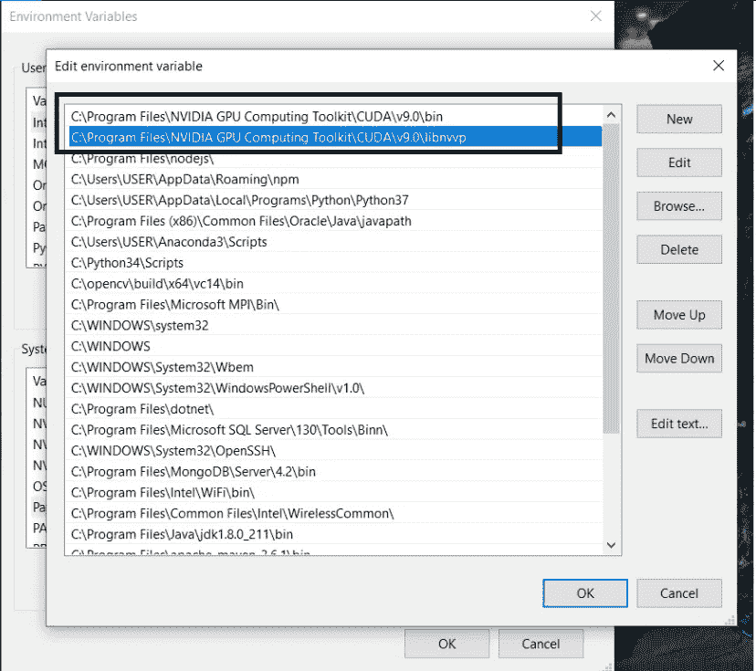

# Windows 10 上的 CUDA 工具包

> 原文：<https://medium.com/analytics-vidhya/cuda-toolkit-on-windows-10-20244437e036?source=collection_archive---------0----------------------->


卡斯帕·卡米尔·鲁宾在 [Unsplash](https://unsplash.com?utm_source=medium&utm_medium=referral) 上的照片

在这里，我将一步一步地解释在 Windows 上安装 CUDA 的方法，因为大多数 Youtube 教程做得不完全。

**CUDA** 是 NVIDIA 发明的并行计算平台和编程模型。它通过利用图形处理单元的能力，大幅提高了计算性能。(图形处理器)

首先，你必须检查你的笔记本电脑或电脑的 GPU 版本。要执行该操作，请单击桌面左下方的**开始按钮**，在搜索框中键入**设备管理器**，并点击菜单上的**设备管理器**。您将得到如下界面。


设备管理器

检查这里提到的显示适配器。要安装 CUDA，你需要一个支持 CUDA 的 GPU。你可以通过以下网站查看。与 OpenCL 不同，**支持 CUDA** 的 GPU 仅**可从 **NVIDIA** 获得。**

[](https://developer.nvidia.com/cuda-gpus) [## CUDA GPUs

### 为开发者推荐的 GPU 英伟达泰坦 RTX 英伟达泰坦 RTX 专为数据科学、人工智能研究、内容…

developer.nvidia.com](https://developer.nvidia.com/cuda-gpus) 

如果您的 GPU 支持 CUDA，我们继续。现在你已经检查了你的 GPU 的系统信息。你只需右击桌面，选择 NVIDIA 控制面板并打开它。在“转到帮助”选项卡中，选择“系统信息”。其中有一个组件部分，如下所示。


NVIDIA 的系统信息

在 NVCUDA.DLL 下，它显示 NVIDIA CUDA 10.2.95 驱动程序。由于更新，驱动程序详细信息可能会有所更改。根据驱动程序的详细信息，您必须选择所需的 CUDA 版本。如果您没有安装所需的软件，CUDA 将无法正常运行。

现在让我们转到安装部分。根据 CUDA 驱动版本，我正在通过以下链接安装 CUDA 工具包。

[](https://developer.nvidia.com/cuda-downloads?) [## CUDA 工具包 10.2 下载

### 编辑描述

developer.nvidia.com](https://developer.nvidia.com/cuda-downloads?) 

您可以提供相关的详细信息，并选择适合您的版本，如下所示。


安装 CUDA 工具包

我更喜欢**。exe(本地)**为安装程序类型。下载好之后，准备安装。只需继续步骤，并在安装过程中使用自定义安装。


安装过程


安装过程

完成 CUDA 工具包安装后，你必须在兼容 CUDA 版本的 Windows 10 上安装 cuDNN。NVIDIA CUDA 深度神经网络库(cuDNN)是一个 GPU 加速的深度神经网络图元库。cuDNN 为标准例程提供了高度优化的实现，例如前向和后向卷积、池化、规范化和激活层。cuDNN 是英伟达深度学习 SDK 的一部分。

cuDNN 下载链接:[https://developer.nvidia.com/cudnn](https://developer.nvidia.com/cudnn)

你必须创建一个帐户才能下载。


在 NVIDIA 中创建帐户

只需创建一个帐户，并使用其凭据登录。接受条款和条件后，您将被引导至下载页面。下载与您的 CUDA 版本兼容的正确版本。


正在下载 cuDNN 零件

下载 cuDNN 后，解压下载的文件并打开。文件结构如下。


cuDNN 文件

复制 3 个文件夹和文本文件，转到 NVIDIA GPU 计算工具包所在的位置。最有可能它将被安装在*C:\ Program Files \ NVIDIA GPU Computing Toolkit*文件路径。(这取决于您安装的位置)。由于我之前在我的笔记本电脑上安装了 CUDA 9.0 版本，CUDA 文件存在于以下路径位置。

*C:\Program Files\NVIDIA GPU 计算工具包\CUDA\v9.0*

现在粘贴你从 cuDNN 解压文件夹中复制的内容。

现在你必须添加环境变量的路径，如下所示。需要更新系统变量中的路径。



更新环境变量

由于 CUDA 主要在 Python 3.6 上兼容，所以我在 Anaconda 上创建了一个环境。这里显示了 Tensorflow 和 CUDA 对 Windows 的兼容性。


Tensorflow 和 CUDA 兼容性

先打开**蟒蛇导航器**。如果你没有安装它，通过给定的链接安装它。

巨蟒安装链接:[https://www.anaconda.com/distribution/#download-section](https://www.anaconda.com/distribution/#download-section)

最初，它支持 Python 3.7，您需要创建一个与 Python 3.6 兼容的环境。因为我用的是 Python 3.6.5 版本。

要创建一个环境，您可以使用 **Anaconda Navigator 或 Anaconda 提示符。**这里我使用了 Anaconda 提示。让我们创建虚拟环境。

```
conda create -n yourenvname python**=**x.x anaconda
```


使用 Python 3.6.5 的 testenv

激活虚拟环境

```
source activate yourenvname
```


激活 testenv(虚拟环境)

现在安装兼容的 tensorflow 版本。这里我安装的是 1.12.0 版本。

```
conda install tensorflow==1.12.0
```

然后安装兼容的 tensorflow-gpu 版本。这里我安装的是 1.12.0 版本。

```
conda install tensorflow-gpu==1.12.0
```

现在在虚拟环境下启动 **Spyder**

```
spyder
```

要验证 CUDA Toolkit 是否安装正确，请在 Spyder 中键入以下代码

```
from tensorflow.python.client import device_lib
print(device_lib.list_local_devices())
```

如果输出是这样的，提到可用的 GPU，CUDA 安装就成功了。


验证的输出

如果它没有给出如上的输出，那么你选择的 CUDA 版本可能有问题。有时系统信息中提到的 CUDA 版本并不是准确的版本。因此，在这种情况下，请更改 CUDA 版本，并再次尝试该流程。希望你从中有所收获。祝你好运！！！