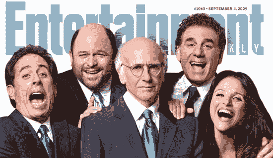

# 抑制你的热情还是宋飞？用 Scikit-Learn 构建自然语言处理的朴素贝叶斯分类器

> 原文：<https://medium.com/analytics-vidhya/curb-your-enthusiasm-or-seinfeld-2e430abf866c?source=collection_archive---------5----------------------->

娱乐周刊([第 1063 期，出版于 2009 年 9 月 4 日](https://ew.com/article/2009/08/27/seinfeld-7/)

在过去的几周里，我一直在探索自然语言处理(NLP)的基础。最终我能够很好地利用我的知识；我将决定是否可以使用贝叶斯定理和 NLP 来区分“宋飞正传”和“抑制你的热情”剧本。在这个…