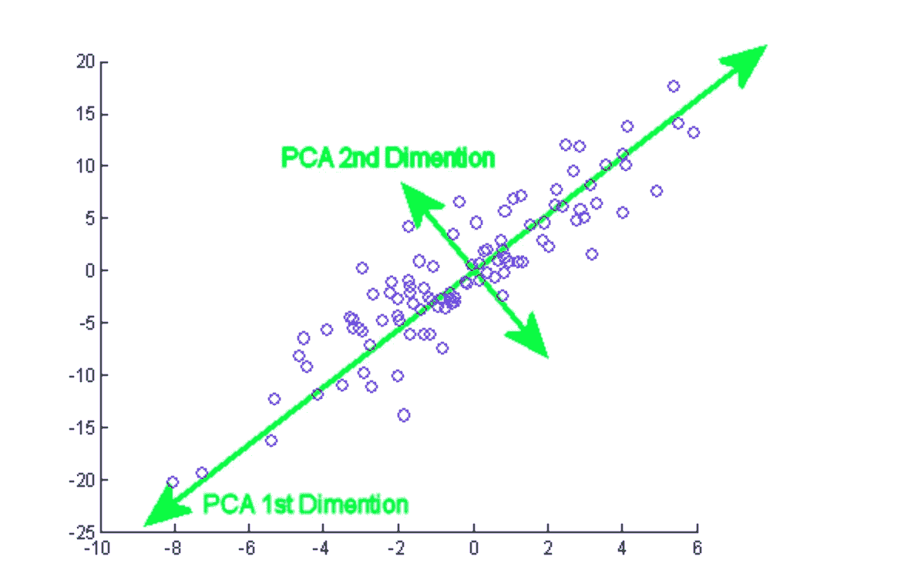

# 维度的诅咒

> 原文：<https://medium.com/analytics-vidhya/curse-of-dimensionality-df82d6e41281?source=collection_archive---------17----------------------->

这个短语是理查德·贝尔曼创造的。它是指在高维空间中分析和组织数据时出现的现象。维度是指增加一个新的变量。随着变量的增加，数据空间变得非常稀疏，很难建立预测准确性。

它出现在不同的领域，如组合学、机器学习、k 近邻分类和采样。例如，如果我们在一条直线上，在二维空间和三维空间中有一些数据点。

1(a)围绕 4 个区域 1(b)(8*8)=64 个区域 1(c)超过 64 个区域

当维度增加时，与研究区域相关联的体积也呈指数增加。但是如果我们没有得到相应增加的数据数量来占据所有可用空间的结果，就会使我们的覆盖范围越来越稀疏，从而导致维数灾难。数据变得越来越稀疏，分析结果也越来越差。

基于距离度量的算法，如 K-最近邻和 k-means，受维数灾难的影响很大，因为增加数据的维数会增加点与点之间的距离。随机森林算法不会受到维数灾难的太大影响，因为不是使用问题的所有特征，而是单独的树只使用特征的子集。这最小化了每棵树优化的空间，有助于解决维数灾难的问题。

**如何对抗维度诅咒:**

1.  作为特征选择的一部分，我们可以选择最初捕获数据关键特征的更小的特征子集。我们可以去掉那些高度相关的特征，或者把它们结合起来。
2.  保留重要的维度，舍弃不相关的维度。一种用于降维的常见技术被称为主成分分析(PCA)。主成分分析旨在通过找到尽可能多地捕捉方差的数据集子集来降低维数。

**主成分分析** ( **PCA** )是一种统计程序，它使用正交变换将一组可能相关变量的观察值转换为一组称为**主成分**的值。第一个主分量具有最大的可能方差，并且每个随后的分量在与前面的分量正交的约束下依次具有最大的可能方差。

**结论:**

最后可以得出结论，过多的特征会造成数据稀疏，给 k 均值和聚类算法等机器学习算法带来困难。减少维数灾难是可解释性和强大模型之间的权衡。

**参考文献:**

贝尔曼环(1961)。适应性控制过程。有导游的旅行。新泽西州普林斯顿，普林斯顿大学出版社

圣地亚哥大学大数据机器学习

[https://en.wikipedia.org/wiki/Principal_component_analysis](https://en.wikipedia.org/wiki/Principal_component_analysis)