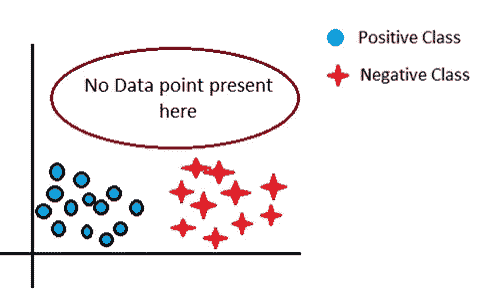
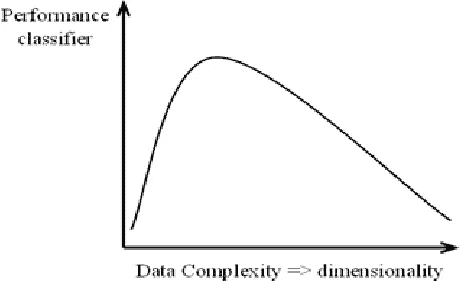
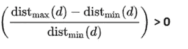
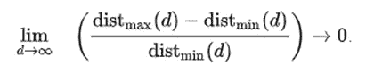
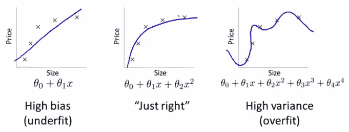

# 维度的诅咒:所有 ML 工程师都需要应对的诅咒

> 原文：<https://medium.com/analytics-vidhya/curse-of-dimensionality-the-curse-that-all-ml-engineers-need-to-deal-with-5d459d39dc8a?source=collection_archive---------9----------------------->

它基本上谈论了我们因为高维数据而面临的问题。

让我们假设我们正在解决一个数据集上的分类问题，该数据集具有 3 个二元特征 f1、f2 和 f3。我们能得到的不同点的最大数量是 2 = 8。

如果我们有 10 个**二元特征** f1，f2，…，f10 会怎么样？

我们能得到的不同点的最大数量是 2 ⁰ = 1024

> *你能猜出这个问题吗？*

随着特征数量的增加，对更好分类的数据点的需求也在增加，这也是指数级的*。*

**想象一下当我们拥有真正有价值的特性时**

**

*[来源:我的电脑]*

*在上图中，由于高亮显示的区域缺少点，我们不能肯定地说，如果一个新点落在该区域中，它将属于什么类。*

> *还有一种被称为*休斯现象*的现象，即“给定固定数量的数据点，回归器或分类器的性能首先会提高，但随后会随着数据维数的增加而降低”*

**

*[ *来源:谷歌图片**

**维度的诅咒*谈到的第二个问题是关于距离度量，尤其是欧几里德距离。*

*让我们首先定义一些术语*

*distmin(xi) =从 xi 到最近点 xj 的欧氏距离*

*distmax(xi) =从 xi 到最远点 xk 的欧几里得距离*

*如果我们取 n 个随机点，和一个参考点 Q*

*对于少量尺寸:*

**

*但是随着维度数量的增加:*

**

*[来源:维基百科]*

> *上面写了什么？*

*这意味着当我们具有高维数 distmax (d) ≈ distmin (d)时，即所有点彼此之间的距离相同。*

> **在高维中，欧氏距离失去了意义！！！**

*这也是为什么像 K-最近邻这种基于距离的模型在高维空间中失败的原因。*

**维数灾难*谈到的另一个问题是数据点的过度拟合。*

*好吧，我不会深入细节，因为只要看看下面的图片就能很好地理解了*

**

*[来源:Coursera 吴恩达机器学习课程]*

*在最右边的图中，有更多的特征(x，x，x 和 x⁴),这导致了数据的过度拟合。*

*现在一个明显的问题可能是:*

> *当我们将数据点投影到更高维度时，我们会得到一个更好的分类超平面，那么我们为什么要担心维数灾难呢？而且不违反休斯现象吗？*

*嗯，最简单的答案是，如果新创建的特征(更多维度)与其余的特征不相关，并且为我们的任务增加了一些真正的价值，*增加特征的数量没有坏处。**

*目前就这些了…*

**