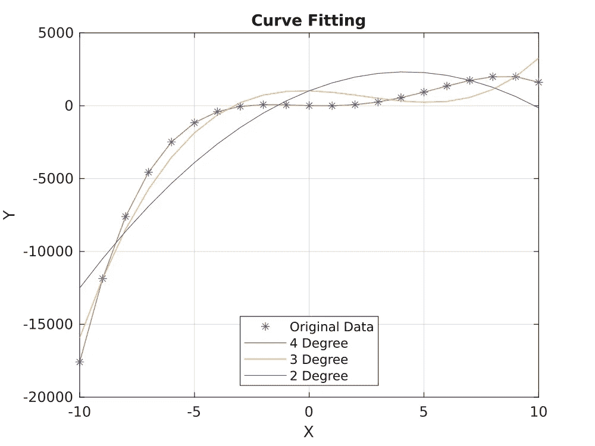

# 曲线拟合

> 原文：<https://medium.com/analytics-vidhya/curve-fitting-cdb6608480da?source=collection_archive---------15----------------------->

曲线拟合是数据管理的重要组成部分。几乎所有的统计分析都依赖于曲线拟合。显而易见的问题是，如果你有数据，为什么要拟合一个数学方程。

大型数据需要大量的存储空间，而单一的数学公式则不需要。

插值更容易。假设每 0.5 个单位的变量(x = 1，1.5，2，2.5，…)有一个数据点，但你必须在每 0.2 个单位的区间(或任何不是 0.5 个单位或 0.5 个单位的倍数的区间)应用一个公式，然后你必须进行各种插值来获得值。想象你正在对 100 个数据点进行插值。这浪费了大量的计算能力和时间。

解释数据也更容易。我们都知道什么是导数(或梯度)。较高的梯度表示曲线的对比度或锐度较高。一个数学公式可以很容易地给出图的最大值或最小值。

好吧，承认它的好处，让我们看看 Matlab 在这方面能为我们做些什么。它有一个直接的内置函数。为了方便起见，我将使用由随机方程生成的数据(主要是因为您可以在家里复制结果)，并将一些数据点导出到 excel 文件中(因为这通常是存储数据的方式)。通常我会使用 **XLSWRITE 命令，但是它已经从 Matlab** 中删除了。所以，我要用**写矩阵**。

```
clear all;
x = zeros(21,2);% X varies from -10 to +10 with increments of 1
x(:,1) = -10:10;% The random formula of which I'm gonna take data
% (Don't tell anyone I cheated)
x(:,2) = -x(:,1).^4 + 10*x(:,1).^3 + 20*x(:,1).^2 - 40.*x(:,1) + 10;% Write it into an Excel file
writematrix(x,'data.xls');
```

零步完成后。让我们看一个使用 **POLYFIT** 进行多项式拟合的程序。

```
clear all;% read data from excel file named 'data'
data = readmatrix('data.xls');% split data into independent variable and dependant variable
x = data(:,1);
y = data(:,2);
plot(x,y,'*')
hold on;% Fit for 4,3,2 degree Polynomial
p4 = polyfit(x,y,4);
p3 = polyfit(x,y,3);
p2 = polyfit(x,y,2);
```

答案 p4，p3，p2 包含多项式方程(a，b，c，d，e)的系数

```
p4 --> ax^4 + bx^3 + cx^2 + dx + e
p3 --> ax^3 + bx^2 + cx + d
p2 --> ax^2 + bx + c
```

请注意，如果它是一个 4 次多项式，那么有 5 个系数！最后，还有一个名为 **POLYVAL** 的函数可以帮助我们非常容易地绘制数据。

```
clear all;% read data from excel file named 'data'
data = readmatrix('data.xls');% split data into independent variable and dependant variable
x = data(:,1);
y = data(:,2);
plot(x,y,'*')
hold on;% Fit for 4,3,2 degree Polynomial
p4 = polyfit(x,y,4);
p3 = polyfit(x,y,3);
p2 = polyfit(x,y,2);% Compare the data
y4 = polyval(p4,x);
y3 = polyval(p3,x);
y2 = polyval(p2,x);
plot(x,y4)
plot(x,y3)
plot(x,y2)grid on;
xlabel('X');
ylabel('Y');
title('Curve Fitting')
```



当然，如果原始数据对于 X 值的单位变化具有更大的变化(即，更多的波峰和波谷)，那么我们将需要更高次的多项式。并且对于足够高的变化，进行多项式拟合变得不切实际。但至少它帮助我们预测趋势，这足以用于预测目的。