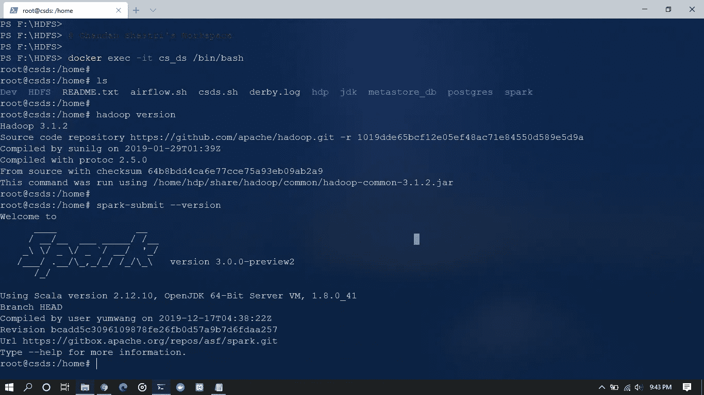

# 使用 Docker 定制数据科学工作空间

> 原文：<https://medium.com/analytics-vidhya/custom-data-science-workspace-using-docker-6629f5218ccd?source=collection_archive---------15----------------------->

作为一名数据工程初学者，我想尝试 Spark 和 Hadoop。因为它们都可以在基于 Unix 的操作系统(Linux，macOS)上轻松工作，所以在我的笔记本上安装 Ubuntu 似乎是个好主意，这样我就可以在 Linux 和 Windows 之间双重启动了。

但是，工作量很大。重启笔记本电脑做一些编程，再重启做剩下的事情，其实效率并不是很高。(我需要 Windows 是因为我在空闲时间做一些编辑，而那些程序只支持 Windows。)

我想要一个可以让我使用 Linux 所有优点的东西，同时保留 Windows 的灵活性来完成我的其他任务。

**答案:码头集装箱**

使用 Docker 容器来运行 Hadoop 和 Spark 似乎很不错，因为我了解到 HortonWorks Sandbox(现由 Cloudera 所有)是以 Docker 映像的形式提供的，它允许您使用几乎所有开箱即用的大数据工具，无需额外设置。

**捕获物:大小**

一切都没问题，直到我开始拉沙盒 Docker 图像。我在想为什么下载需要这么长时间，然后我注意到它的大小约为 22gb…！

22 GB。这真的很大，尤其是对于一个只想在 Spark 和 Hadoop 上做些工作的人来说。所以我放弃了使用 HortonWorks 沙盒 docker 镜像的想法。

**最终解决方案:DIY 沙盒**

因为我是一名工程师，我天生喜欢把东西放在一起，让它们为更大的目的而工作。我启动 Docker，把最新的 Ubuntu 图片作为我的 CDW(自定义数据科学工作空间)的基础

然后我研究了 Hadoop、Spark 和 JDK 的兼容版本。我瞄准了 Hadoop 3.2.0 和 JDK 8 的 Spark 3.0.0。这意味着以后遇到问题的可能性很小。

两个小时后，我的带有 Spark 和 Hadoop 的 Docker 映像就可以使用了..！

我确保所有的东西和命令都开箱即用，最终用户不需要配置任何东西。

**使用我的 Docker 图像的说明:**

确保您的系统至少有 8 GB 的内存，并且 Docker Desktop 设置为使用 4 GB 的内存。我的沙箱大小只有 2 GB，所以不用担心存储和下载问题；-)

启动 Docker 并运行以下命令:

> docker pull chandanshastri/cs _ ds _ v 1.21
> docker run—hostname csds—name cs _ ds-it—entry point/bin/bash chandanshastri/cs _ ds _ v 1.21:最新

这将从我的图像创建一个容器，就是这样。不需要更多的步骤…！

要开始在容器内工作，只需运行以下命令:

> docker start cs _ ds
> docker exec-it cs _ ds/bin/bash

您将从容器内部获得 bash 终端。将您的目录更改为/home。做一个‘ls’，你会看到 Spark 和 Hadoop 目录。

你可以运行 ***sh csds.sh*** 来启动 Hadoop DFS 和 YARN。它还会启动端口 10000 上的节俭服务器。您可以使用 Beeline 访问 Apache Hive。

要使用 Spark，您可以使用 spark-shell ( Scala)或 PySpark，为了易于使用和 matplotlib 可视化，我已经将它们配置为与 Jupyter Notebook 一起启动。如果你想认真的话，你也可以为 Spark 编写程序并使用 spark-submit 命令运行它们。

作为奖励，我配置了 Apache 气流，它也是开箱即用的。MySQL、Postgres、Apache server、PHP 和 Tensorflow(是)也是无需额外配置即可使用。

如果有什么需要密码，就按“321”。

***一切正常。***

而且用 Visual Studio Code 的远程开发工具味道最好。

注意:您可以在 Windows 上运行我的自定义 Hadoop 和 Spark 发行版。只需将它们从容器复制到您的本地路径。但是您需要设置环境变量并编辑*-site.xml 文件，以便根据您的系统路径模式设置 Hadoop 名称节点和数据节点目录。我在 Spark 的 bin 目录下创建了一个定制的 cmd 文件，用于在 Windows 上启动 thrift 服务器。(默认实现在 Windows 上遇到了问题)

但是您将错过 Hadoop 生态系统的许多配置特性，目前只有 Linux 支持这些特性。