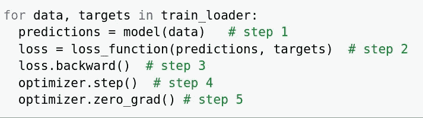
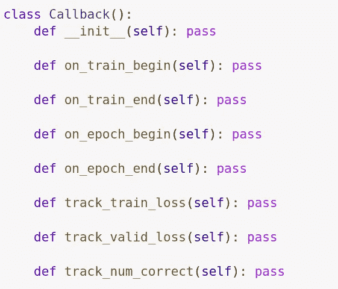
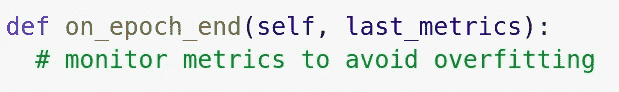
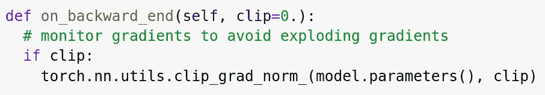

# 定制深度学习模型训练循环

> 原文：<https://medium.com/analytics-vidhya/custom-deep-learning-models-training-loop-b8c7a5de2e65?source=collection_archive---------10----------------------->

这篇文章旨在帮助你理解回访以及如何使用回访。也是为了让你准备好进入复杂的回调系统，无论是在 [*fast.ai*](https://docs.fast.ai/callbacks.html) *还是* [*keras*](https://keras.io/callbacks/) *回调。*

照片由 [Clément H](https://unsplash.com/@clemhlrdt?utm_source=medium&utm_medium=referral) 在 [Unsplash](https://unsplash.com?utm_source=medium&utm_medium=referral) 上拍摄

Pytorch 中深度学习模型的基本训练循环包括五个步骤:-

1.  计算预测。
2.  计算损失。
3.  向后传球。
4.  更新参数。
5.  消除渐变。

这五个步骤可以简单地放入如下代码行中

训练深度学习模型的基本步骤。

## 说明

*   训练神经网络中的数据总是以小批量的形式输入，每个小批量包含特征和标签(*数据和目标*)。我们将特征传递给神经网络架构来计算预测。这就是通常所说的*向前传球*。
*   使用向前传球的预测和实际目标，我们计算损失，这告诉我们离目标有多远。这是使用*损失函数*完成的。
*   在获得损耗之后，我们通过网络架构向后传播损耗相对于模型参数的梯度。这就是*反向传播算法*发挥作用的地方。
*   然后，在*反向通过*后，我们更新/调整正在优化的模型参数。
*   最后，我们不希望在小批量之间累积梯度，所以我们将把模型参数的梯度归零。

## 什么可能会出错？

上面的训练循环工作得非常好，但是非常有限。想象一种情况，你想:-

*   控制培训的学习速度
*   训练期间控制坡度
*   在培训期间跟踪指标
*   添加正则化技术
*   …

这是创建自定义训练循环的要点，通过它我们可以在训练神经网络时添加任何我们可能想到的东西。

# **回调**

到目前为止，唯一允许我们定制训练循环的方法是使用*回调。"你只有在想家的时候才会讨厌路途。"那是一次回调。在编程中，把回调看作一个只在特定条件下调用的函数/方法。*

如果我们都是从这个主题开始，在进入复杂的回调系统之前，这里有一个简单的代码来演示回调是如何工作的。

回调时的代码演示

通过回调，我们现在可以选择在训练开始或结束时，在 epoch 开始或结束时，在批处理开始或结束时，在我们的训练循环上做一些事情。我们甚至可以关注培训和验证指标。

**例#1** ，考虑到我们要避免对训练数据的过拟合，我们可以在每个历元之后使用回调来决定是否继续训练。这仅仅意味着我们希望在 epoch end 上实现早期停止。

回调如何用于提前停止的示例

**示例#2，**假设我们想要通过使用梯度裁剪方法来对抗爆炸梯度问题来提高我们的神经网络训练稳定性。我们可以在每次反向传递后使用回调来剪裁超出首选范围的模型参数的梯度值。

回调如何用于渐变剪辑的示例

你可以在我的 [Github](https://github.com/shebogholo/pytorch/blob/master/custom_train_loop.ipynb) 上找到这篇文章的工作代码演示。

## 承认

感谢你阅读这篇文章，特别感谢[杰德·雅培](https://twitter.com/alienelf)和[弗雷德里克·阿皮娜](https://twitter.com/ThisIsApix)花时间阅读这篇文章。