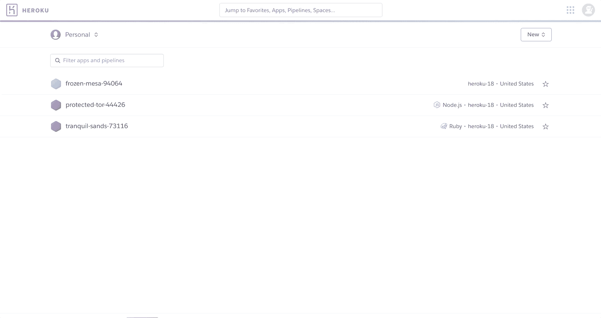
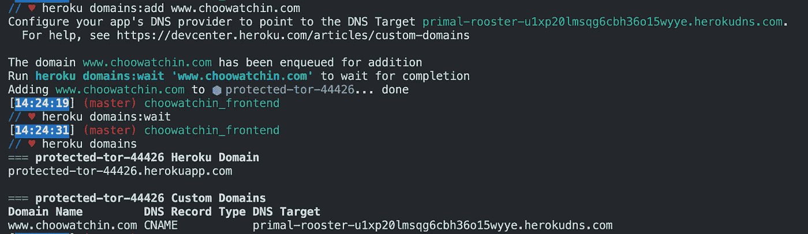
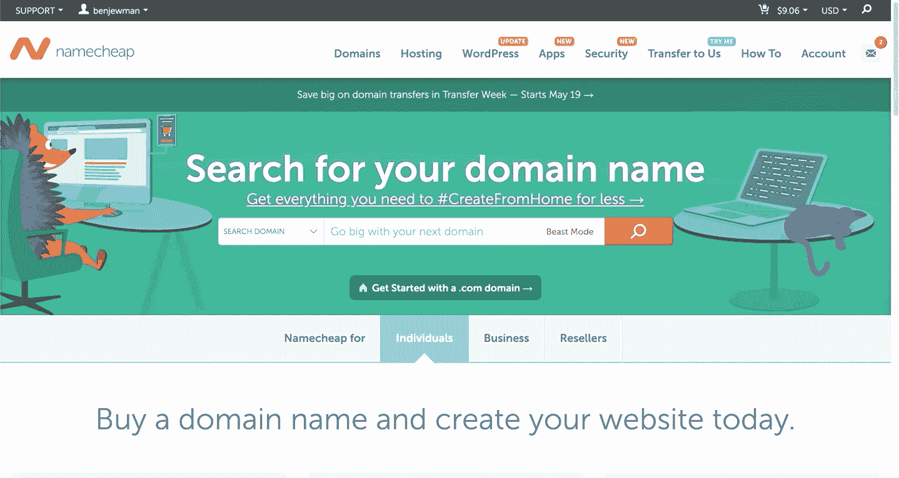

# Heroku 应用程序的自定义域

> 原文：<https://medium.com/analytics-vidhya/custom-domains-for-heroku-apps-7c71d43e3eab?source=collection_archive---------6----------------------->

乔恩·泰森在 [Unsplash](https://unsplash.com?utm_source=medium&utm_medium=referral) 上的照片

在 Heroku 网站上查看我的应用程序设置时，我注意到了免费为应用程序添加自定义域的选项。我觉得那很棒。Heroku 需要一张信用卡来创建自定义域名，但是他们实际上并不收取任何费用来添加自定义域名。

在我的应用程序中添加了一个自定义域名后，我很快发现这个*免费*域名并不是我想象的那样。我没有发现购买网站域名的漏洞。Heroku 上的这个选项允许你使用一个你已经从域名注册商如 Namecheap 购买的自定义域名。使用这个自定义域需要一些配置/协作，我将向您展示我是如何设置一个自定义域来重定向到我的 Heroku 应用程序的。

# 购买域名

首先，我通过 Namecheap 购买了我想用于 web 应用程序的域名。

 [## 域名价格和注册|定价表-名称便宜

### 选择 Namecheap 的 3 个理由。查看我们目前的报价。人人都爱免费的东西！我们在这里帮助你成长…

www.namecheap.com](https://www.namecheap.com/domains/) 

我搜索我想要的名字。既然可以买到，Namecheap 就提供了购买选择。我选择并支付了一个”。com”地址。它的税前或费用为 8.88 美元/年。一旦我知道了我的域名，我就可以开始配置我的 Heroku 应用程序来使用它。

# 向 Heroku 应用程序添加域名的两种方式

我有两种方法来添加自定义域到我的 Heroku 应用程序。最初，我从 Heroku 网站添加了一个域名。成功完成后，我从 CLI 添加了同一个域，以确保两种方法都能工作。

 [## 云应用平台| Heroku

### 无论您是在构建简单的原型还是关键业务产品，Heroku 的全托管平台都能为您提供…

www.heroku.com](https://www.heroku.com/) 

## 从网站添加域

我在网站上登录了我的 Heroku 帐户，打开了我要添加自定义域名的应用程序。我点击“设置”标签，向下滚动到“域名”部分。我点击了“添加域”按钮，这提示了一个弹出窗口。我在相应的框中输入购买的域名，然后点击底部的“下一步”按钮。它用我的域名下的 DNS 目标字符串更新了窗口。这个 DNS 目标很重要，但是我们仍然可以在“设置”页面上看到它。

从 Heroku 网站添加域

## 从 CLI 添加域

为了确保我能做到，我从命令行做了完全相同的事情。在我的终端中，我进入我的应用程序，用命令`heroku login`登录我的 heroku 帐户，这提示浏览器打开，以便我可以用我的 Heroku 帐户连接命令行。从命令行登录后，我输入了`heroku domains:add www.choowatchin.com`。然后我输入`heroku domains:wait`，以确保域名已经成功添加到应用程序中。最后，我输入了`heroku domains`，这样我就可以看到我新添加的域名和相应的 DNS 目标，这对下一步很重要。

从命令行添加域

# 使用 DNS 目标配置 Heroku 应用程序的域注册器

最后，我回到 Namecheap，将 Heroku 应用程序中的 DNS 目标添加到我新购买的域名中。登录后，我选择了导航栏中的“Account”选项卡，这将我导向“Dashboard”页面。我点击了我的域右边的“管理”按钮，发现自己在该域的“详细信息”页面。接下来，我选择了“高级 DNS”选项卡，并在“主机记录”部分添加了一条新记录。记录详细信息如下:

*   Type = "别名记录"
*   Host = "www "
*   值= {DNS 目标}
*   TTL = "自动"

使用 DNS 目标将 Heroku app 与域名注册商连接

输入`heroku domains`后，从 Heroku 网站上的应用程序设置页面或 CLI 复制并粘贴 DNS 目标。(注意:请确保您在别名记录中输入的“值”与 Heroku 应用程序中的 DNS 目标相匹配。这个值在我的示例 gif 和截图中不匹配，因为我多次添加了这个域，当您添加一个新域时，DNS 目标会发生变化)

以前，我的应用只能通过随机生成的 Heroku 品牌的网址([https://protected-tor-44426.herokuapp.com/](https://protected-tor-44426.herokuapp.com/))访问。虽然仍然可以通过那个网址访问，但我的用户现在也可以通过我选择的网址([http://www.choowatchin.com/](http://www.choowatchin.com/home))访问它。如果你遵循我在这个博客中的步骤，并愿意每年支付不到 10 美元，你可以给你的 Heroku 应用程序一个自己的自定义域。

 [## 应用程序的自定义域名

### 默认情况下，Heroku 应用程序在其 Heroku 域中可用，其格式为[应用程序名称].herokuapp.com。

devcenter.heroku.com](https://devcenter.heroku.com/articles/custom-domains)