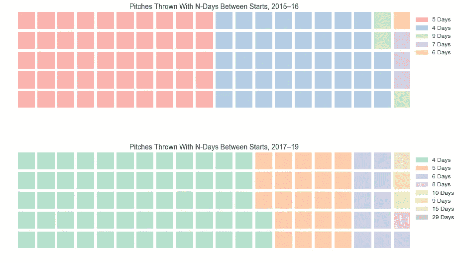

# 改进投手分析的自定义函数

> 原文：<https://medium.com/analytics-vidhya/custom-functions-to-improve-pitcher-analysis-d2bbe5043e7d?source=collection_archive---------19----------------------->

## 对于 Statcast 数据，一个按日期的音高编号和休息日计数器

2019 年至 2020 年的棒球休赛期是我或任何人一生中最长的一个赛季，从世界职业棒球大赛结束到常规赛开始，过去了近 9 个月。在缺乏游戏动作的情况下，作为一个注重数据的棒球迷，我解决问题的一个方法是熟悉 Baseball Savant 的搜索页面功能的细节，Baseball Savant 是 MLB stat cast 的总部。

美国职业棒球大联盟在 2015 年引入了 Statcast。对于那些可能不熟悉 Statcast 的人来说，它是一个跟踪系统，可以收集以前无法测量的关于棒球比赛中发生的几乎每一种事件的信息。用 [MLB 的话说](https://www.mlb.com/news/statcast-primer-baseball-will-never-be-the-same/c-119234412)，Statcast 收集数据“使用一系列高分辨率的光学摄像机以及安装在所有 30 个大联盟棒球场的雷达设备”。这项技术可以在任何给定时间精确跟踪球的位置和运动，以及场上的每个球员。”由于与投球有关(这是我最关注的领域)，Statcast 开辟了一个全新的信息分析生态系统，提供了垂直释放点、水平释放点、释放范围、速度和加速度(三维)、释放旋转速率等指标。

来自 [Pixabay](https://pixabay.com/?utm_source=link-attribution&amp;utm_medium=referral&amp;utm_campaign=image&amp;utm_content=1149153) 的[免费图片](https://pixabay.com/photos/?utm_source=link-attribution&amp;utm_medium=referral&amp;utm_campaign=image&amp;utm_content=1149153)

F 对于最近的一个项目，我用 Statcast [搜索功能](https://baseballsavant.mlb.com/statcast_search)查询了 Chris Sale 自 2017 年以来的每一次投球。尽管我对我可以获得的信息印象深刻(自从我主要通过棒球卡或晨报获取统计数据以来，事情显然已经发生了很大变化)，但有几个功能我希望是内置的，但没有。例如，生成的 CSV 文件在标记每场比赛的投球数方面没有提供任何信息(例如，Sale 的第 5 次投球日期 *x* ，或者 Sale 的第 87 次投球日期 *y* )。

在我的数据探索中，当我想根据开始之间的休息天数对 Sale 的投球历史进行分组时，这里的`4`表示给定的投球是在连续休息四天之后的比赛中投掷的；或者，在因雨、受伤或停赛的情况下，这个数字可能高达`6`或`15`或`29`。

如果不能从 Baseball Savant 直接获得这些数据点，就要由我来编写自定义函数来计算它们，然后相应地填充我的数据框架。我很高兴在这里分享这些功能，从`pitch_counter()`开始:

现在，如果我愿意，我可以查看 Sale 每场比赛的所有第 20 次投球、第 50 次投球或第 100 次投球的汇总统计数据，或者轻松地对某场比赛的后期投球和早期投球进行比较。

在上面的函数创建并填充的`Pitch_Per_Game`列的基础上，我可以稍后继续使用下一个函数—`rest_days()`—来跟踪每场比赛之前收到的休息日销售额:

就这样，我写了一个名为`Days_Between_Starts`的专栏。现在，我可以做有趣的可视化，比如这个华夫饼干图:

看起来他习惯了在芝加哥获得更长的休息时间-他在那里度过了 2016 年-比他自 2019 年以来在波士顿获得的休息时间更长！如果我在分析 Sale 的受伤倾向(这是我曾经涉足过的)，那么我会对那些从 10 到 29 天不等的惊人的长休息时间非常感兴趣。*如何解释它们？*

所以你有它。几个自定义函数可以很容易地应用于 Baseball Savant 的任何查询，这可能会打开一些新见解的大门。至少，他们希望这些门更容易打开。