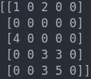
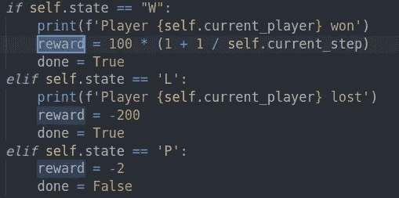
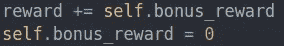
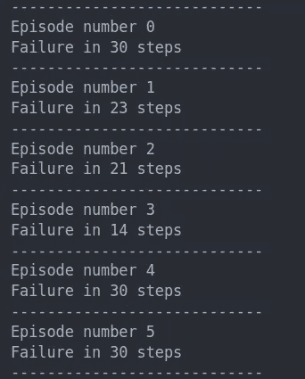
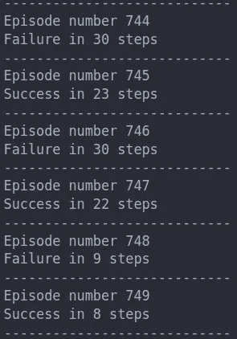
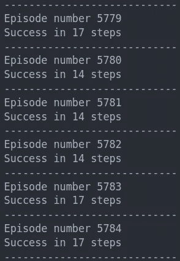
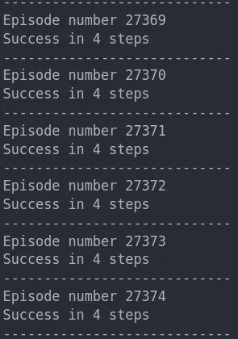

# 具有协作代理的定制健身房环境

> 原文：<https://medium.com/analytics-vidhya/custom-gym-environment-with-agents-that-collaborate-4f96ef898a2a?source=collection_archive---------13----------------------->

在 [**上一篇**](/@mathieuces/how-to-create-a-custom-gym-environment-with-multiple-agents-f368d13582ee) 中，我解释了如何用多个代理制作一个开放的 AI 的 g **ym** 环境。在这一篇中，我将解释如何让他们合作追求一个共同的目标:走出迷宫！

这篇文章的所有代码都在我的 [**GitHub**](https://github.com/MathieuCesbron/Maze/tree/collaboration) 上。

# 自定义环境

定制环境将是一个**迷宫**(类似于[上一篇文章](/@mathieuces/how-to-create-a-custom-gym-environment-with-multiple-agents-f368d13582ee)中的那个)但是有一些变化。

起始迷宫

0: **空区域**，代理可以去那里

1: **代理 1** 谁将尝试找到出口

2: **代理 2** 谁也要试着找到出口

陷阱，如果一个特工去了那里，他就输了

4: **传送点，**如果一个 a 代理移动到传送点，另一个代理立刻向北移动 3 格。

5: **退出**，退出迷宫并赢得游戏

在游戏中，代理人 1 开始移动，然后代理人 2 移动，然后代理人 1…如果代理人掉进陷阱或找到出口，游戏结束。是一款**回合制游戏**。

# 奖励函数

奖励函数对于找到一种有效的方法来为我们的代理人找到更好的策略是必不可少的。我们的奖励函数取决于行动的结果(*赢了游戏=='W'* ，*输了游戏=='L'* ，*继续游戏=='P'* )

环境中报酬的计算

如果一个经纪人找到了出口，他会得到丰厚的回报。请注意**它还取决于当前步骤**，因为我们希望代理在可能较少的步骤中找到出口。所以我们赢得的越少，回报就越大。

如果你检查代码，你还会看到我们实现了一个 **bonus_reward。如果代理移动到没有代理已经访问过单元，奖励仅为 1，否则为 0。它是用来促进发现的。**

如果一个代理移动到一个空的单元，他将被奖励-2，如果一个代理已经去过那里，和-1，如果没有人去过那里(注意，奖励仍然是负的)。

# 培训

我们期待的部分来了，我们的代理人会找到最佳策略吗？

起始迷宫

## 第 0-50 集

在学习开始时，代理经常在不到 3 步的时间内找不到出口，当他们找到出口时，主要是因为代理发现了一个陷阱。

## 第 51 集–1000 集

我们开始看到一些成功，22 步的成功远非最佳，代理人显然没有有效地使用传送点，但这仍然是一个进步。

## 第 1001 集–20000

AHH！这几乎是这个范围内唯一的成功。让我们看看现在是否能找到最短的路径。

## 第 25000 集及以后

最短的路径可以通过使用传送器在 4 个步骤中完成。在 25000 集之后，我们训练一个模型来找到最优解。

# 结论

协作在强化学习中起作用，看起来很有趣。然而，最大的缺点是获得结果所需的训练时间**很长**。

你看了 Open AI 做的捉迷藏视频吗？他们使用了只有公司才能拥有的计算能力(结果仍然令人印象深刻)。