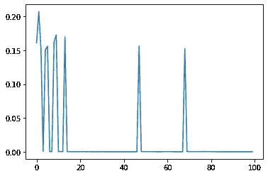
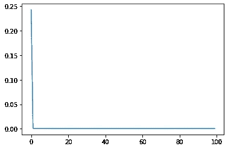
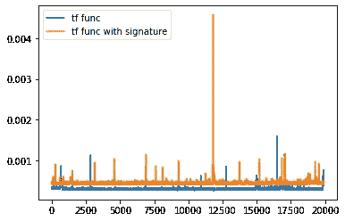

# Tensorflow 2.1 中的自定义 Keras 模型和 tf 函数

> 原文：<https://medium.com/analytics-vidhya/custom-keras-models-and-tf-functions-in-tensorflow-2-1-8641dc9eabd7?source=collection_archive---------2----------------------->

在这篇文章中，我将探讨如何使用 ***tf.functions*** 来提高定制 keras 模型的训练速度。

# 定义模型

在我们公司，我们用不同形状的样品训练模型。让我们定义一个定制的玩具模型，它可以接受在第一维中长度变化的输入。

该模型在其第一维上执行 reduce_max，然后通过激活 **relu** 使其通过一系列密集层。

# 定义数据集

我们定义一个生成器，它产生第一维中长度不同的样本。然后创建一个数据集，其中每个示例的形状为(X，20 ),其中 X 可以在 1 和 10 之间变化。

# 定义训练循环

# 热切模式下的训练

默认情况下，tensorflow 2.1 以渴望模式运行一切。渴望模型对于模型开发来说非常方便，因为它允许我们轻松地设置断点并进入模型代码。然而渴望模式是缓慢的。让我们看看对 1000 个例子进行训练的时间。

```
train_data = dataset.take(1000)%%time
train(train_data, train_step)CPU times: user 8.11 s, sys: 269 ms, total: 8.38 s
Wall time: 8 s
```

# 用 tf 函数训练

Tf 函数提供了将 python 函数自动转换为 tensorflow 图的功能，tensorflow 运行时可以高效地执行该图。

```
tf_train_step = tf.function(train_step)%%time
train(train_data, tf_train_step)WARNING:tensorflow:5 out of the last 6 calls to <function train_step at 0x148a40bf8> triggered tf.function retracing. Tracing is expensive and the excessive number of tracings is likely due to passing python objects instead of tensors. Also, tf.function has experimental_relax_shapes=True option that relaxes argument shapes that can avoid unnecessary retracing. Please refer to [https://www.tensorflow.org/tutorials/customization/performance#python_or_tensor_args](https://www.tensorflow.org/tutorials/customization/performance#python_or_tensor_args) and [https://www.tensorflow.org/api_docs/python/tf/function](https://www.tensorflow.org/api_docs/python/tf/function) for more details.
WARNING:tensorflow:6 out of the last 8 calls to <function train_step at 0x148a40bf8> triggered tf.function retracing. Tracing is expensive and the excessive number of tracings is likely due to passing python objects instead of tensors. Also, tf.function has experimental_relax_shapes=True option that relaxes argument shapes that can avoid unnecessary retracing. Please refer to [https://www.tensorflow.org/tutorials/customization/performance#python_or_tensor_args](https://www.tensorflow.org/tutorials/customization/performance#python_or_tensor_args) and [https://www.tensorflow.org/api_docs/python/tf/function](https://www.tensorflow.org/api_docs/python/tf/function) for more details.
WARNING:tensorflow:7 out of the last 10 calls to <function train_step at 0x148a40bf8> triggered tf.function retracing. Tracing is expensive and the excessive number of tracings is likely due to passing python objects instead of tensors. Also, tf.function has experimental_relax_shapes=True option that relaxes argument shapes that can avoid unnecessary retracing. Please refer to [https://www.tensorflow.org/tutorials/customization/performance#python_or_tensor_args](https://www.tensorflow.org/tutorials/customization/performance#python_or_tensor_args) and [https://www.tensorflow.org/api_docs/python/tf/function](https://www.tensorflow.org/api_docs/python/tf/function) for more details.
WARNING:tensorflow:8 out of the last 11 calls to <function train_step at 0x148a40bf8> triggered tf.function retracing. Tracing is expensive and the excessive number of tracings is likely due to passing python objects instead of tensors. Also, tf.function has experimental_relax_shapes=True option that relaxes argument shapes that can avoid unnecessary retracing. Please refer to [https://www.tensorflow.org/tutorials/customization/performance#python_or_tensor_args](https://www.tensorflow.org/tutorials/customization/performance#python_or_tensor_args) and [https://www.tensorflow.org/api_docs/python/tf/function](https://www.tensorflow.org/api_docs/python/tf/function) for more details.
WARNING:tensorflow:6 out of the last 11 calls to <function train_step at 0x148a40bf8> triggered tf.function retracing. Tracing is expensive and the excessive number of tracings is likely due to passing python objects instead of tensors. Also, tf.function has experimental_relax_shapes=True option that relaxes argument shapes that can avoid unnecessary retracing. Please refer to [https://www.tensorflow.org/tutorials/customization/performance#python_or_tensor_args](https://www.tensorflow.org/tutorials/customization/performance#python_or_tensor_args) and [https://www.tensorflow.org/api_docs/python/tf/function](https://www.tensorflow.org/api_docs/python/tf/function) for more details.
WARNING:tensorflow:6 out of the last 12 calls to <function train_step at 0x148a40bf8> triggered tf.function retracing. Tracing is expensive and the excessive number of tracings is likely due to passing python objects instead of tensors. Also, tf.function has experimental_relax_shapes=True option that relaxes argument shapes that can avoid unnecessary retracing. Please refer to [https://www.tensorflow.org/tutorials/customization/performance#python_or_tensor_args](https://www.tensorflow.org/tutorials/customization/performance#python_or_tensor_args) and [https://www.tensorflow.org/api_docs/python/tf/function](https://www.tensorflow.org/api_docs/python/tf/function) for more details.
CPU times: user 2.65 s, sys: 501 ms, total: 3.15 s
Wall time: 2.33 s
```

我们注意到所用的时间从 8.44 秒大幅提高到了 2.25 秒。我们还注意到 tensorflow 发出了一堆关于撤销的警告。

因为范例的形状不同，所以会发生回溯。每当函数遇到下面没有见过的图形时，它将为该图形编译一个新的图形。编制一张新的图表是昂贵的。在我们的例子中，数据集可以有 10 种不同的形状，因此重走操作最多会发生 10 次。

# 用带有签名的 tf 函数进行训练

为了避免对每个新形状进行回溯，我们可以为 tf 函数提供一个输入签名。变化的尺寸可以用“无”表示。

```
tf_train_step_signature = tf.function(
    train_step,
    input_signature=[
        tf.TensorSpec(shape=(None, None, 20), dtype=tf.float32), 
        tf.TensorSpec(shape=(None,), dtype=tf.float32)
    ]
)%%time
train(train_data, tf_train_step_signature)CPU times: user 1.22 s, sys: 451 ms, total: 1.67 s
Wall time: 889 ms
```

# 比较带签名和不带签名的 tf 函数

使用签名避免了回溯，训练时间从 2.25 秒进一步提高到 889 毫秒。在决定使用签名更好之前，让我们用更多的示例执行训练，并添加一些工具。

```
train_data_large = dataset.take(20000)from time import timedef timer(f, timings):
    def wraps(*args, **kwargs):
        st = time()
        res = f(*args, **kwargs)
        en = time()
        timings.append(en-st)
    return wrapstimings_tf = []
tf_train_step = timer(tf.function(train_step), timings_tf)%%time
train(train_data_large, tf_train_step)WARNING:tensorflow:5 out of the last 6 calls to <function train_step at 0x148a40bf8> triggered tf.function retracing. Tracing is expensive and the excessive number of tracings is likely due to passing python objects instead of tensors. Also, tf.function has experimental_relax_shapes=True option that relaxes argument shapes that can avoid unnecessary retracing. Please refer to [https://www.tensorflow.org/tutorials/customization/performance#python_or_tensor_args](https://www.tensorflow.org/tutorials/customization/performance#python_or_tensor_args) and [https://www.tensorflow.org/api_docs/python/tf/function](https://www.tensorflow.org/api_docs/python/tf/function) for more details.
WARNING:tensorflow:6 out of the last 9 calls to <function train_step at 0x148a40bf8> triggered tf.function retracing. Tracing is expensive and the excessive number of tracings is likely due to passing python objects instead of tensors. Also, tf.function has experimental_relax_shapes=True option that relaxes argument shapes that can avoid unnecessary retracing. Please refer to [https://www.tensorflow.org/tutorials/customization/performance#python_or_tensor_args](https://www.tensorflow.org/tutorials/customization/performance#python_or_tensor_args) and [https://www.tensorflow.org/api_docs/python/tf/function](https://www.tensorflow.org/api_docs/python/tf/function) for more details.
WARNING:tensorflow:7 out of the last 10 calls to <function train_step at 0x148a40bf8> triggered tf.function retracing. Tracing is expensive and the excessive number of tracings is likely due to passing python objects instead of tensors. Also, tf.function has experimental_relax_shapes=True option that relaxes argument shapes that can avoid unnecessary retracing. Please refer to [https://www.tensorflow.org/tutorials/customization/performance#python_or_tensor_args](https://www.tensorflow.org/tutorials/customization/performance#python_or_tensor_args) and [https://www.tensorflow.org/api_docs/python/tf/function](https://www.tensorflow.org/api_docs/python/tf/function) for more details.
WARNING:tensorflow:6 out of the last 12 calls to <function train_step at 0x148a40bf8> triggered tf.function retracing. Tracing is expensive and the excessive number of tracings is likely due to passing python objects instead of tensors. Also, tf.function has experimental_relax_shapes=True option that relaxes argument shapes that can avoid unnecessary retracing. Please refer to [https://www.tensorflow.org/tutorials/customization/performance#python_or_tensor_args](https://www.tensorflow.org/tutorials/customization/performance#python_or_tensor_args) and [https://www.tensorflow.org/api_docs/python/tf/function](https://www.tensorflow.org/api_docs/python/tf/function) for more details.
CPU times: user 17.4 s, sys: 8.34 s, total: 25.8 s
Wall time: 11.8 stimings_tf_signature = []
tf_train_step_signature = timer(
    tf.function(
        train_step,
        input_signature=[
            tf.TensorSpec(shape=(None, None, 20), dtype=tf.float32), 
            tf.TensorSpec(shape=(None,), dtype=tf.float32)
        ]
    ),
    timings_tf_signature
)%%time
train(train_data_large, tf_train_step_signature)CPU times: user 19.5 s, sys: 8.43 s, total: 28 s
Wall time: 13.4 s
```

结果是，从长远来看，没有签名的 tf 函数比有签名的 tf 函数快。绘制时间表可以清楚地说明为什么会发生这种情况。

```
from matplotlib.pylab import plt
plt.plot(timings_tf[0:100])
```



该图绘制了运行每个训练步骤的时间。在情节中有一些最初的尖峰。每当对图形进行代价高昂的重寻时，就会出现峰值。但是一旦遇到数据中所有可能的形状，就没有进一步的回溯。

```
plt.plot(timings_tf_signature[0:100])
```



对于具有签名的 tf 函数的图，不会发生回溯，因此在构造图的最初的第一个昂贵步骤之后，其余的步骤花费相似的时间量。

因此，现在让我们在放弃所有初始的昂贵的回溯操作之后，比较在两种情况下运行一个步骤所需的时间。

```
plt.ioff()
plt.plot(timings_tf[100:], label="tf func")
plt.plot(timings_tf_signature[100:], label="tf func with signature")
plt.legend(loc="upper left")
plt.show()
```



该图清楚地表明，具有签名的 tf 函数确实较慢。

# **图内训练循环**

也可以将整个“train”函数包装成 tf 函数。在这种情况下，包括数据集迭代的整个训练发生在编译的张量流图内。

```
tf_train = tf.function(train)%%time
tf_train(train_data_large, train_step)CPU times: user 14.6 s, sys: 8.37 s, total: 22.9 s
Wall time: 8.01 s
```

# **结论**

默认情况下，tensorflow 2.1 以渴望模式运行，这对于开发和调试非常有用。通过将你的函数包装在“tf.function”中可以提高性能，TF . function 会编译一个 tensorflow 图，框架可以有效地执行该图。

有几种方法可以将部分代码包装成“tf.function”。在演示的 toy 示例中，当整个训练发生在 tf.function 中时，可以观察到最佳性能。

然而，在现实世界的使用案例中，有几个因素在起作用-所有数据集是在内存中还是从磁盘/网络流出，模型的计算负载，是否使用了 gpu /多个 gpu，训练数据的形状如何变化等。人们应该通过实验来弄清楚如何最有效地使用“tf.function”。

**ps** :你可以在[https://colab . research . Google . com/github/saswatac/TF playground/blob/master/Custom % 20k eras % 20 models % 20 和%20tf%20functions.ipynb](https://colab.research.google.com/github/saswatac/tfplayground/blob/master/Custom%20Keras%20models%20and%20tf%20functions.ipynb) 查看 colab 中笔记本形式的帖子

**pps** :查看我们公司的网站[https://neuralconcept.com/](https://neuralconcept.com/)，在这里我们正在打造一款深度学习产品，学习对工程模拟进行建模。