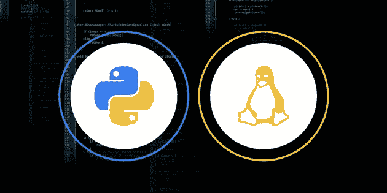
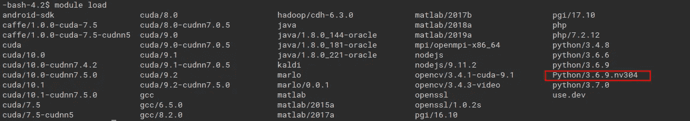
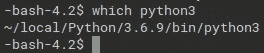

# 任何 Linux 系统或服务器上的定制/多 python 或 cuda

> 原文：<https://medium.com/analytics-vidhya/custom-multiple-python-or-cuda-on-any-linux-system-or-server-ecd22b5e7b6d?source=collection_archive---------26----------------------->



图片来源:[https://wccftech.com/](https://wccftech.com/)

我当时正在我大学的计算服务器上工作，不幸的是事情并不顺利，他们有非常好的计算资源，但我无法利用这些能力，并且正在烧毁我的笔记本电脑。作为一名机器工程师，我必须使用最好的硬件来完成工作。我的大学提供了最好的计算环境之一( [EECS](http://support.eecs.qmul.ac.uk/research/compute-servers/) )，但是很难使用它们来创建虚拟环境并马上开始。因此，在与 IT 人员进行了大量邮件追逐和沮丧之后，我决定使用我自己的定制 python，为我自己原生构建。

# 安装 python

为了将 python 安装到自定义路径并使用它，需要记住一些事情。首先，路径应该有读写权限，为此，你可以使用 home 目录~/来实现这个目的。其次，应该正确初始化路径和 LD_LIBRARY_PATH，这样，如果您使用 python RHEL 或 PIP，它会自动选择，您不必一次又一次地指定路径。

**第一部分——python 安装**

本指南可以用于任何可以从源代码构建的包安装，python 在这里只是一个例子。在主目录中创建目录，并使用 wget 下载 python，在那里安装 python 并提取 python

```
mkdir -p $HOME/local/src $HOME/local/share/lmodfiles                                               cd $HOME/local/src                       
wget [https://www.python.org/ftp/python/3.6.9/Python-3.6.9.tgz](https://www.python.org/ftp/python/3.6.9/Python-3.6.9.tgz)tar zxvf Python-3.6.9.tgz
```

安装零件

```
cd Python-3.6.9
./configure — prefix=$HOME/local/Python/3.6.9 --enable-optimizations
make && make install
```

这将在*$ HOME/local/python/3 . 6 . 9/bin/Python*安装 Python，您可以从那里使用 Python，但这不是全部。每次运行 python 文件或调用 RHEL python 终端时，您都必须编写自定义路径。另外，如果你必须安装像 tensorflow 和 numpy 这样的包，那么你也必须指定路径。这还不是全部，如果你的库路径没有初始化你的 python，它将不会识别你的 python。这就是为什么我们要做第二部分。

**第二部分—环境变量**

第一种简单的方法是只附加路径和 LD_LIBRARY_PATH，并附加在~/中。bashrc 或者~/。bash_profile 但是~/里已经有这样的东西了怎么办。bashrc 或者您没有访问~/的权限。或者你想有一个自己的自定义软件包？对于这样的需求和遵循最佳实践，我们将使用 Linux " *模块*的功能。

模块的描述说"*模块是模块包的用户接口。模块包通过模块文件*提供用户环境的动态修改。这意味着，为了使用我们的定制软件或 python(在我们的例子中)，我们需要编写一个 modulefile 并在我们开始使用它时调用它。

modulefile 可以用 lua 或 tcl 编写，这取决于系统发行版。但本质上它们非常非常简单。根据系统的不同，您可以遵循任一步骤。

**1。lua 模块文件**

您应该创建目录*$ HOME/local/share/lmodfiles/python*，并在该目录中创建一个名为 3.6.9.lua 的模块文件

```
cd $HOME/local/share/lmodfiles/python
nano 3.6.9.lua
```

然后添加到线下，并根据需要更新路径

```
-- Local Variables                       
local name = "Python"                       
local version = "3.6.9"-- Locate Home Directory                       
local homedir = os.getenv("HOME")                       
local root = pathJoin(homedir, "local", name, version)
                                                                   -- Set Basic Paths                       
prepend_path("PATH", pathJoin(root, "bin"))                       prepend_path("MANPATH", pathJoin(root, "share/man"))
```

**2。tcl 模块文件**

您应该创建$ HOME/local/share/lmodfiles/python 目录，并在该目录中创建一个名为 3.6.9 的模块文件

```
cd $HOME/local/share/lmodfiles/python
nano 3.6.9.lua
```

然后添加到线下，并根据需要更新路径

```
#%Module
#
# Module Python 3.6.9
proc ModulesHelp { } {
        global python_version
        puts stderr "\tSets the environment for Python $python_version"
        puts stderr "\n"
        puts stderr "\tProduct information:\thttps://[www.python.org/downloads/release/python-369/](http://www.python.org/downloads/release/python-366/)"
}set     python_version       3.6.9
set     python_root          $HOME/local/Python/3.6.9module-whatis "Sets the environment for Python $python_version"conflict pythonprepend-path PYTHONPATH         $python_root/lib/python3.6/site-packages
prepend-path PATH               $python_root/bin
prepend-path LD_LIBRARY_PATH    $python_root/lib
```

## **最后一部分——用途**

为了使用您的自定义 python，您总是要编写

```
module use $HOME/local/share/lmodfiles
```

然后在模块中加载

```
module load Python/3.6.9
```

检查模块文件是否正确写入的一种方法是在键入`module load`后按双 tab 键



健全性检查 1

加载模块后，您可以使用“which”命令来检查是否选择了自定义 python。



健全检查 2

然后，您可以使用`python3 -m pip install virtualenv`来安装虚拟环境，并从您的定制 python 开始。

# 参考

 [## HOWTO:本地安装软件

### 有时，在 HPC 系统上访问一个软件的最佳方式是自己将它安装为“本地……

www.osc.edu](https://www.osc.edu/resources/getting_started/howto/howto_locally_installing_software) [](http://tommymao.blogspot.com/2018/02/cant-connect-to-https-url-because-ssl.html) [## 无法连接到 HTTPS URL，因为 SSL 模块不可用。

### 尝试运行 python 但遇到此错误:[root @ nbu 773 SRV 1 tmp]# python 3 get-pip . py pip 配置为…

tommymao.blogspot.com](http://tommymao.blogspot.com/2018/02/cant-connect-to-https-url-because-ssl.html) 

[https://unix.stackexchange.com/a/42583](https://unix.stackexchange.com/a/42583)