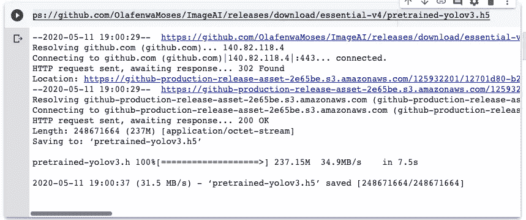

# 使用 ImageAi 的自定义对象检测只需几个步骤

> 原文：<https://medium.com/analytics-vidhya/custom-object-detection-using-imageai-with-few-steps-e97b999bae79?source=collection_archive---------4----------------------->

" **ImageAI** 是一个 python 库，旨在使开发人员、研究人员和学生能够使用简单的几行代码构建具有自包含深度学习和计算机视觉功能的应用程序和系统"官方文档(【https://imageai.readthedocs.io/en/latest/】T2

ImageAi 是一个非常强大的工具，可以为自定义数据集创建模型，实用且易于使用，按照这些步骤创建自己的分类器；

1-准备数据集

2-安装 imageAi

3-下载预训练重量(yolo、RetinaNet)

样本对象检测

# 计算机视觉

近年来，我们可以在生活中看到很多应用，包括自动驾驶汽车、面部检测应用、教育、军事、金融等。

样本对象分割

样本对象检测

## 准备数据集

有必要为训练过程收集大量的图像，建议该项目每个班至少 200 张图像，结构如下:

## 注释图像

ImageAi 支持 Pascal Voc 标注格式，个人来标注图片我用的是 LabelIMG，一个好用的工具，在项目结构上面看到的分离之后，在训练和验证之间(70%训练图片和 30%验证图片)。打开 LabelImg，我们开始为数据集中的每幅图像添加注释，如下所示。

在注释每个图像之后，应用程序将为每个图像生成一个 xml 文件，该文件将被定向到“注释”文件夹，

## 安装 ImageAi 和培训要求

正如已经描述过的，我们使用 Google Colab 来执行训练，使用 GPU 来加速这个过程；

# 要求

**蟒蛇:**[https://python.org](https://python.org/)

**张量流:**！pip3 安装 tensor flow(verso 亚 a 2.0)

**OpenCV :** ！pip3 安装 opencv-python

**Keras :** ！pip3 安装 keras

**ImageAI :** ！pip3 安装 imageai —升级

# 下载前型号 yolov3

*！wget*[*https://github . com/OlafenwaMoses/ImageAI/releases/download/essential-v4/pretrained-yolov 3 . H5*](https://github.com/OlafenwaMoses/ImageAI/releases/download/essential-v4/pretrained-yolov3.h5)

在执行前面的步骤并在 google colab 上启用笔记本的 GPU 后，我们可以训练我们的应用程序，为此我们必须运行下面的代码，完整的项目文档编写得非常好，易于理解。

链接:[https://imageai . readthedocs . io/en/latest/custom detection/index . html](https://imageai.readthedocs.io/en/latest/customdetection/index.html)

现在只需等待培训过程……(大约 3 小时)

训练过程结束后，我们上传一个视频，使用下面的代码测试应用程序；

用于测试视频对象检测的样本

遵循结果；